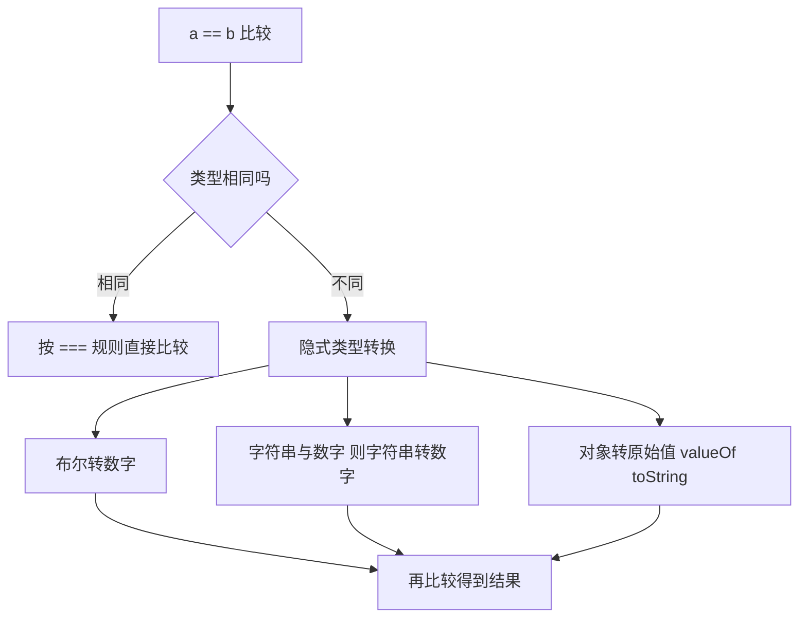

# 02 · 运算符（Operators）

> 掌握 JavaScript 各类运算符，重点理解 == 与 === 的区别、隐式类型转换，以及现代的可选链 ?. 和空值合并 ??。

## 📖 知识讲解

### 1. 运算符分类

| 类别 | 示例 | 说明 |
| ---- | ---- | ---- |
| 算术 | `+ - * / % **` | 注意 `+` 遇字符串变拼接 |
| 比较 | `> < >= <= == === != !==` | 返回布尔 |
| 逻辑 | `&& \|\| !` | 短路求值，返回的是操作数而非纯布尔 |
| 赋值 | `= += -= *= /= ??= \|\|= &&=` | 复合赋值 |
| 位 | `& \| ^ ~ << >>` | 基于二进制 |
| 三元 | `条件 ? a : b` | 唯一的三目运算符 |
| 可选链 | `?.` | 安全访问可能不存在的属性/方法 |
| 空值合并 | `??` | 仅 null/undefined 时取右值 |

### 2. == vs ===（核心）

- `===` 严格相等：**不转换类型**，类型不同直接 `false`。
- `==` 宽松相等：先做**隐式类型转换**再比较，规则复杂易出错。

记忆要点：
- `1 == '1'` → `true`，`1 === '1'` → `false`
- `0 == false` → `true`
- `null == undefined` → `true`，但 `null === undefined` → `false`
- `NaN` 与任何值（含自身）都不相等

**最佳实践**：永远用 `===` / `!==`，避免 `==`。

### 3. 短路求值

- `a && b`：a 为假值则返回 a，否则返回 b。
- `a || b`：a 为真值则返回 a，否则返回 b。
- 假值：`false 0 "" null undefined NaN`。

### 4. ?. 与 ?? 的区别

- `?.` 防止访问 `undefined.xxx` 报错。
- `??` 只在左侧为 `null/undefined` 时取右侧；`||` 会把 `0`、`''` 也当假值，容易误伤。

## 🔄 流程图 / 原理图

## 💻 代码说明

- **算术区**：`'a' + 1` 演示加号拼接；`2 ** 10` 演示幂运算。
- **比较区**：并排打印 `==` 与 `===`，直观看出隐式转换。
- **逻辑区**：`'' || '默认值'` 演示用 `||` 取默认值的经典用法。
- **位运算区**：`7 & 1` 判断奇偶，`1 << 4` 等于 16。
- **可选链区**：`user.contact?.phone` 在 contact 不存在时安全返回 undefined。
- **?? vs ||**：`count = 0` 时 `count ?? 99` 得 0，`count || 99` 得 99，凸显差异。

## ▶️ 运行方式

- **浏览器**：打开 `index.html`，页面显示结果，F12 看控制台。
- **Node**：`node demo.js`。

## ⚠️ 常见坑 / 最佳实践

1. 用 `===` 不用 `==`，避免隐式转换的坑。
2. `+` 是唯一会因字符串变拼接的算术符，拼接和加法别混。
3. 取默认值优先用 `??` 而非 `||`，否则 `0`、`''` 会被误当假值。
4. `?.` 只防 null/undefined，别用它掩盖真正的逻辑错误。
5. 位运算会把操作数当 32 位整数处理，大数会溢出。

## 🔗 官方文档

- [表达式与运算符 - MDN](https://developer.mozilla.org/zh-CN/docs/Web/JavaScript/Reference/Operators)
- [相等性比较 - MDN](https://developer.mozilla.org/zh-CN/docs/Web/JavaScript/Guide/Equality_comparisons_and_sameness)
- [可选链 ?. - MDN](https://developer.mozilla.org/zh-CN/docs/Web/JavaScript/Reference/Operators/Optional_chaining)
- [空值合并 ?? - MDN](https://developer.mozilla.org/zh-CN/docs/Web/JavaScript/Reference/Operators/Nullish_coalescing)
