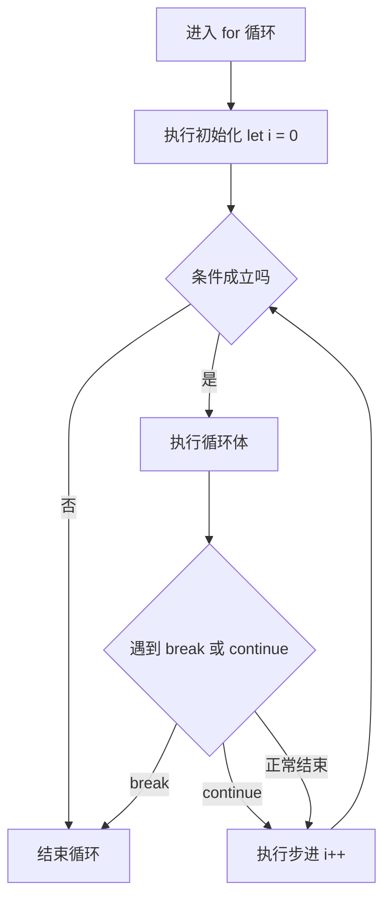

# 03 · 流程控制（Control Flow）

> 用条件语句和循环语句控制代码的执行路径，是所有程序逻辑的骨架。

## 📖 知识讲解

### 1. 条件语句

- **if / else if / else**：从上到下判断，命中第一个为真的分支即执行。
- **switch**：适合一个值等于多个固定取值的场景；每个 `case` 末尾要写 `break`，否则会"穿透"到下一个 case；`default` 兜底。

### 2. 循环语句

| 语句 | 特点 |
| ---- | ---- |
| `for` | 已知次数，`for(初始;条件;步进)` |
| `while` | 先判断后执行，可能一次都不执行 |
| `do-while` | 先执行后判断，至少执行一次 |
| `for...of` | 遍历可迭代对象的**值**（数组/字符串/Map/Set） |
| `for...in` | 遍历对象的**键名**（不推荐遍历数组） |

### 3. for...of vs for...in（核心易错）

- `for...of` 拿到的是**值**，专为数组等可迭代对象设计。
- `for...in` 拿到的是**键名（字符串）**，会遍历到原型链上的可枚举属性；遍历数组时索引是字符串 `"0"`、`"1"`，且顺序不保证。
- **结论**：遍历数组用 `for...of` 或 `forEach`；遍历对象用 `for...in` 或 `Object.keys`。

### 4. break / continue

- `break`：立即跳出**整个**循环。
- `continue`：跳过**本次**迭代，进入下一轮。

## 🔄 流程图 / 原理图

## 💻 代码说明

- **grade()**：用 `if/else if` 链做分数评级，命中即 return。
- **weekName()**：用 `switch`，`case 6` 和 `case 7` 故意不写 break 演示穿透共用逻辑。
- **for 求和**：累加 1 到 5 得 15。
- **do-while**：条件 `k < 0` 一开始就为假，但循环体仍执行了 1 次，体现"先执行后判断"。
- **for...of vs for...in**：分别遍历数组的值和对象的键，对比差异。
- **break/continue**：`break` 在 i===4 时停止（打印 1 2 3）；`continue` 跳过偶数（打印 1 3 5）。

## ▶️ 运行方式

- **浏览器**：打开 `index.html`，页面显示结果，F12 看控制台。
- **Node**：`node demo.js`。

## ⚠️ 常见坑 / 最佳实践

1. `switch` 的 `case` 漏写 `break` 会意外穿透，除非你是故意共用逻辑。
2. 不要用 `for...in` 遍历数组，索引是字符串且会遍历到原型属性。
3. `while` 循环务必确保条件能变为假，否则死循环。
4. 在循环里声明变量用 `let`（块级作用域），避免 `var` 闭包陷阱。
5. 需要至少执行一次的场景用 `do-while`。

## 🔗 官方文档

- [流程控制与错误处理 - MDN](https://developer.mozilla.org/zh-CN/docs/Web/JavaScript/Guide/Control_flow_and_error_handling)
- [循环与迭代 - MDN](https://developer.mozilla.org/zh-CN/docs/Web/JavaScript/Guide/Loops_and_iteration)
- [switch - MDN](https://developer.mozilla.org/zh-CN/docs/Web/JavaScript/Reference/Statements/switch)
- [for...of - MDN](https://developer.mozilla.org/zh-CN/docs/Web/JavaScript/Reference/Statements/for...of)
- [for...in - MDN](https://developer.mozilla.org/zh-CN/docs/Web/JavaScript/Reference/Statements/for...in)
