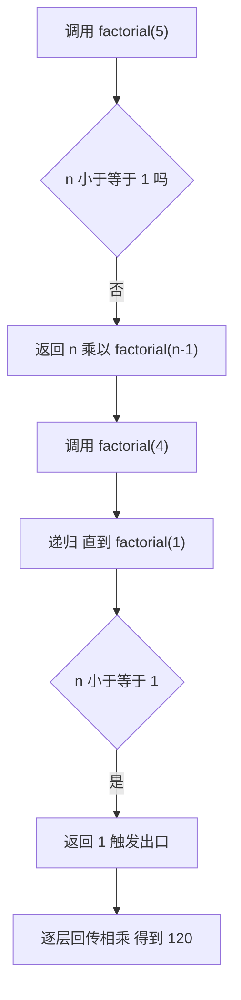

# 04 · 函数（Functions）

> 函数是 JavaScript 中可复用的代码块，也是一等公民（可赋值、传参、返回）。掌握声明方式、箭头函数、参数处理与递归。

## 📖 知识讲解

### 1. 函数声明 vs 函数表达式

- **函数声明** `function foo(){}`：会被**整体提升**，定义之前就能调用。
- **函数表达式** `const foo = function(){}`：赋值给变量，**不会提升**，必须先定义后调用。

### 2. 箭头函数

`(a, b) => a + b`。特点：

- 语法简洁：单表达式可省略 `return` 和 `{}`，单参数可省略 `()`。
- **没有自己的 `this`**：继承定义时外层作用域的 `this`，非常适合回调。
- 没有 `arguments`、不能用作构造函数、没有 `prototype`。

### 3. 参数处理

- **默认参数** `function f(x = 1)`：实参为 `undefined` 时用默认值。
- **剩余参数** `function f(...args)`：把多余实参收集成**真数组**。
- **arguments**：传统函数内的类数组对象，含全部实参；箭头函数没有。现代推荐用剩余参数替代。

### 4. 递归

函数调用自身。必备两要素：

- **基线条件（出口）**：停止递归，否则栈溢出。
- **递归条件**：每次调用让问题规模缩小，逐渐逼近出口。

## 🔄 流程图 / 原理图

## 💻 代码说明

- **declared vs expressed**：`declared()` 在定义前调用成功（提升）；表达式必须先赋值。
- **箭头函数**：`add`、`square`、`sayHi` 展示三种简写；`counter.makeIncrementer` 展示箭头函数继承外层 `this`，闭包计数 1、2。
- **greet()**：默认参数，不传时用"游客/欢迎"。
- **sum(...nums)**：剩余参数收集成数组后用 `reduce` 求和。
- **showArguments()**：用 `arguments` 取实参并 `Array.from` 转真数组。
- **factorial / fib**：经典递归，强调出口条件不可少。

## ▶️ 运行方式

- **浏览器**：打开 `index.html`，页面显示结果，F12 看控制台。
- **Node**：`node demo.js`。

## ⚠️ 常见坑 / 最佳实践

1. 箭头函数没有自己的 `this`，不能用作对象方法里需要动态 `this` 的场景，也不能当构造函数。
2. 函数表达式不会提升，调用顺序要注意。
3. 递归一定要写出口条件，否则 `Maximum call stack size exceeded`。
4. 用剩余参数 `...args` 取代老旧的 `arguments`，能直接用数组方法。
5. 默认参数只在实参严格等于 `undefined` 时生效，传 `null` 不会触发默认值。

## 🔗 官方文档

- [函数 - MDN](https://developer.mozilla.org/zh-CN/docs/Web/JavaScript/Guide/Functions)
- [箭头函数表达式 - MDN](https://developer.mozilla.org/zh-CN/docs/Web/JavaScript/Reference/Functions/Arrow_functions)
- [默认参数 - MDN](https://developer.mozilla.org/zh-CN/docs/Web/JavaScript/Reference/Functions/Default_parameters)
- [剩余参数 - MDN](https://developer.mozilla.org/zh-CN/docs/Web/JavaScript/Reference/Functions/rest_parameters)
- [arguments - MDN](https://developer.mozilla.org/zh-CN/docs/Web/JavaScript/Reference/Functions/arguments)
