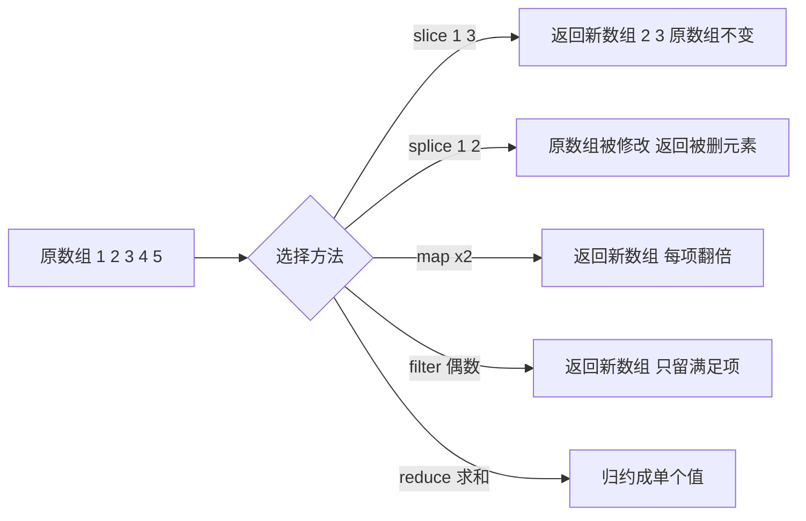

# 05 · 数组（Arrays）

> 数组是 JavaScript 最常用的数据结构，掌握创建、增删改查与常用方法，并分清哪些方法会修改原数组。

## 📖 知识讲解

### 1. 创建数组

- 字面量 `[1, 2, 3]`（最常用）
- `new Array(3)`（长度为 3 的空数组，注意歧义）
- `Array.of(7)` → `[7]`
- `Array.from('abc')` → `['a','b','c']`（从可迭代对象/类数组生成）

### 2. 方法分两类：是否修改原数组

| 修改原数组（mutating） | 不修改（返回新值） |
| ---------------------- | ------------------ |
| `push` `pop` `shift` `unshift` | `slice` `concat` `join` |
| `splice` `sort` `reverse` | `indexOf` `includes` `find` |
| `fill` | `map` `filter` `reduce` |

### 3. 常用方法速查

- `push/pop`：尾部增/删；`unshift/shift`：头部增/删。
- `slice(start, end)`：截取子数组，**含头不含尾**，负数从末尾算，不改原数组。
- `splice(start, count, ...items)`：万能增删改，**会改原数组**，返回被删元素。
- `concat`：合并返回新数组；现代可用扩展运算符 `[...a, ...b]`。
- `indexOf` / `includes`：查找索引 / 是否包含。
- `join(sep)`：用分隔符拼成字符串。
- `sort`：默认按**字符串**排序，数字排序必须传比较函数 `(a,b)=>a-b`；会改原数组。
- `reverse`：反转，会改原数组。

### 4. 遍历

`forEach`（纯遍历）、`map`（映射）、`filter`（过滤）、`reduce`（聚合）、`for...of`（取值）。

## 🔄 流程图 / 原理图

## 💻 代码说明

- **创建区**：对比字面量、`Array.of`、`Array.from` 的结果。
- **增删区**：`push/unshift/pop/shift` 依次操作并打印中间状态；`splice(1,2,'a','b')` 删 2 个插 2 个。
- **查找区**：`indexOf`、`includes`、`find`、`findIndex` 对比。
- **slice/concat 区**：`slice` 不改原数组（打印验证），`concat` 与扩展运算符两种合并方式。
- **sort 区**：故意展示默认 sort 把 `[10,1,21,2]` 排成 `[1,10,2,21]`（按字符串），再用 `(a,b)=>a-b` 修正。
- **遍历区**：`forEach/map/filter/reduce/for...of` 各演示一遍。

## ▶️ 运行方式

- **浏览器**：打开 `index.html`，页面显示结果，F12 看控制台。
- **Node**：`node demo.js`。

## ⚠️ 常见坑 / 最佳实践

1. `sort` 默认按字符串排序，数字一定要传比较函数 `(a,b)=>a-b`。
2. `sort`、`reverse`、`splice` 会**改原数组**，需要保留原数组先用 `[...arr]` 拷贝。
3. `slice` 含头不含尾；`splice` 第二个参数是"删除个数"，别和 `slice` 混淆。
4. 判断是否包含优先用 `includes`（能正确处理 `NaN`），`indexOf` 对 `NaN` 永远返回 -1。
5. 遍历需要返回新数组用 `map`，纯副作用用 `forEach`，不要混用。

## 🔗 官方文档

- [Array - MDN](https://developer.mozilla.org/zh-CN/docs/Web/JavaScript/Reference/Global_Objects/Array)
- [Array.prototype.splice - MDN](https://developer.mozilla.org/zh-CN/docs/Web/JavaScript/Reference/Global_Objects/Array/splice)
- [Array.prototype.slice - MDN](https://developer.mozilla.org/zh-CN/docs/Web/JavaScript/Reference/Global_Objects/Array/slice)
- [Array.prototype.sort - MDN](https://developer.mozilla.org/zh-CN/docs/Web/JavaScript/Reference/Global_Objects/Array/sort)
- [Array.prototype.reduce - MDN](https://developer.mozilla.org/zh-CN/docs/Web/JavaScript/Reference/Global_Objects/Array/reduce)
