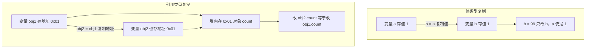

# 06 · 对象（Objects）
> 对象是 JavaScript 中最核心的复合数据类型，用「键值对」把相关的数据和行为打包在一起；理解它的「引用」特性是避开无数 bug 的关键。

## 📖 知识讲解

**对象字面量**：用一对花括号 `{}` 直接声明对象，里面是若干 `键: 值` 对（用逗号分隔）。值可以是任意类型：数字、字符串、数组、函数，甚至另一个对象。

**属性读写删除：**

| 操作 | 语法 | 说明 |
| --- | --- | --- |
| 读（点语法） | `obj.name` | 最常用，键名固定时使用 |
| 读（方括号） | `obj["name"]` / `obj[key]` | 键名是变量、含空格或特殊字符时必须用 |
| 写 | `obj.age = 19` | 键存在则修改，不存在则新增 |
| 删除 | `delete obj.age` | 删除整个键 |
| 判断存在 | `"age" in obj` | 包含继承属性；`obj.hasOwnProperty("age")` 只看自身属性 |

**方法与简写：** 值为函数的属性叫「方法」。ES6 支持方法简写 `add(n) {}`（省略 `function`）；当变量名与键名相同时支持属性简写 `{ name }`。

**值类型 vs 引用类型（重点）：**
- 值类型（`number`/`string`/`boolean`/`null`/`undefined`/`symbol`）：变量里存的是**值本身**，复制就是复制值，互不影响。
- 引用类型（`object`/`array`/`function`）：变量里存的是**内存地址（引用）**，复制只复制地址，多个变量指向**同一个对象**，改一个全变。

**浅拷贝 vs 深拷贝：**
- 浅拷贝（`{...obj}` / `Object.assign`）：只复制第一层，嵌套对象仍共享引用 → 改嵌套会污染原对象。
- 深拷贝（`structuredClone(obj)` / `JSON.parse(JSON.stringify(obj))`）：递归复制每一层，彻底独立。

**Object 常用静态方法：** `Object.keys/values/entries`（取键/值/键值对）、`Object.assign`（浅合并）、`Object.freeze`（冻结对象禁止增删改）。

**getter / setter（访问器属性）：** 用 `get`/`set` 把「读写」包装成方法，但调用时像普通属性一样（无需括号），常用于计算属性、数据校验、格式转换。

## 🔄 流程图 / 原理图

下图对比「值类型复制」与「引用类型复制」在内存中的差异，这是理解浅拷贝/深拷贝的根：

## 💻 代码说明

- 第 1 段：`user` 对象字面量，演示属性可嵌套数组和对象。
- 第 2 段：点语法 / 方括号语法读取，`obj[key]` 用变量当键名；`delete` 删除；`in` 与 `hasOwnProperty` 判断属性是否存在。
- 第 3 段：`add: function` 传统写法与 `sub(n) {}` 简写、`{ name, age }` 属性简写。
- 第 4 段：`b = a` 与 `obj2 = obj1` 对比——改 `obj2.count` 后 `obj1.count` 同步变 `999`，证明引用共享。
- 第 5 段：`{...original}` 浅拷贝污染了 `original.nested.level`；`JSON.parse(JSON.stringify(...))` 深拷贝彻底隔离。
- 第 6 段：`Object.keys/values/entries/assign/freeze`，注意 `freeze` 后修改静默失败。
- 第 7 段：`temperature` 对象的 `fahrenheit` 是访问器属性，读触发 `get`、写触发 `set`，自动换算摄氏/华氏。

## ▶️ 运行方式

- 浏览器：直接双击打开本目录 `index.html`，页面显示关键结果，按 F12 看控制台完整输出。
- Node：在本目录执行 `node demo.js`，终端打印全部结果（DOM 输出已用 `typeof document` 保护，不会报错）。

## ⚠️ 常见坑 / 最佳实践

- ❌ 误以为 `const obj2 = obj1` 是「复制对象」——其实共享同一引用，改一个全变。
- ❌ 用 `{...obj}` 浅拷贝后改嵌套对象，原对象被污染——嵌套数据需深拷贝。
- ⚠️ `JSON.parse(JSON.stringify())` 深拷贝会丢失 `function`、`undefined`、`Date` 变字符串、循环引用直接报错；优先用 `structuredClone()`。
- ⚠️ `Object.freeze` 是**浅冻结**，嵌套对象仍可改；需深冻结要递归。
- ✅ 判断「自身属性」用 `Object.hasOwn(obj, key)`（新）或 `obj.hasOwnProperty(key)`，而非 `in`（含继承属性）。
- ✅ 优先用方法简写和属性简写，代码更简洁。

## 🔗 官方文档

- [使用对象 - MDN](https://developer.mozilla.org/zh-CN/docs/Web/JavaScript/Guide/Working_with_objects)
- [Object - MDN](https://developer.mozilla.org/zh-CN/docs/Web/JavaScript/Reference/Global_Objects/Object)
- [getter - MDN](https://developer.mozilla.org/zh-CN/docs/Web/JavaScript/Reference/Functions/get)
- [setter - MDN](https://developer.mozilla.org/zh-CN/docs/Web/JavaScript/Reference/Functions/set)
- [Object.freeze() - MDN](https://developer.mozilla.org/zh-CN/docs/Web/JavaScript/Reference/Global_Objects/Object/freeze)
