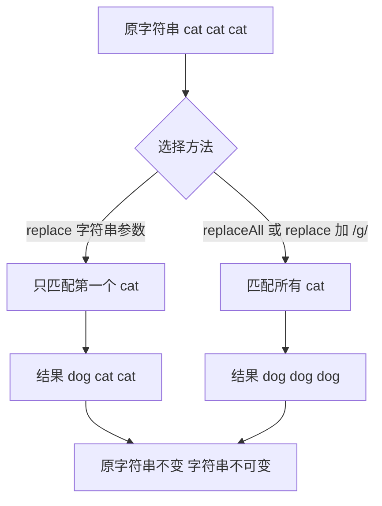

# 07 · 字符串（Strings）
> 字符串是文本处理的基础。掌握查找、截取、替换、拆分、补齐这一套常用方法，再加上模板字符串，几乎能搞定日常一切文本操作。

## 📖 知识讲解

字符串是**不可变（immutable）**的：所有方法都不会改变原字符串，而是**返回一个新字符串**。

**常用方法速查：**

| 方法 | 作用 | 示例 → 结果 |
| --- | --- | --- |
| `length` | 长度（属性，非方法） | `"abc".length` → `3` |
| `slice(start, end)` | 截取，**支持负数** | `"hello".slice(-2)` → `"lo"` |
| `substring(start, end)` | 截取，**不支持负数**，会自动交换大小参数 | `"hello".substring(5,0)` → `"hello"` |
| `indexOf(s)` | 查找下标，找不到返回 `-1` | `"abc".indexOf("b")` → `1` |
| `includes(s)` | 是否包含，返回布尔 | `"abc".includes("b")` → `true` |
| `replace(a, b)` | 替换**第一个** | `"a a".replace("a","x")` → `"x a"` |
| `replaceAll(a, b)` | 替换**全部** | `"a a".replaceAll("a","x")` → `"x x"` |
| `split(sep)` | 按分隔符拆成数组 | `"a,b".split(",")` → `["a","b"]` |
| `trim()` | 去两端空白 | `" a ".trim()` → `"a"` |
| `padStart(len, pad)` | 头部补齐到指定长度 | `"7".padStart(3,"0")` → `"007"` |
| `repeat(n)` | 重复 n 次 | `"ab".repeat(2)` → `"abab"` |
| `toUpperCase()` | 转大写 | `"ab".toUpperCase()` → `"AB"` |

**`slice` 与 `substring` 的关键区别：** `slice` 支持负数索引（从末尾倒数），`substring` 不支持（负数当 0），且 `substring` 会自动把较小值当起点。日常优先用 `slice`。

**模板字符串（Template literals）：** 用**反引号** `` ` `` 包裹，两大能力：
1. **插值** `${表达式}`：直接把变量/运算结果嵌进字符串，告别 `+` 拼接。
2. **多行**：反引号内可以直接换行，无需 `\n`。

## 🔄 流程图 / 原理图

下图展示「替换文本」时 `replace` 与 `replaceAll` 的处理流程差异：

## 💻 代码说明

- 第 1～2 段：`length` 取长度；`slice` 与 `substring` 对比，重点看 `slice(-11)` 负数与 `substring(5,0)` 自动交换参数。
- 第 3 段：`indexOf` 返回下标（找不到 `-1`）、`includes/startsWith/endsWith` 返回布尔。
- 第 4 段：`replace` 只换第一个、`replaceAll` 换全部、`replace(/cat/g, ...)` 用正则全局替换。
- 第 5 段：`split(",")` 拆成数组、`split("")` 拆成单字符、数组 `join` 合回字符串。
- 第 6～8 段：`trim` 去空白、`padStart` 补零（格式化时间 `09:05` 的实用例）、`repeat` 画分割线。
- 第 10 段：模板字符串 `` `${userName}` `` 插值与多行字符串。

## ▶️ 运行方式

- 浏览器：双击打开本目录 `index.html`，按 F12 看控制台完整输出。
- Node：本目录执行 `node demo.js`。

## ⚠️ 常见坑 / 最佳实践

- ⚠️ 字符串**不可变**，`str.toUpperCase()` 不改原字符串，要用返回值：`str = str.toUpperCase()`。
- ⚠️ `indexOf` 找不到返回 `-1` 而非 `false`，判断包含建议直接用 `includes`，语义更清晰。
- ⚠️ `slice` 支持负数、`substring` 不支持——拿不准就用 `slice`。
- ⚠️ `replace` 传字符串只替换第一个；要全部替换用 `replaceAll` 或 `replace(/x/g, ...)`。
- ✅ 拼接含变量的字符串优先用模板字符串，比 `+` 更清晰、不易漏空格。
- ✅ 补零、对齐用 `padStart/padEnd`，别手写 `if` 拼。

## 🔗 官方文档

- [String - MDN](https://developer.mozilla.org/zh-CN/docs/Web/JavaScript/Reference/Global_Objects/String)
- [模板字符串 - MDN](https://developer.mozilla.org/zh-CN/docs/Web/JavaScript/Reference/Template_literals)
- [String.prototype.slice() - MDN](https://developer.mozilla.org/zh-CN/docs/Web/JavaScript/Reference/Global_Objects/String/slice)
- [String.prototype.replaceAll() - MDN](https://developer.mozilla.org/zh-CN/docs/Web/JavaScript/Reference/Global_Objects/String/replaceAll)
- [String.prototype.padStart() - MDN](https://developer.mozilla.org/zh-CN/docs/Web/JavaScript/Reference/Global_Objects/String/padStart)
