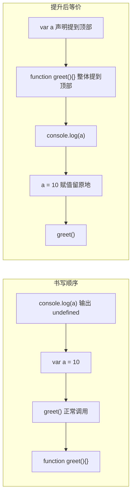
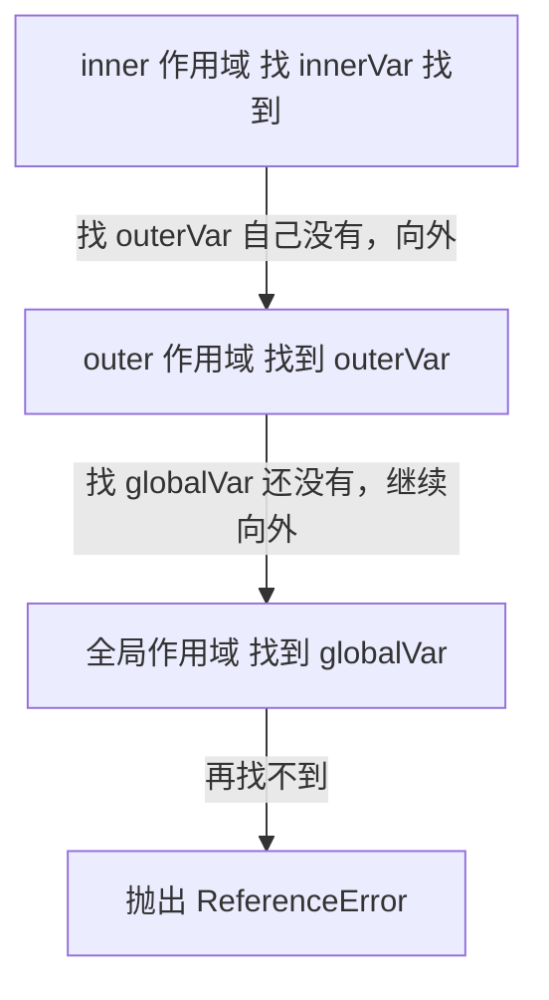

# 08 · 作用域与提升（Scope & Hoisting）
> 「变量在哪里能被访问到」由作用域决定；「为什么声明前就能用」由提升决定。搞懂这两点，才能解释 JS 里大量看似诡异的行为。

## 📖 知识讲解

**三种作用域：**

| 作用域 | 范围 | 由谁产生 |
| --- | --- | --- |
| 全局作用域 | 整个程序 | 最外层声明的变量 |
| 函数作用域 | 整个函数体内 | `var` 和函数内声明 |
| 块级作用域 | 一对 `{}` 内 | `let` / `const`（`var` 没有块作用域！） |

**变量提升（Hoisting）：** JS 引擎在执行前会先「扫描」代码，把声明提到所在作用域顶部。
- `var`：**声明被提升，赋值留在原地**。所以声明前访问得到 `undefined`（不报错）。
- 函数声明 `function foo(){}`：**整个函数被提升**，所以声明前就能调用。
- `let` / `const`：声明也会被提升，但存在**暂时性死区（TDZ）**——从作用域顶部到声明语句之间访问会直接抛 `ReferenceError`，而不是 `undefined`。

**作用域链（Scope Chain）：** 内层函数访问一个变量时，先在自己作用域找，找不到就逐层向外找，直到全局；全局还没有就报错。这条「由内向外的查找路径」就是作用域链。内层同名变量会**遮蔽（shadow）**外层。

## 🔄 流程图 / 原理图

**图 1：提升后，引擎眼中的代码顺序**（左为书写顺序，右为提升后等价顺序）：

**图 2：作用域链——内层 inner 逐层向外查找变量**

## 💻 代码说明

- 第 1 段：`print('var 提升', typeof hoistedVar)` 在声明前访问得到 `undefined`，证明 `var` 声明被提升、赋值留原地。
- 第 2 段：`greet()` 在 `function greet(){}` 之前调用却成功，证明函数声明整体提升。
- 第 3 段：`tdzDemo` 在 `let tdzVar` 之前访问它，捕获到 `ReferenceError`，演示暂时性死区。
- 第 4 段：块 `{}` 内的 `var blockVar` 泄漏到块外仍能访问，而 `let blockLet` 出块即销毁、访问报错——证明 `var` 无块作用域。
- 第 5 段：`inner` 返回 `内层 <- 外层 <- 全局`，演示作用域链逐层向外。
- 第 6 段：`shadow` 内的同名 `value` 遮蔽外层，外层不受影响。

## ▶️ 运行方式

- 浏览器：双击打开本目录 `index.html`，按 F12 看控制台完整输出。
- Node：本目录执行 `node demo.js`。

## ⚠️ 常见坑 / 最佳实践

- ❌ 依赖 `var` 提升写「声明前使用」的代码，可读性极差且易出 bug。
- ❌ 在循环、`if` 里用 `var` 定义变量，会泄漏到外层函数作用域造成意外覆盖。
- ⚠️ `let/const` 的 TDZ：别在声明前访问它们，会报 `ReferenceError`（这其实是好事，能尽早暴露错误）。
- ✅ **默认用 `const`，需要重新赋值才用 `let`，永远不用 `var`**——块级作用域更安全、更可预测。
- ✅ 变量「就近声明」，缩小作用域，减少命名冲突与遮蔽带来的困惑。

## 🔗 官方文档

- [作用域 - MDN 术语表](https://developer.mozilla.org/zh-CN/docs/Glossary/Scope)
- [变量提升 Hoisting - MDN](https://developer.mozilla.org/zh-CN/docs/Glossary/Hoisting)
- [let - MDN](https://developer.mozilla.org/zh-CN/docs/Web/JavaScript/Reference/Statements/let)
- [const - MDN](https://developer.mozilla.org/zh-CN/docs/Web/JavaScript/Reference/Statements/const)
- [闭包（含作用域链）- MDN](https://developer.mozilla.org/zh-CN/docs/Web/JavaScript/Closures)
