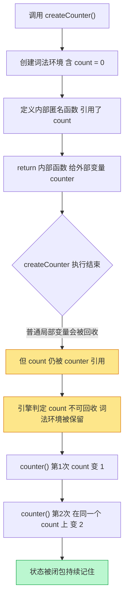
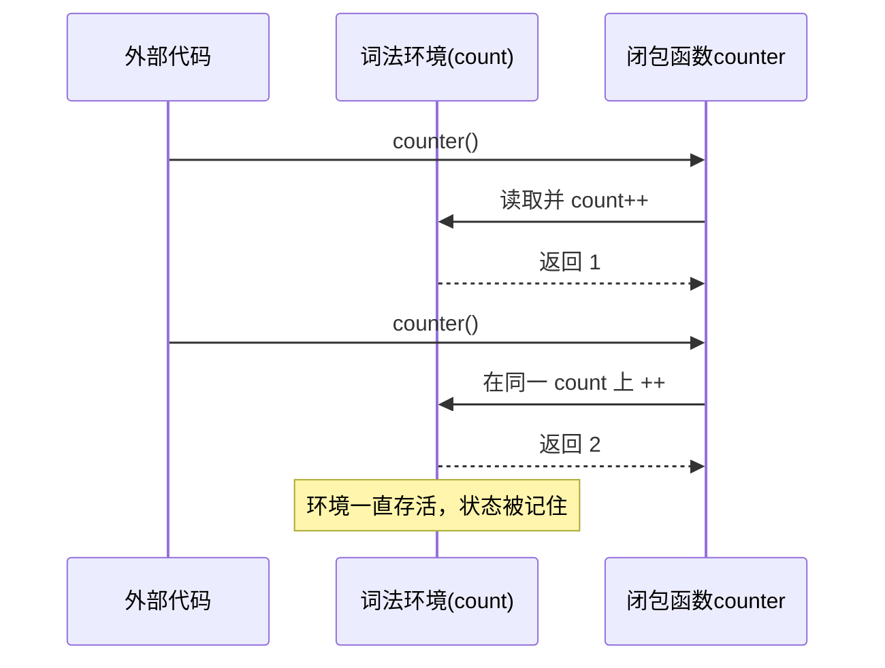

# 09 · 闭包（Closures）
> 闭包 = 一个函数 + 它「记住」并能持续访问的外层词法环境。即使外层函数已经执行完毕，被闭住的变量也不会被回收——这正是私有变量、计数器、柯里化的底层原理。

## 📖 知识讲解

**定义：** 当一个内部函数引用了外部函数的变量，并被「带出」外部函数（作为返回值、回调、事件处理器等）后，这个内部函数连同它引用的那些变量，就构成了**闭包**。

**词法作用域（Lexical Scope）：** 函数能访问哪些变量，在**定义时**（写代码时的位置）就决定了，而不是在调用时。内部函数天生「看得见」定义它时所处的外层变量。

**核心机制：** 通常函数执行完，其局部变量会被垃圾回收。但如果这些变量**仍被某个存活的内部函数引用**，引擎就**不会回收它们**——这块「被持有的词法环境」就一直存在，闭包因此能记住状态。

**两个易混点：**
- 每次调用外部函数都会创建**一份全新的**词法环境，所以两个计数器互不干扰。
- 多个闭包若引用的是**同一个**变量（如 `var` 循环里的 `i`），它们会共享并看到它的最终值。

**典型应用：** ① 私有变量 / 数据封装（外部拿不到内部 `balance`）；② 计数器 / 状态保持；③ 柯里化、函数工厂；④ 防抖节流、回调里保存上下文。

## 🔄 流程图 / 原理图

下图讲清「函数 + 词法环境 + 变量被持有不释放」的完整执行流程（以计数器为例）：

## 💻 代码说明

- 第 1 段 `createCounter`：`count` 是私有变量，返回的函数闭住它，每次 `counter()` 在同一个 `count` 上累加；`counter2` 拥有独立环境，从 1 重新开始。
- 第 2 段循环陷阱：`var i` 无块作用域，三个回调闭住**同一个** `i`，循环结束 `i=3`，故全是 `3`；改成 `let i` 后每轮生成全新的 `i`，得到 `0,1,2`。
- 第 3 段 `createBankAccount`：`balance` 被闭包封装，只能通过 `deposit/withdraw/getBalance` 操作，`account.balance` 直接访问得到 `undefined`，实现「私有」。
- 第 4 段 `add(a)(b)(c)`：柯里化，每层函数闭住前面的参数；`add(10)` 生成固定首参的专用函数 `add10`。

## ▶️ 运行方式

- 浏览器：双击打开本目录 `index.html`，按 F12 看控制台完整输出。
- Node：本目录执行 `node demo.js`。

## ⚠️ 常见坑 / 最佳实践

- ❌ 循环里用 `var` + 闭包（定时器、事件监听）——回调全部拿到最终值。改用 `let`，或用 IIFE 立即传值。
- ⚠️ 闭包会让被引用的变量常驻内存，**滥用可能导致内存泄漏**；不再需要时把引用置 `null`。
- ⚠️ 闭包记住的是**变量本身**（引用），不是定义那一刻的「值快照」——所以共享变量会看到最新值。
- ✅ 用闭包做数据封装/私有变量，比挂在全局或对象上更安全。
- ✅ 防抖（debounce）、节流（throttle）、缓存（memoize）都是闭包的经典落地场景。

## 🔗 官方文档

- [闭包 Closures - MDN](https://developer.mozilla.org/zh-CN/docs/Web/JavaScript/Closures)
- [函数 Functions - MDN](https://developer.mozilla.org/zh-CN/docs/Web/JavaScript/Guide/Functions)
- [IIFE 立即执行函数 - MDN](https://developer.mozilla.org/zh-CN/docs/Glossary/IIFE)
