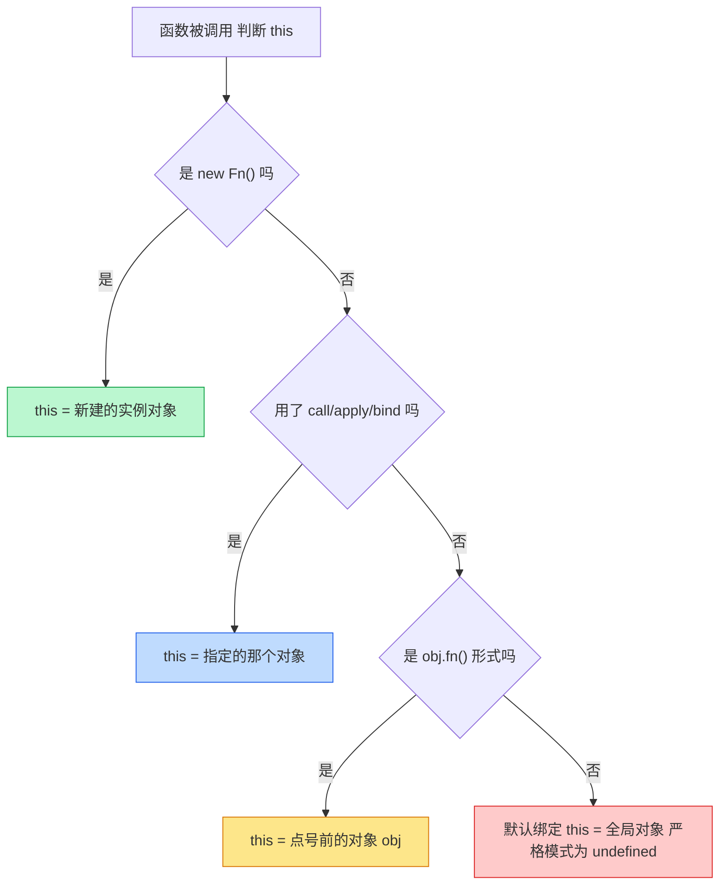

# 10 · this 绑定（this Binding）
> `this` 不是定义时决定的，而是**函数被调用时**根据「谁调用、怎么调用」才确定。记住四条绑定规则和它们的优先级，`this` 就不再玄学。

## 📖 知识讲解

**四种绑定规则（按优先级从低到高）：**

| 优先级 | 规则 | 怎么调用 | this 指向 |
| --- | --- | --- | --- |
| 1（最低） | 默认绑定 | `fn()` 独立调用 | 全局对象（严格模式下 `undefined`） |
| 2 | 隐式绑定 | `obj.fn()` 作为方法调用 | 点号前面的对象 `obj` |
| 3 | 显式绑定 | `fn.call/apply/bind(obj)` | 手动指定的 `obj` |
| 4（最高） | new 绑定 | `new Fn()` | 新创建的实例对象 |

**记忆口诀：new > 显式（call/apply/bind）> 隐式（obj.fn）> 默认（裸调用）。**

**call / apply / bind 区别：**
- `call(thisArg, a, b)`：立即执行，参数**逐个**传。
- `apply(thisArg, [a, b])`：立即执行，参数用**数组**传。
- `bind(thisArg, ...)`：**不执行**，返回一个 `this` 被永久绑定的新函数。

**箭头函数的 this（特殊）：** 箭头函数**没有自己的 this**，它捕获**定义时**外层作用域的 this（词法 this），且无法被 `call/apply/bind` 改变。因此非常适合做回调，避免 this 丢失。

**this 丢失：** 把对象方法赋值给变量再单独调用（`const f = obj.fn; f()`），或作为回调传入（`setTimeout(obj.fn)`），会退化成默认绑定，`this` 不再指向原对象——这是最常见的坑。

## 🔄 流程图 / 原理图

下图是判断 `this` 指向的「四步决策树」，从高优先级往下问：

> 补充：箭头函数不进入上面这棵树——它直接「继承」定义时外层的 this。

## 💻 代码说明

- 规则 1 `showThisType`：裸调用 `showThisType()`，默认绑定，this 为全局对象或 `undefined`。
- 规则 2 `user.greet()`：隐式绑定，this 指向 `user`；而 `const bareGreet = user.greet; bareGreet()` 丢失绑定，演示「隐式丢失」。
- 规则 3 `introduce`：`call('北京'...)` 逐个传参、`apply(['上海'...])` 数组传参、`bind(person,'广州')` 返回新函数延迟调用。
- 规则 4 `new Animal('旺财')`：new 绑定，this 指向新实例 `dog`。
- 优先级：`objA.who.bind(objB)()` 返回 `B`，证明显式绑定优先于隐式。
- 箭头函数：`listWrong` 用普通函数回调，this 丢失取不到 `name`；`listRight` 用箭头函数捕获外层 `team`，正确取到 `前端组`。

## ▶️ 运行方式

- 浏览器：双击打开本目录 `index.html`，按 F12 看控制台完整输出。
- Node：本目录执行 `node demo.js`。

## ⚠️ 常见坑 / 最佳实践

- ❌ `const f = obj.method; f()` 或 `setTimeout(obj.method, 0)`——this 丢失。修复：`obj.method.bind(obj)` 或用箭头函数包一层。
- ❌ 给对象方法用箭头函数（`obj = { fn: () => this.x }`）——箭头函数的 this 是定义时外层（通常是全局），拿不到 `obj`。对象方法应该用普通函数 / 方法简写。
- ✅ 回调（`map/forEach/setTimeout`）里需要外层 this 时，优先用箭头函数。
- ✅ 需要把 this 固定下来反复使用时，用 `bind` 生成绑定好的函数。
- ⚠️ class 中把方法传给事件监听前，常用 `bind(this)` 或类字段箭头函数避免 this 丢失。

## 🔗 官方文档

- [this - MDN](https://developer.mozilla.org/zh-CN/docs/Web/JavaScript/Reference/Operators/this)
- [Function.prototype.call() - MDN](https://developer.mozilla.org/zh-CN/docs/Web/JavaScript/Reference/Global_Objects/Function/call)
- [Function.prototype.apply() - MDN](https://developer.mozilla.org/zh-CN/docs/Web/JavaScript/Reference/Global_Objects/Function/apply)
- [Function.prototype.bind() - MDN](https://developer.mozilla.org/zh-CN/docs/Web/JavaScript/Reference/Global_Objects/Function/bind)
- [箭头函数 - MDN](https://developer.mozilla.org/zh-CN/docs/Web/JavaScript/Reference/Functions/Arrow_functions)
