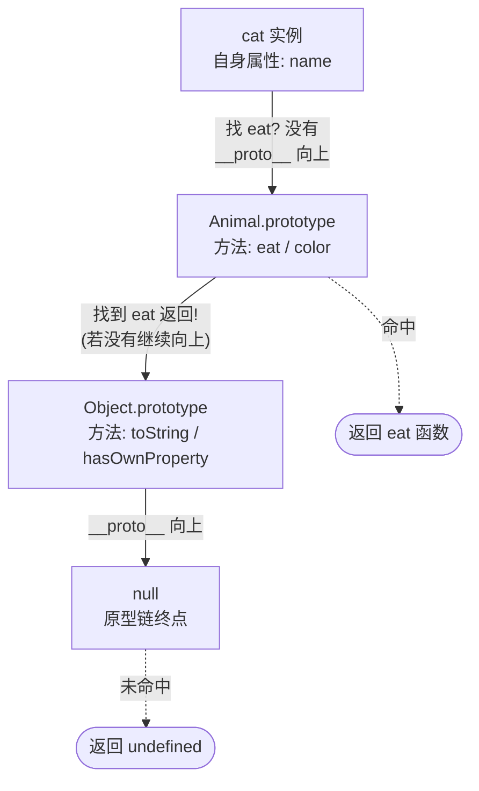
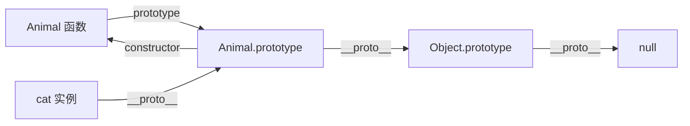

# 11 · 原型与原型链（Prototype & Prototype Chain）

> JavaScript 没有传统类，对象通过「原型链」共享属性和方法；理解 prototype / __proto__ / 查找规则，是看懂继承、class、instanceof 的基础。

## 📖 知识讲解

### 三个最容易混淆的概念

| 名称 | 属于谁 | 含义 |
| --- | --- | --- |
| `prototype` | **函数**专有的属性 | 指向「用 new 创建出的实例」共享的原型对象 |
| `[[Prototype]]` | 每个**对象**的内部隐藏槽位 | 规范术语，指向自己的原型 |
| `__proto__` | 每个对象（访问器） | 读写 `[[Prototype]]` 的非标准但通用方式，现代推荐 `Object.getPrototypeOf` / `Object.setPrototypeOf` |

关键等式：**`实例.__proto__ === 构造函数.prototype`**。

### 原型链查找规则

访问 `obj.x` 时，引擎按如下顺序查找：

1. 先在 `obj` **自身**找；
2. 找不到就去 `obj.__proto__` 找；
3. 再找不到就继续沿 `__proto__` 一层层往上；
4. 直到某层是 `null`（链的终点），仍没有就返回 `undefined`。

写入属性 `obj.x = 1` 则**只作用于自身**，不会修改原型。

### 核心 API

- `构造函数 + new`：`this` 指向新实例，方法挂 `Ctor.prototype` 上由所有实例共享。
- `Object.create(proto)`：以 `proto` 为原型创建新对象；`Object.create(null)` 得到无原型的纯净对象。
- `instanceof`：判断「构造函数的 `prototype`」是否出现在对象的原型链上。
- `hasOwnProperty(key)`：只看**自身**属性，继承来的返回 `false`；`in` 运算符则会顺链查找。

## 🔄 流程图 / 原理图

读取 `cat.eat()` 时，沿原型链逐级查找的过程：

构造函数、实例、原型三者的指向关系：

## 💻 代码说明

- **第一部分** 验证 `cat.__proto__ === Animal.prototype`，并指出只有函数才有 `prototype` 属性。
- **第二部分** 用三条 `getPrototypeOf` 断言把 `cat → Animal.prototype → Object.prototype → null` 这条链完整串起来。
- **第三部分** `Object.create(base)` 直接指定原型；`Object.create(null)` 演示无原型对象连 `toString` 都没有。
- **第四部分** `myInstanceof` 手写实现，用 `while` 循环沿链比对，揭示 `instanceof` 的本质。
- **第五部分** 对比 `hasOwnProperty`（仅自身）与 `in`（含继承），并给出 `Object.prototype.hasOwnProperty.call` 的安全写法。

## ▶️ 运行方式

- 浏览器：直接双击打开 `index.html`，按 F12 看控制台。
- Node：在本目录执行 `node demo.js`。

## ⚠️ 常见坑 / 最佳实践

- **不要用 `__proto__` 写业务代码**：它非标准且会影响性能，读写原型请用 `Object.getPrototypeOf` / `Object.setPrototypeOf`。
- **方法放原型、数据放实例**：方法挂 `prototype` 被所有实例共享；若把方法写进构造函数内部，每个实例都会复制一份，浪费内存。
- **`typeof null === 'object'` 与 `instanceof` 跨 iframe 失效**：判断类型尽量用 `Array.isArray`、`Object.prototype.toString.call`。
- **`for...in` 会遍历继承属性**：需要只看自身属性时用 `Object.keys` 或配合 `hasOwnProperty` 过滤。
- **直接调用 `obj.hasOwnProperty` 可能被对象自身同名属性覆盖**，用 `Object.prototype.hasOwnProperty.call(obj, key)` 更稳妥。

## 🔗 官方文档

- [对象原型 - MDN](https://developer.mozilla.org/zh-CN/docs/Web/JavaScript/Guide/Inheritance_and_the_prototype_chain)
- [Object.create() - MDN](https://developer.mozilla.org/zh-CN/docs/Web/JavaScript/Reference/Global_Objects/Object/create)
- [instanceof - MDN](https://developer.mozilla.org/zh-CN/docs/Web/JavaScript/Reference/Operators/instanceof)
- [Object.prototype.hasOwnProperty() - MDN](https://developer.mozilla.org/zh-CN/docs/Web/JavaScript/Reference/Global_Objects/Object/hasOwnProperty)
