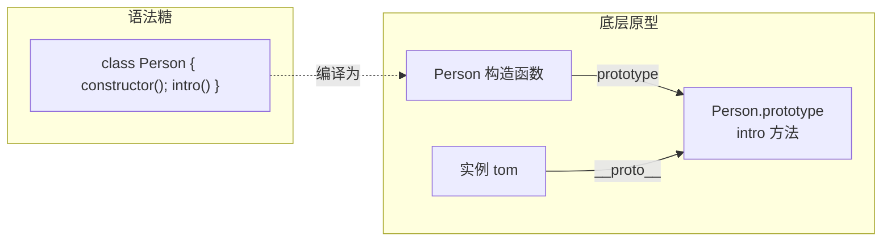
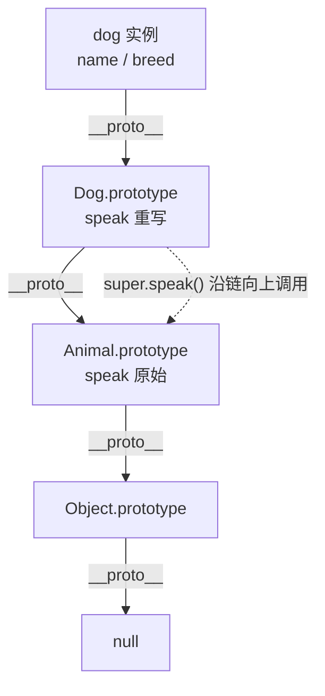

# 12 · ES6 类（Class）

> `class` 是基于原型继承的「语法糖」，让面向对象写法更清晰；它统一了构造函数、原型方法、继承、封装等概念。

## 📖 知识讲解

### 核心语法

- **`constructor`**：`new` 时自动调用，初始化实例属性；一个类最多一个。
- **实例方法**：写在类体里的方法，本质被定义在 `类.prototype` 上，**所有实例共享**。
- **类字段（class fields）**：直接写 `species = '人类'`，等价于在 constructor 里 `this.species = '人类'`。
- **`static`**：静态字段/方法挂在**类本身**上，用「类名.成员」调用，实例访问不到，常用于工具函数与工厂方法。
- **`get` / `set`**：把方法伪装成属性，读写时自动触发，便于做计算属性或赋值校验。
- **私有字段 `#name`**：真正私有，必须在类体里先声明，类外部访问会直接语法报错。
- **`extends` / `super`**：`extends` 建立继承；子类 constructor 里**必须先调用 `super()`** 才能用 `this`；`super.method()` 可复用父类逻辑。

### class 与原型的关系

`class` 不是新的对象模型，它只是把「构造函数 + prototype」写得更顺手。验证：`Person.prototype.intro` 确实存在，`new Person()` 的实例 `__proto__` 就指向 `Person.prototype`。

## 🔄 流程图 / 原理图

class 语法糖与底层原型的对应关系：

`extends` 形成的继承链（实例 → 子类原型 → 父类原型 → Object）：

## 💻 代码说明

- **一、基本 class**：`Person` 含类字段 `species`、constructor、实例方法 `intro`；末尾断言证明 `intro` 在原型上、实例 `__proto__` 指向 `Person.prototype`。
- **二、static**：`MathUtil.PI` / `MathUtil.add` 用类名调用，实例上拿不到。
- **三、getter/setter**：`Circle.area` 像属性一样读取（无括号），`set radius` 做正数校验。
- **四、私有字段**：`BankAccount.#balance` 只能在类内读写，外部通过 `get balance` 暴露只读视图。
- **五、extends/super**：`Dog` 继承 `Animal`，constructor 先 `super(name)`，`speak` 用 `super.speak()` 复用父类后再拼接，`instanceof` 验证父类也在链上。

## ▶️ 运行方式

- 浏览器：直接双击打开 `index.html`，按 F12 看控制台。
- Node：在本目录执行 `node demo.js`。

## ⚠️ 常见坑 / 最佳实践

- **子类 constructor 不调用 `super()` 就用 `this` 会报错**（ReferenceError）；如果子类不写 constructor，会自动生成一个转发参数的默认版本。
- **class 默认严格模式且不提升**：在声明前使用会落入暂时性死区（TDZ），不能像函数声明那样提前调用。
- **方法里的 `this` 取决于调用方式**：把实例方法当回调传出去（如 `setTimeout(obj.fn)`）会丢失 `this`，需用箭头函数或 `bind`。
- **私有字段用 `#` 而非下划线**：`_x` 只是约定，外部仍能访问；`#x` 才是语言级私有。
- **静态成员不要用实例调用**：`new MathUtil().add` 是 `undefined`，应 `MathUtil.add`。

## 🔗 官方文档

- [类 Class - MDN](https://developer.mozilla.org/zh-CN/docs/Web/JavaScript/Reference/Classes)
- [extends - MDN](https://developer.mozilla.org/zh-CN/docs/Web/JavaScript/Reference/Classes/extends)
- [私有类字段 - MDN](https://developer.mozilla.org/zh-CN/docs/Web/JavaScript/Reference/Classes/Private_class_fields)
- [getter - MDN](https://developer.mozilla.org/zh-CN/docs/Web/JavaScript/Reference/Functions/get)
