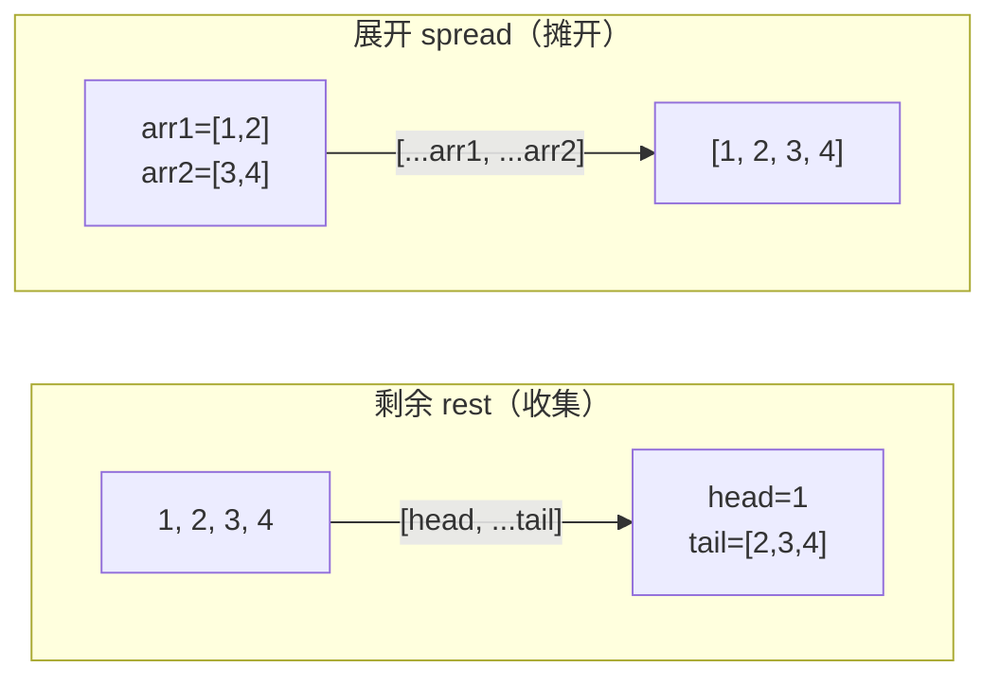
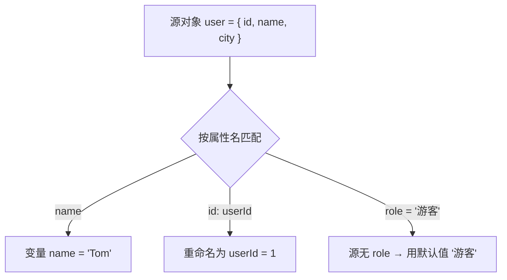

# 13 · 解构赋值与展开运算符（Destructuring & Spread）

> 解构让你从数组/对象里「按结构」快速取值，展开运算符 `...` 让你把集合「摊开」复制、合并、传参；两者大幅减少样板代码。

## 📖 知识讲解

### 解构赋值（Destructuring）

- **数组解构**：按**位置**取值 `const [a, b] = arr`；可用逗号跳过、`= 默认值` 兜底、`[m, n] = [n, m]` 交换变量。
- **对象解构**：按**属性名**取值 `const { name } = obj`；`{ name: newName }` 重命名；`{ x = 1 }` 默认值。
- **嵌套解构**：左边写出与数据相同的结构，一次取出深层字段。
- **默认值只在值为 `undefined` 时生效**，`null` 不会触发默认值。

### 剩余 / 展开（Rest / Spread）——同样是 `...`，位置决定含义

| 形态 | 名称 | 作用 |
| --- | --- | --- |
| `const [a, ...rest] = arr` | 剩余元素 | 在**左侧/形参**，把剩下的**收集**成数组/对象 |
| `[...arr1, ...arr2]` | 展开 | 在**右侧/调用处**，把集合**摊开** |
| `fn(...args)` | 展开 | 把数组摊成多个实参 |
| `function fn(...args)` | 剩余参数 | 把多个实参收集成数组 |

`...` 做的合并/复制是**浅拷贝**：只复制第一层，嵌套对象仍是同一引用。

## 🔄 流程图 / 原理图

`...` 在「收集」与「摊开」两种场景下的方向：

对象解构 + 重命名 + 默认值的匹配过程：

## 💻 代码说明

- **一、数组解构**：位置取值、逗号跳过、默认值（仅 `undefined` 触发）、`[m, n] = [n, m]` 交换。
- **二、对象解构**：基础取值、`name: userName` 重命名、`role = '游客'` 默认值。
- **三、嵌套解构**：从 `profile` 一次取出 `user.name`、`user.address.city`、`tags[0]`。
- **四、剩余 rest**：`[head, ...tail]` 与 `{ id, ...others }` 把剩余收集成新数组/对象。
- **五、展开 spread**：数组合并、对象合并（后者覆盖）、`Math.max(...arr)` 传参、`[...'abc']` 拆字符串。
- **六、函数参数解构**：`createUser({ name, age = 18 } = {})` 形参解构 + 默认值 + `= {}` 兜底；`sum(...nums)` 剩余参数求和。

## ▶️ 运行方式

- 浏览器：直接双击打开 `index.html`，按 F12 看控制台。
- Node：在本目录执行 `node demo.js`。

## ⚠️ 常见坑 / 最佳实践

- **对缺省参数解构会报错**：`function fn({ a }) {}` 在调用 `fn()` 时报 `Cannot destructure ... undefined`，务必给 `= {}` 默认值兜底。
- **默认值不对 `null` 生效**：只有 `undefined` 才触发默认值，传 `null` 会原样保留。
- **`...` 是浅拷贝**：`{ ...obj }` 只复制第一层，嵌套对象/数组仍共享引用，深拷贝需 `structuredClone` 或递归。
- **块级语句开头用对象解构要加括号**：`({ a } = obj)`，否则 `{` 被当作代码块导致语法错误。
- **对象展开顺序很重要**：`{ ...base, ...patch }` 中后者覆盖前者，调换顺序结果不同。

## 🔗 官方文档

- [解构赋值 - MDN](https://developer.mozilla.org/zh-CN/docs/Web/JavaScript/Reference/Operators/Destructuring_assignment)
- [展开语法 - MDN](https://developer.mozilla.org/zh-CN/docs/Web/JavaScript/Reference/Operators/Spread_syntax)
- [剩余参数 - MDN](https://developer.mozilla.org/zh-CN/docs/Web/JavaScript/Reference/Functions/rest_parameters)
