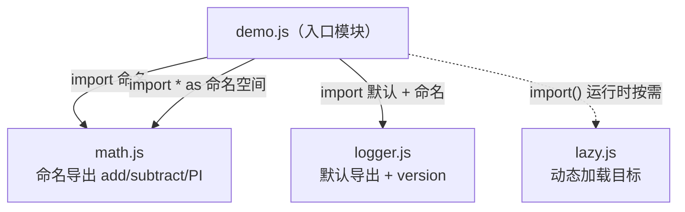
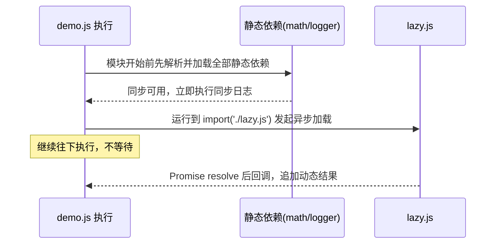

# 14 · ES Module（ESM）

> ESM 是 JavaScript 官方的模块标准，用 `export` 导出、`import` 导入，浏览器和 Node 原生支持；它取代了零散的 `<script>` 全局变量与 CommonJS。

## 📖 知识讲解

### 导出（export）

- **命名导出**：`export const PI = ...` 或 `export { add, subtract }`，一个模块可有多个，导入时名字要对应。
- **默认导出**：`export default fn`，一个模块**最多一个**，导入时名字可任取。
- 两者可共存（见 `logger.js`：默认导出 + 命名导出 `version`）。

### 导入（import）

| 写法 | 作用 |
| --- | --- |
| `import { add, PI } from './math.js'` | 命名导入，花括号里名字要匹配 |
| `import { add as plus } from './math.js'` | 导入时重命名 |
| `import createLogger from './logger.js'` | 默认导入，名字自取 |
| `import * as math from './math.js'` | 整体导入为命名空间对象 |
| `const mod = await import('./lazy.js')` | **动态导入**，返回 Promise，运行时按需加载 |

### ESM 与 CommonJS 区别

| 维度 | ESM | CommonJS（Node 旧标准） |
| --- | --- | --- |
| 语法 | `import` / `export` | `require()` / `module.exports` |
| 加载时机 | **静态**，编译期确定依赖，可做 Tree-shaking | **运行时**动态 require |
| 绑定 | 导出的是**实时只读引用** | 导出的是值的拷贝 |
| 顶层 import | 必须在模块顶部、路径为字符串字面量 | require 可在任意位置、路径可为变量 |
| 加载方式 | 异步、严格模式、需 http(s) 或 type=module | 同步 |

## 🔄 流程图 / 原理图

模块依赖与四种导入方式：



静态 import 与动态 import() 的执行时序：



## 💻 代码说明

- `math.js`：两种命名导出写法（声明即导出 / 末尾 `export { }`）。
- `logger.js`：`export default` 默认导出 + 命名导出 `version` 共存。
- `lazy.js`：动态导入的目标，仅在需要时加载。
- `demo.js`（入口）：顶部静态导入演示命名/默认/`* as` 三种方式；末尾用 `import('./lazy.js').then()` 演示动态导入，并通过日志说明「同步行先打印、异步结果后到」。

## ▶️ 运行方式

ESM **不能用 `file://` 直接双击打开**（浏览器会以 CORS 安全策略拦截跨源模块）。二选一：

1. **Node 运行**（本目录已含 `package.json` 的 `"type": "module"`）：
   ```bash
   node demo.js
   ```
2. **本地服务器 + 浏览器**：在本目录起一个静态服务器再访问，例如：
   ```bash
   npx serve          # 或
   python3 -m http.server 8080
   ```
   然后浏览器打开 `http://localhost:8080/index.html`，F12 看控制台。

## ⚠️ 常见坑 / 最佳实践

- **双击 file:// 打开报 CORS 错误**：ESM 必须经 http(s) 加载，务必用本地服务器或 node。
- **浏览器里 `<script>` 必须加 `type="module"`**，否则 `import` 语法直接报错。
- **浏览器导入路径必须带扩展名**（`./math.js`），不能省略 `.js`；且需是相对/绝对路径或带映射的裸包名。
- **import 会被提升且静态解析**：路径不能是运行时变量，需要条件/变量路径时用动态 `import()`。
- **ESM 默认严格模式**，顶层 `this` 是 `undefined`，没有 `require`/`module`/`__dirname`（Node 中用 `import.meta.url` 替代）。
- **不要混用** `require` 与 `import`；Node 项目用 `"type":"module"` 或 `.mjs` 明确语义。

## 🔗 官方文档

- [JavaScript 模块 - MDN](https://developer.mozilla.org/zh-CN/docs/Web/JavaScript/Guide/Modules)
- [import - MDN](https://developer.mozilla.org/zh-CN/docs/Web/JavaScript/Reference/Statements/import)
- [export - MDN](https://developer.mozilla.org/zh-CN/docs/Web/JavaScript/Reference/Statements/export)
- [动态 import() - MDN](https://developer.mozilla.org/zh-CN/docs/Web/JavaScript/Reference/Operators/import)
