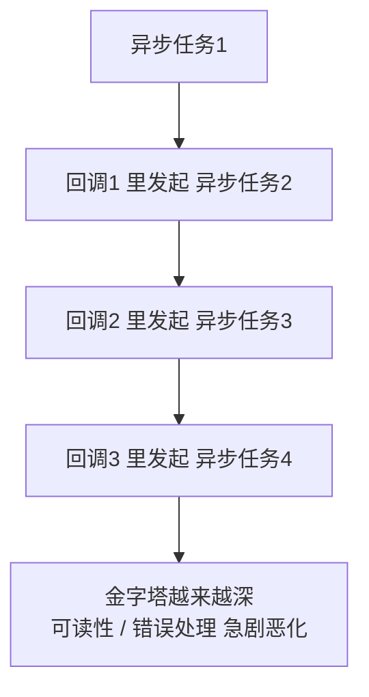

# 15 · 回调函数（Callbacks）

> 回调就是「把一个函数当参数传给另一个函数，让它在合适时机替你调用」；它是 JavaScript 异步编程的最基础形态，也是理解 Promise / async-await 的前置知识。

## 📖 知识讲解

### 什么是回调

把函数 A 作为参数传给函数 B，由 B 决定何时执行 A，A 就是「回调函数」。常见于事件监听、数组遍历、定时器、网络请求等场景。

### 同步回调 vs 异步回调

| 类型 | 何时执行 | 例子 |
| --- | --- | --- |
| **同步回调** | 在当前函数内**立即**调用，顺序可预测 | `arr.forEach`、`arr.map`、`arr.sort` |
| **异步回调** | 登记后**稍后**执行，不阻塞后续代码 | `setTimeout`、事件监听、`fetch` 回调 |

关键模型：同步代码先在**调用栈**跑完，异步回调被放进**任务队列**，等栈清空后由**事件循环**取出执行。所以 `setTimeout(fn, 0)` 也会排在所有同步代码**之后**。

### 回调地狱（callback hell）

多个异步操作必须**按顺序**执行时，回调不断向内嵌套，形成向右倾斜的「金字塔」，导致：可读性差、错误处理重复、难以维护扩展。解决方案是 Promise 链与 async/await（后续模块）。

### 错误优先回调（error-first）

Node.js 的约定：回调**第一个参数固定是 `error`**，成功时为 `null`，数据放在第二个参数。调用方先判断 `err` 再用 `data`。

## 🔄 流程图 / 原理图

同步回调 vs 异步回调进入任务队列的过程：

```mermaid
sequenceDiagram
    participant Stack as 调用栈(同步)
    participant Queue as 任务队列
    participant Loop as 事件循环
    Stack->>Stack: forEach 同步回调立即执行
    Stack->>Queue: setTimeout 把回调登记进队列
    Stack->>Stack: 继续执行剩余同步代码
    Note over Stack: 同步代码全部执行完，栈清空
    Loop->>Queue: 取出排队的异步回调
    Queue-->>Stack: 放回栈中执行
```

回调地狱的嵌套结构（层层向右缩进）：



## 💻 代码说明

- **一、概念**：`greet(name, callback)` 在内部调用传入的 `callback`，展示回调的本质。
- **二、同步回调**：`forEach` 在循环中立即执行，证明它在「之后那行」之前完成。
- **三、异步回调**：用 `①②③④` 序号标注，`setTimeout`（含延时 0）的回调一定排在同步 `②` 之后。
- **四、回调地狱**：`fakeAsync` 三层嵌套演示金字塔结构与其维护问题，并指出 Promise/async 是出路。
- **五、error-first**：`readConfig` 成功时 `callback(null, data)`、失败时 `callback(err, null)`，调用方先 `if (err) return` 再用数据。

## ▶️ 运行方式

- 浏览器：直接双击打开 `index.html`，按 F12 看控制台（异步结果约 1 秒后陆续追加）。
- Node：在本目录执行 `node demo.js`。

## ⚠️ 常见坑 / 最佳实践

- **同步/异步顺序误判**：`setTimeout(fn, 0)` 不是「马上执行」，它仍排在所有同步代码之后；不要依赖它做即时计算。
- **回调里丢失 `this`**：把对象方法直接当回调传出会丢 `this`，用箭头函数或 `bind` 固定。
- **回调地狱**：超过两三层嵌套就该改用 Promise 链或 async/await。
- **错误必须处理**：error-first 回调里别忘了 `if (err) return`，否则 `data` 可能为 `null` 引发后续报错。
- **不要在回调里 `throw` 跨越异步边界**：异步回调抛出的错误无法被外层 `try/catch` 捕获，应通过回调参数传递错误。

## 🔗 官方文档

- [回调函数 - MDN](https://developer.mozilla.org/zh-CN/docs/Glossary/Callback_function)
- [setTimeout() - MDN](https://developer.mozilla.org/zh-CN/docs/Web/API/Window/setTimeout)
- [事件循环 - MDN](https://developer.mozilla.org/zh-CN/docs/Web/JavaScript/Reference/Execution_model)
