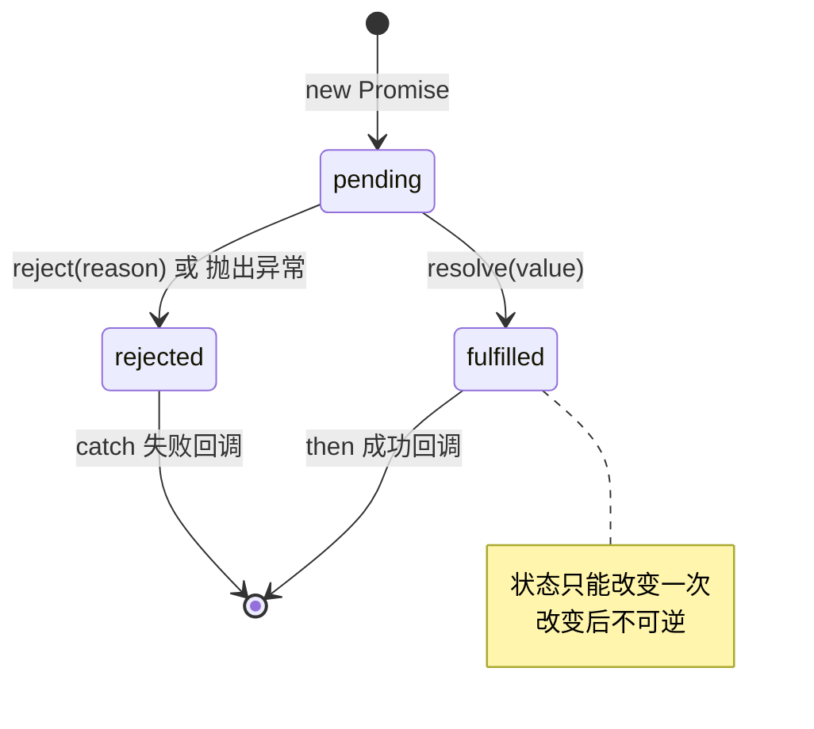
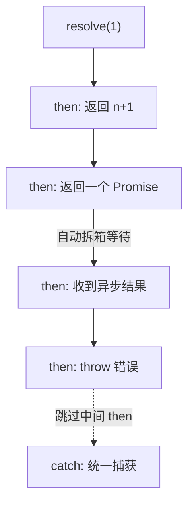

# 16 · Promise（Promise）

> Promise 是 JS 处理异步操作的标准对象：它代表一个"现在还没有、但未来会有结果"的值，用链式调用取代回调地狱。

## 📖 知识讲解

### 三种状态（state）

一个 Promise 永远处于以下三种状态之一，且**只能从 pending 改变一次**，之后被"锁死"：

| 状态 | 含义 | 触发方式 |
| --- | --- | --- |
| `pending` | 进行中（初始态） | `new Promise` 时 |
| `fulfilled` | 已成功 | 执行器里调用 `resolve(value)` |
| `rejected` | 已失败 | 执行器里调用 `reject(reason)` 或抛出异常 |

### 核心 API

- `new Promise((resolve, reject) => {...})`：构造时 **executor 同步立即执行**。
- `.then(onFulfilled, onRejected)`：注册成功/失败回调，**返回一个新 Promise**（所以能链式）。
- `.catch(onRejected)`：等价于 `.then(null, onRejected)`，捕获链路上任何错误。
- `.finally(onFinally)`：无论成败都执行，**不接收值**，常用于收尾（关闭 loading）。

### 静态方法

| 方法 | 何时敲定 | 结果 |
| --- | --- | --- |
| `Promise.all` | 全部成功 / 任一失败 | 成功结果数组；失败给第一个错误 |
| `Promise.race` | 第一个敲定（不论成败） | 采用最先敲定者的结果 |
| `Promise.allSettled` | 全部敲定 | 每项 `{status, value/reason}`，永不 reject |
| `Promise.any` | 第一个成功 / 全部失败 | 第一个成功值；全失败给 `AggregateError` |
| `Promise.resolve / reject` | 立即 | 快速生成已敲定的 Promise |

## 🔄 流程图 / 原理图

### Promise 三态流转

### then 链式传值

## 💻 代码说明

- **三态演示**：`resolve` 后再次调用 `resolve` 无效，证明状态被锁死。
- **链式调用**：`then` 里 `return 普通值` 会传给下一个 `then`；`return Promise` 则会等它敲定并拆箱；任意一步 `throw` 会跳到最近的 `catch`。
- **静态方法**：用 `setTimeout` 模拟不同耗时，直观对比 `all/race/allSettled/any` 的差异。

## ▶️ 运行方式

- 浏览器：直接打开 `index.html`，按 F12 看控制台。
- Node：`node demo.js`。

## ⚠️ 常见坑 / 最佳实践

- **忘记 return**：链式里 `then` 不 `return` 会让下一个 `then` 收到 `undefined`。
- **吞掉错误**：链尾一定要加 `.catch`，否则会出现 "unhandled promise rejection"。
- **`all` 的短路**：只要一个失败就整体失败，需要"全部结果"时用 `allSettled`。
- **不要在 `then` 里嵌套 `then`**：那又回到回调地狱，应保持扁平链式。

## 🔗 官方文档

- [Promise - MDN](https://developer.mozilla.org/zh-CN/docs/Web/JavaScript/Reference/Global_Objects/Promise)
- [使用 Promise - MDN](https://developer.mozilla.org/zh-CN/docs/Web/JavaScript/Guide/Using_promises)
