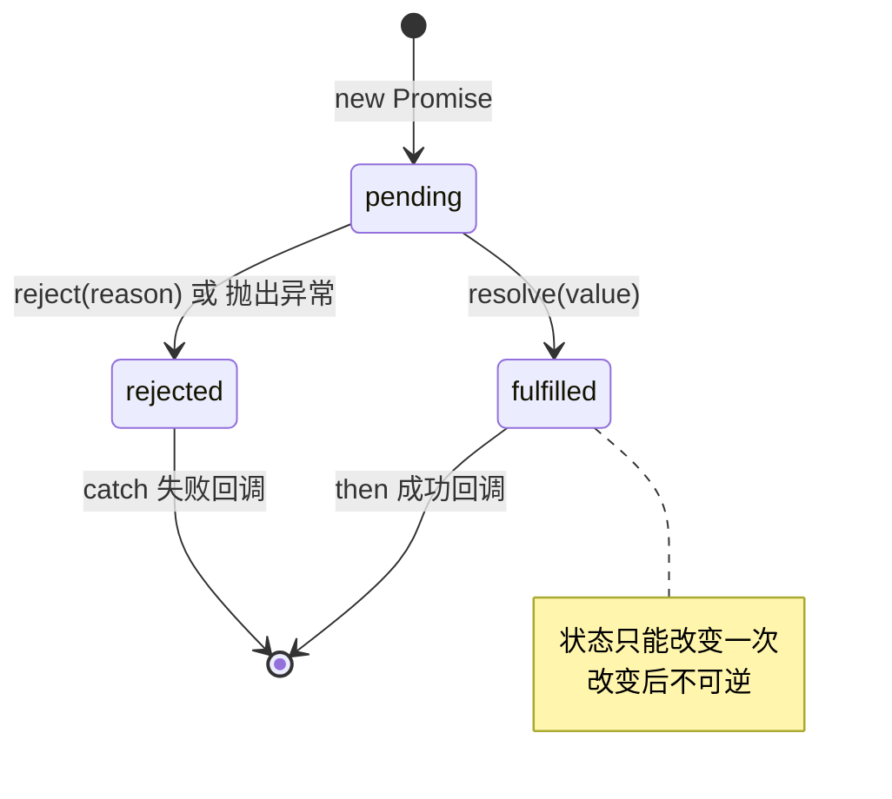
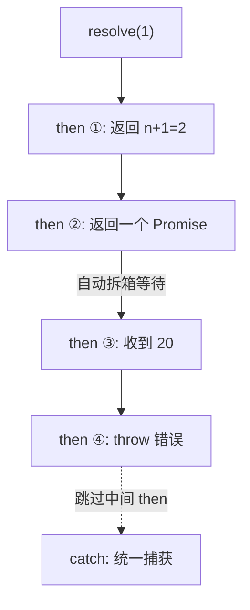
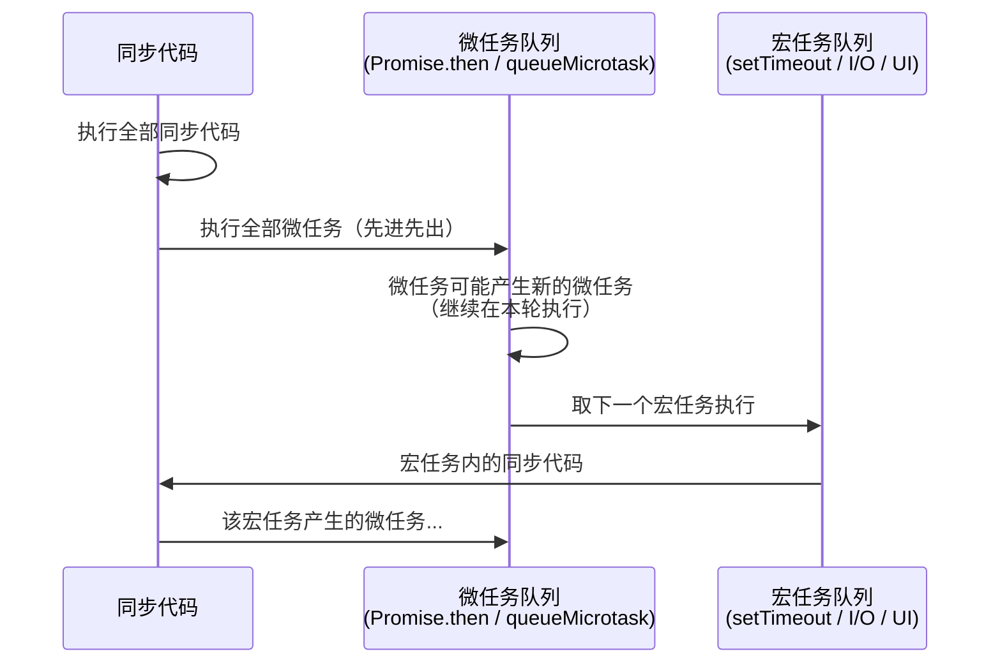
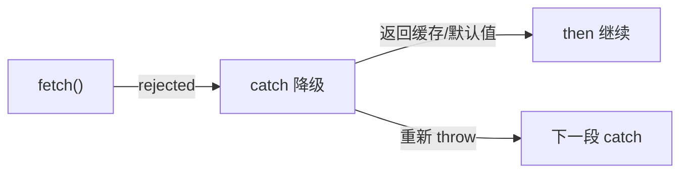

# 16 · Promise（Promise）

> Promise 是 JS 处理异步操作的标准对象：它代表一个"现在还没有、但未来会有结果"的值，用**链式调用**取代回调地狱。它依托**微任务队列**实现非阻塞的异步编排。

## 📖 知识讲解

### 三种状态（state）

一个 Promise 永远处于以下三种状态之一，且**只能从 `pending` 改变一次**，之后被"锁死"：

| 状态 | 含义 | 触发方式 |
| --- | --- | --- |
| `pending` | 进行中（初始态） | `new Promise` 时 |
| `fulfilled` | 已成功 | 执行器里调用 `resolve(value)` |
| `rejected` | 已失败 | 执行器里调用 `reject(reason)` 或抛出异常 |

> `resolve()` 后再调用 `resolve()` 或 `reject()` 都无效——状态不可逆。

### 核心 API

- `new Promise((resolve, reject) => {...})`：构造时 **executor 同步立即执行**。
- `.then(onFulfilled, onRejected)`：注册成功/失败回调，**返回一个新 Promise**（所以能链式）。
- `.catch(onRejected)`：等价于 `.then(null, onRejected)`，捕获链路上任何错误。
- `.finally(onFinally)`：无论成败都执行，**不接收值**，常用于收尾（关闭 loading 等）。

### 静态方法

| 方法 | 何时敲定 | 结果 | 典型场景 |
| --- | --- | --- | --- |
| `Promise.all` | 全部成功 / 任一失败 | 成功: 结果数组；失败: 第一个错误 | 并发请求，必须全部成功 |
| `Promise.race` | 第一个敲定（不论成败） | 采用最先敲定者的结果 | 超时控制、竞速 |
| `Promise.allSettled` | 全部敲定 | 每项 `{status, value/reason}`，永不 reject | 需要全部结果，不关心个别失败 |
| `Promise.any` | 第一个成功 / 全部失败 | 第一个成功值；全失败给 `AggregateError` | 快速返回首个可用结果 |
| `Promise.resolve / reject` | 立即 | 快速生成已敲定的 Promise | 同步值转 Promise、thenable 拆箱 |

---

### ⭐ 关键进阶概念

#### 1. then 的返回值三形态

`.then()` 返回的是**新 Promise**，下一个 `.then()` 收到什么取决于上一个的返回值：

| 返回值 | 行为 |
|---|---|
| **普通值** | 自动包成 `Promise.resolve(值)` 传给下一个 then |
| **Promise 对象** | 等待它敲定后"拆箱"传值 |
| **抛出异常** (`throw ...`) | 变成 `rejected`，跳过后面 then 直达最近的 catch |

```js
Promise.resolve(1)
  .then(n => n + 1)                           // 普通值 → 下一个 then 收到 2
  .then(n => Promise.resolve(n * 10))          // Promise → 等待拆箱 → 20
  .then(n => { throw new Error('oops') })      // throw → 跳过
  .catch(e => console.log(e.message));          // "oops"
```

#### 2. ⭐ 微任务（Microtask）机制（最重要）

Promise 的回调（then/catch/finally）是**微任务**，附着在当前宏任务末尾执行：

**执行顺序铁律**：
```
全部同步代码 → 全部微任务队列 → 下一个宏任务
```

```js
console.log('1: sync');
setTimeout(() => console.log('5: macrotask'), 0);
Promise.resolve().then(() => console.log('3: microtask'));
Promise.resolve().then(() => console.log('4: microtask'));
console.log('2: sync');
// 输出：1 → 2 → 3 → 4 → 5
```

**微任务包含**：`Promise.then/catch/finally`、`queueMicrotask`、`MutationObserver`、`process.nextTick(Node)`

**宏任务包含**：`setTimeout/setInterval`、I/O、UI 渲染、事件回调

> 注意：`await` 也会产生微任务——`await` 之后的代码类似于 `.then()` 里的回调。

#### 3. `.then(onFulfilled, onRejected)` vs `.catch()`

两者用法不同，关键区别是**错误作用域**：

- **`catch` 能捕获前一个 `then` 回调里抛出的错误**，而 `then` 的第二个参数不能。
- `catch` 本质是 `then(null, onRejected)`，但写法更清晰，推荐优先使用。

```js
Promise.reject('err')
  .then(null, err => { throw '又错了' })  // ❌ 二参不处理自己回调的抛错
  .catch(e => console.log(e));            // ✅ catch 能捕获 → "又错了"
```

#### 4. thenable 拆箱

**Thenable** = 任何具有 `.then()` 方法的对象。`Promise.resolve(thenable)` 会将其拆箱——调用它的 `then` 方法，等它决定敲定状态。

```js
const thenable = {
  then(resolve) { resolve('从 thenable 拆箱'); }
};
Promise.resolve(thenable).then(v => console.log(v)); // "从 thenable 拆箱"
```

真实的 Promise 也是 thenable，所以 `Promise.resolve(existingPromise)` 返回同一个引用（不会包装）。

#### 5. `finally` 的特殊行为

- `finally` 回调**不接收任何参数**（它不知道 Promise 成功了还是失败了）。
- `finally` 返回的 Promise 沿袭**原来的结果**，除非 `finally` 里抛出了异常——那会覆盖。
- 如果 `finally` 返回 `Promise.resolve(...)`，它不会修改结果，但会**等待**该 Promise 完成（用于在 finally 里执行异步清理）。

```js
Promise.resolve('原始值')
  .finally(() => '覆盖值')          // ❌ 不生效，结果仍是 "原始值"
  .then(v => console.log(v));       // "原始值"

Promise.resolve('原始值')
  .finally(() => { throw 'oops' })  // 抛错会覆盖
  .catch(e => console.log(e));      // "oops"
```

---

### 🔄 流程图 / 原理图

#### Promise 三态流转



#### then 链式传值与错误传播



#### 微任务 vs 宏任务执行顺序



#### 错误恢复模式



#### 并发控制

```mermaid
flowchart TD
    subgraph limit=2
        direction LR
        T1["任务 1<br/>200ms"] --- T2["任务 2<br/>100ms"]
    end
    T2 -->|完成→插入| T3["任务 3<br/>300ms"]
    T1 -->|完成→插入| T4["任务 4<br/>50ms"]
```

---

### 💻 代码说明

`demo.js` 包含以下完整示例（按顺序对应）：

| # | 内容 | 行号范围 | 说明 |
|---|---|---|---|
| 一 | Promise 三态 | executor 同步执行，状态锁定 |
| 二 | then / catch / finally | 基本使用与finally特性 |
| 三 | 链式调用 | 值传递 + Promise拆箱 + throw跳转 |
| 四 | 静态方法 | all / race / allSettled / any |
| 五 | then 返回值三形态 | 普通值 / Promise / thenable |
| 六 | ⭐ 微任务执行顺序 | 同步 → 微任务 → 宏任务 |
| 七 | then 二参数 vs catch | 错误作用域对比 |
| 八 | thenable 拆箱 | 鸭式辨型机制 |
| 九 | 错误处理深度 | 全局监听 / 降级恢复 / finally抛错 |
| 十 | 实战模式 | 超时、重试、并发限制、AbortController、轮询 |
| 十一 | async/await 等价 | Promise 写法 vs async/await |
| 十二 | 常见坑 | 忘记return / 嵌套 / 分支 |

---

### ▶️ 运行方式

- **浏览器**：直接打开 `index.html`，按 F12 看控制台。
- **Node**：`node demo.js`。

---

### ⚠️ 常见坑 / 最佳实践

| # | 陷阱 | 示例 | 后果 | 修复 |
|---|---|---|---|---|
| 1 | **忘记 return** | `.then(() => { fetch(url) })` | 下一个 then 收到 `undefined` | 确保每个 then 都有 `return` |
| 2 | **链尾无 catch** | 任何 then 链 | 全局 `unhandledrejection` 事件 | 链尾必加 `.catch(console.error)` |
| 3 | **嵌套 then** | `.then(() => { p.then(...) })` | 回到回调地狱 | 保持扁平链式，或用 async/await |
| 4 | **忽略 Error 对象** | `reject('字符串')` | 错误栈丢失，难调试 | 总是 `reject(new Error(...))` |
| 5 | **循环中 await 误用** | `forEach(async ...)` | 不等待（forEach 不处理 Promise） | 用 `for...of` 或 `Promise.all` |
| 6 | **无需并行时用 all** | 请求不依赖却用 all | 一个失败全挂 | 按需选 all/race/any/allSettled |
| 7 | **finally 里异步不等待** | `finally(() => api.log())` | 可能日志还没发完就结束了 | 在 finally 里 `return` 异步操作 |
| 8 | **then 分支已分叉** | `let p = then(); p.then(A); p.then(B)` | A 和 B 收到相同值，独立执行 | 确认是否真的需要多分支 |

---

### 🔗 官方文档

- [Promise - MDN](https://developer.mozilla.org/zh-CN/docs/Web/JavaScript/Reference/Global_Objects/Promise)
- [使用 Promise - MDN](https://developer.mozilla.org/zh-CN/docs/Web/JavaScript/Guide/Using_promises)
- [Using promises - MDN (English)](https://developer.mozilla.org/en-US/docs/Web/JavaScript/Guide/Using_promises)
- [Promise.all() - MDN](https://developer.mozilla.org/zh-CN/docs/Web/JavaScript/Reference/Global_Objects/Promise/all)
- [Promise.race() - MDN](https://developer.mozilla.org/zh-CN/docs/Web/JavaScript/Reference/Global_Objects/Promise/race)
- [Promise.allSettled() - MDN](https://developer.mozilla.org/zh-CN/docs/Web/JavaScript/Reference/Global_Objects/Promise/allSettled)
- [Promise.any() - MDN](https://developer.mozilla.org/zh-CN/docs/Web/JavaScript/Reference/Global_Objects/Promise/any)
- [微任务指南 - MDN](https://developer.mozilla.org/zh-CN/docs/Web/API/HTML_DOM_API/Microtask_guide)
- [Event loop - MDN](https://developer.mozilla.org/zh-CN/docs/Web/JavaScript/Event_loop)
- [AbortController - MDN](https://developer.mozilla.org/zh-CN/docs/Web/API/AbortController)
