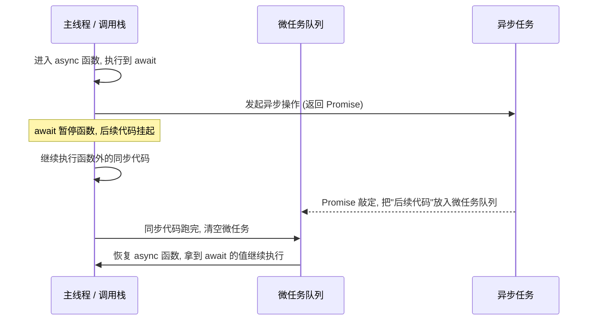
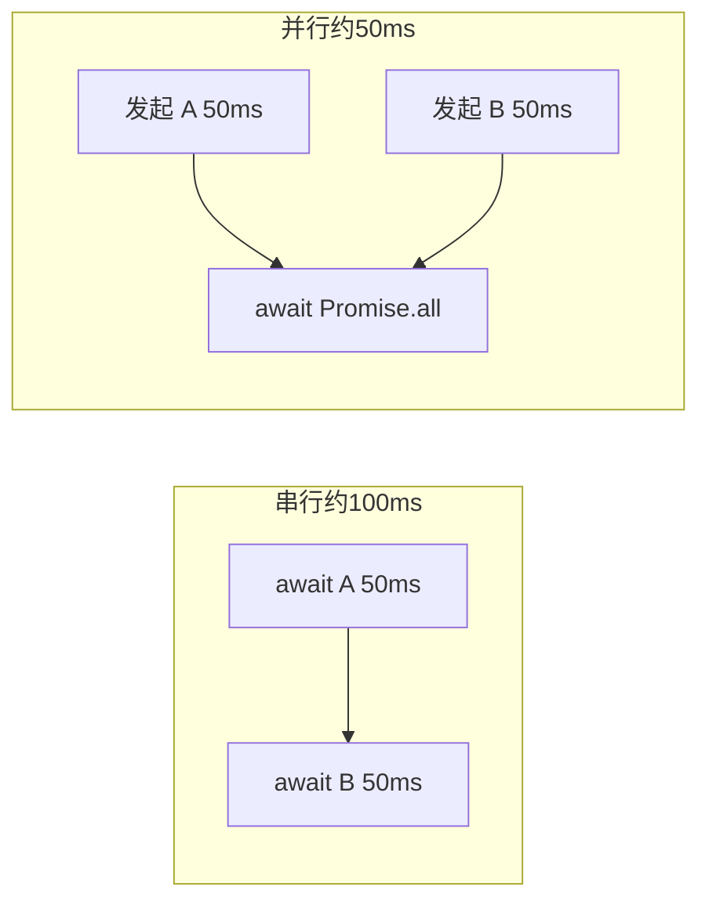

# 17 · async / await（async / await）

> `async/await` 是建立在 Promise 之上的语法糖：用近乎同步的写法处理异步，让代码更直观、错误处理更自然。

## 📖 知识讲解

### 核心规则

- **`async` 函数永远返回 Promise**：`return value` 会被自动包成 `Promise.resolve(value)`；函数内 `throw` 会变成 rejected。
- **`await` 只能用在 async 函数里**（顶层模块除外）：它会**暂停**当前函数，等右侧 Promise 敲定，再取出其值继续往下执行。
- **`await` 不会阻塞主线程**：它把"后续代码"打包成一个**微任务**，主线程继续跑其他同步代码，等 Promise 完成后再回来。
- **错误处理用 `try/catch/finally`**：被 await 的 Promise 若 rejected，会在 await 处抛出异常。

### 串行与并行

- 多个 `await` 依次写 = **串行**，后一个要等前一个，独立任务会浪费时间。
- 独立任务应**先发起再一起等**：`await Promise.all([p1, p2])` 实现并行。

## 🔄 流程图 / 原理图

### await 如何把"后续代码"包成微任务

### 串行 vs 并行耗时对比

## 💻 代码说明

- `getNumber` 返回 `42`，外部仍需 `then/await` 取值，证明 async 必返回 Promise。
- `loadUser` 用两次 `await` 串行取数据，演示"暂停—恢复"。
- `loadWithError` 用 `try/catch` 接住 rejected 的 Promise。
- `serial` 与 `parallel` 通过 `Date.now()` 直观对比耗时差异。

## ▶️ 运行方式

- 浏览器：直接打开 `index.html`，按 F12 看控制台。
- Node：`node demo.js`。

## ⚠️ 常见坑 / 最佳实践

- **独立任务别串行 await**：会拖慢一倍，用 `Promise.all` 并行。
- **循环里 await**：`for...of` + `await` 是串行；要并行先 `map` 成 Promise 数组再 `Promise.all`。
- **忘记 await**：直接拿到的是 Promise 对象而非结果值，常导致 `[object Promise]`。
- **错误别漏接**：async 函数内未捕获的 reject 会变成 unhandled rejection。

## 🔗 官方文档

- [async function - MDN](https://developer.mozilla.org/zh-CN/docs/Web/JavaScript/Reference/Statements/async_function)
- [await - MDN](https://developer.mozilla.org/zh-CN/docs/Web/JavaScript/Reference/Operators/await)
