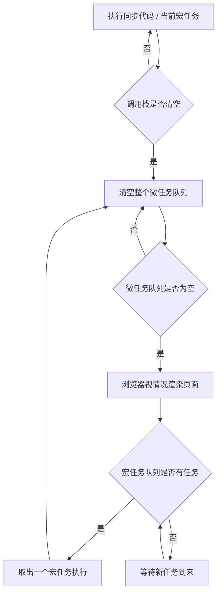

# 18 · 事件循环（Event Loop）

> 事件循环是 JS"单线程却不卡死"的核心机制：它决定同步代码、微任务、宏任务的执行顺序。

## 📖 知识讲解

JS 是**单线程**的，靠事件循环协调异步任务。理解三个概念：

- **调用栈（call stack）**：执行同步代码的地方，函数调用入栈、返回出栈。栈空了才会去看任务队列。
- **宏任务（macrotask）**：`setTimeout`、`setInterval`、`setImmediate`(Node)、I/O、UI 渲染、整体 script。**每轮循环只取一个**宏任务执行。
- **微任务（microtask）**：`Promise.then/catch/finally`、`queueMicrotask`、`MutationObserver`、`await` 之后的代码。**每个宏任务结束后会一次性清空全部**微任务。

### 一轮事件循环的顺序（最重要）

```
1. 执行同步代码（当前宏任务）直到调用栈清空
2. 清空整个微任务队列（期间新产生的微任务也一并清空）
3. 取出一个宏任务执行
4. 回到第 2 步：再次清空微任务队列
5. 循环往复……
```

一句话记忆：**同步 → 微任务清空 → 一个宏任务 → 微任务清空 → 下一个宏任务**。

## 🔄 流程图 / 原理图



## 💻 代码说明 · 经典输出顺序题

`demo.js` 中的代码（已简化标注序号）：

```js
console.log('1 同步：脚本开始');

setTimeout(() => {
  console.log('5 宏任务：setTimeout A');
  Promise.resolve().then(() => console.log('6 微任务：宏任务 A 内的 then'));
}, 0);

Promise.resolve().then(() => console.log('3 微任务：then 1'));
queueMicrotask(() => console.log('4 微任务：queueMicrotask'));

setTimeout(() => console.log('7 宏任务：setTimeout B'), 0);

console.log('2 同步：脚本结束');
```

**正确输出顺序：**

```
1 同步：脚本开始
2 同步：脚本结束
3 微任务：then 1
4 微任务：queueMicrotask
5 宏任务：setTimeout A
6 微任务：宏任务 A 内的 then
7 宏任务：setTimeout B
```

**逐步解析：**

1. 先把同步代码全部跑完 → 输出 `1`、`2`（`setTimeout` 的回调被挂到宏任务队列，不立即执行）。
2. 调用栈清空，**清空微任务队列** → 输出 `3`、`4`。
3. 取队首**一个**宏任务 `setTimeout A` 执行 → 输出 `5`，并产生一个新微任务。
4. 该宏任务结束后**立刻清空微任务** → 输出 `6`。
5. 再取下一个宏任务 `setTimeout B` → 输出 `7`。

关键点：**每执行完一个宏任务，都会把当时的微任务队列全部清空**，所以微任务总是"插队"在下一个宏任务之前。

## ▶️ 运行方式

- 浏览器：直接打开 `index.html`，按 F12 对照打印顺序。
- Node：`node demo.js`（顺序一致；Node 还有 `process.nextTick` 优先级更高的微任务）。

## ⚠️ 常见坑 / 最佳实践

- **`setTimeout(fn, 0)` 不是立即执行**：它是宏任务，要排在所有微任务之后。
- **微任务可能"饿死"渲染**：微任务里不断产生新微任务会一直清不空，阻塞渲染与宏任务。
- **`await` 后面的代码是微任务**：等价于 `.then`，别误以为它"同步"往下走。
- **Node 与浏览器细节有差异**：Node 有 `process.nextTick`、`setImmediate` 等，但"宏前清微"的大原则一致。

## 🔗 官方文档

- [事件循环 - MDN](https://developer.mozilla.org/zh-CN/docs/Web/JavaScript/Reference/Execution_model)
- [微任务详解 - MDN](https://developer.mozilla.org/zh-CN/docs/Web/API/HTML_DOM_API/Microtask_guide)
- [queueMicrotask - MDN](https://developer.mozilla.org/zh-CN/docs/Web/API/Window/queueMicrotask)
