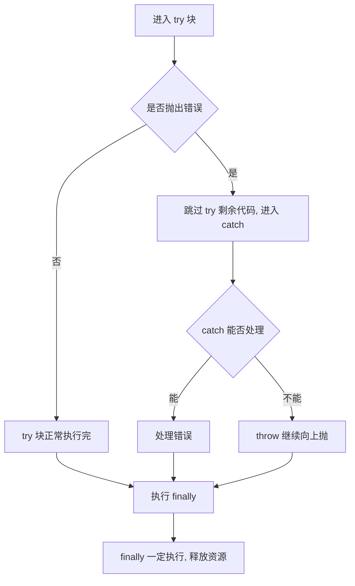

# 19 · 错误处理（Error Handling）

> 健壮的程序必须能优雅地处理错误。本模块讲清 `try/catch/finally`、`throw`、内置错误类型、自定义错误，以及异步错误的捕获。

## 📖 知识讲解

### try / catch / finally

```js
try {
  // 可能抛错的代码
} catch (err) {
  // 捕获到错误后的处理，err 是错误对象
} finally {
  // 无论成败都会执行，常用于释放资源
}
```

### Error 对象

所有错误都有这些属性：

- `name`：错误类型名（如 `TypeError`）。
- `message`：错误描述。
- `stack`：调用栈信息（调试用）。

### 内置错误子类型

| 类型 | 触发场景 |
| --- | --- |
| `Error` | 通用基类 |
| `TypeError` | 对值做了不支持的操作（如 `null.foo()`） |
| `RangeError` | 数值超出合法范围（如 `new Array(-1)`） |
| `ReferenceError` | 访问未声明的变量 |
| `SyntaxError` | 语法错误（多在解析阶段） |

### 自定义错误

继承 `Error` 可携带业务字段，并用 `instanceof` 精确区分：

```js
class ValidationError extends Error {
  constructor(message, field) {
    super(message);
    this.name = 'ValidationError';
    this.field = field;
  }
}
```

## 🔄 流程图 / 原理图



## 💻 代码说明

- **基本结构**：`null.foo()` 抛 `TypeError`，被 catch 接住，finally 仍执行。
- **throw**：`divide` 在除数为 0 时主动 `throw new Error`。
- **内置类型**：用 `instanceof TypeError / RangeError` 判断错误种类。
- **自定义错误**：`ValidationError` 带 `field` 字段，用 `instanceof` 区分处理。
- **异步错误**：Promise 用 `.catch`，async 用 `try/catch`；`setTimeout` 回调里的错误必须在回调内部自捕获。

## ▶️ 运行方式

- 浏览器：直接打开 `index.html`，按 F12 看控制台。
- Node：`node demo.js`。

## ⚠️ 常见坑 / 最佳实践

- **同步 try/catch 抓不到异步回调的错误**：`setTimeout`、事件回调里的错误要在回调内部处理。
- **不要 `throw` 字符串**：`throw 'oops'` 会丢失 stack，应 `throw new Error('oops')`。
- **别吞掉错误**：空的 `catch {}` 会让 bug 静默消失，至少记录日志。
- **自定义错误设置 `name`**：方便日志和 `instanceof` 之外的类型识别。
- **async 函数务必加 catch**：未处理的 reject 会变成全局 unhandled rejection。

## 🔗 官方文档

- [Error - MDN](https://developer.mozilla.org/zh-CN/docs/Web/JavaScript/Reference/Global_Objects/Error)
- [try...catch - MDN](https://developer.mozilla.org/zh-CN/docs/Web/JavaScript/Reference/Statements/try...catch)
- [throw - MDN](https://developer.mozilla.org/zh-CN/docs/Web/JavaScript/Reference/Statements/throw)
