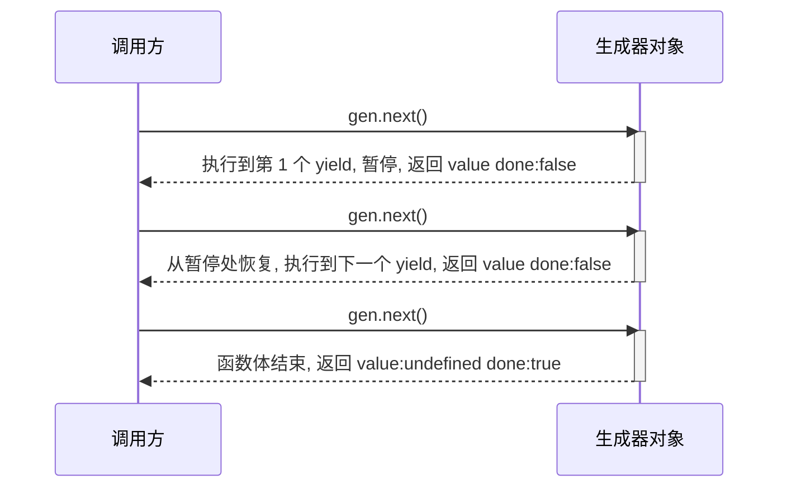
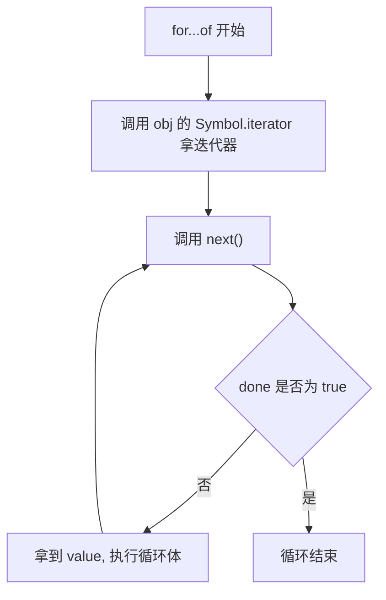

# 20 · 迭代器与生成器（Iterators & Generators）

> 迭代器统一了"如何遍历"的协议；生成器用 `function*` + `yield` 让你以极简方式产生序列，支持暂停/恢复与惰性求值。

## 📖 知识讲解

### 迭代器协议（iterator protocol）

一个对象只要有 `next()` 方法，每次调用返回 `{ value, done }`，就是**迭代器**：

- `value`：本次产出的值。
- `done`：`false` 表示还有，`true` 表示遍历结束。

### 可迭代协议（iterable protocol）

一个对象只要实现 `[Symbol.iterator]()` 方法并返回一个迭代器，就是**可迭代对象**，可被：

- `for...of` 遍历
- 展开运算符 `[...obj]`
- 解构 `const [a, b] = obj`
- `Array.from(obj)`

数组、字符串、Map、Set 都内置了 `Symbol.iterator`。

### 生成器（generator）

- 用 `function*` 声明，函数体里用 `yield` 产出值。
- **调用生成器函数不执行函数体**，而是返回一个**生成器对象**（既是迭代器又可迭代）。
- 每次 `next()` 执行到下一个 `yield` 处**暂停**并交出值，下次 `next()` 从暂停处**恢复**。
- 生成器自动符合迭代器协议，无需手写 `next`，是实现可迭代对象的最简方式。

### 惰性求值（lazy evaluation）

生成器**按需产生值**，可以表示无限序列（如自然数、斐波那契），只在 `next()` 时才算下一个，不会一次性占满内存。

## 🔄 流程图 / 原理图

### next() 调用与 yield 暂停 / 恢复

### for...of 如何驱动迭代器

## 💻 代码说明

- **手写迭代器** `makeRangeIterator`：演示 `next()` 返回 `{value, done}`。
- **可迭代对象** `range`：实现 `[Symbol.iterator]`，可用 `for...of` 和展开。
- **生成器** `countGen`：用 `yield` 自动实现迭代，省去手写 `next`。
- **无限序列** `naturals`：`while(true)` + `yield`，惰性只取前 5 个。
- **生成器当 `[Symbol.iterator]`**：`fibonacci` 用 `*[Symbol.iterator]()` 一行实现可迭代。

## ▶️ 运行方式

- 浏览器：直接打开 `index.html`，按 F12 看控制台。
- Node：`node demo.js`。

## ⚠️ 常见坑 / 最佳实践

- **迭代器是一次性的**：遍历到 `done:true` 后不能重来，需要重新获取迭代器。
- **`Symbol.iterator` 别写成普通字符串键**：必须用计算属性 `[Symbol.iterator]`。
- **生成器函数调用不立即运行**：必须 `next()` 或 `for...of` 才推进。
- **无限生成器别直接展开**：`[...naturals()]` 会死循环，必须配合 `break` 或限定次数。
- **优先用生成器实现迭代**：比手写 `next` 更简洁、不易出错。

## 🔗 官方文档

- [迭代协议 - MDN](https://developer.mozilla.org/zh-CN/docs/Web/JavaScript/Reference/Iteration_protocols)
- [function* - MDN](https://developer.mozilla.org/zh-CN/docs/Web/JavaScript/Reference/Statements/function*)
- [yield - MDN](https://developer.mozilla.org/zh-CN/docs/Web/JavaScript/Reference/Operators/yield)
