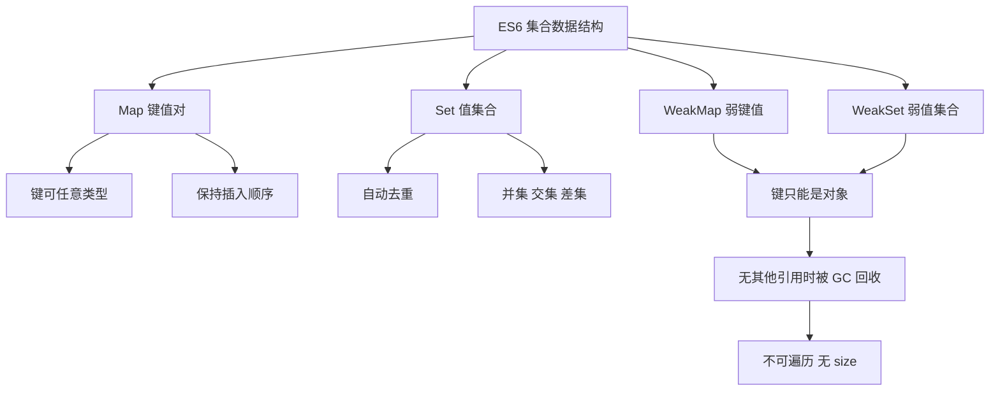

# 21 · Map 与 Set（Map and Set）

> Map 是「任意类型键」的键值对集合，Set 是「自动去重」的值集合，再加上弱引用版 WeakMap/WeakSet，是 ES6 新增的四种内置数据结构。

## 📖 知识讲解

### Map —— 更强大的「字典」

普通对象（`{}`）也能存键值对，但有局限：键只能是字符串或 Symbol、无法直接拿到数量、数字键会被自动重排。`Map` 解决了这些问题。

核心 API：

| 操作 | 写法 | 说明 |
| --- | --- | --- |
| 新增/修改 | `map.set(key, value)` | 返回 Map 自身，可链式调用 |
| 读取 | `map.get(key)` | 不存在返回 `undefined` |
| 判断 | `map.has(key)` | 返回布尔值 |
| 删除 | `map.delete(key)` | 删除单个键 |
| 数量 | `map.size` | 属性，不是方法 |
| 清空 | `map.clear()` | 删除所有 |
| 遍历 | `for...of` / `map.keys()` / `map.values()` / `map.entries()` | 保持插入顺序 |

### Map vs 普通对象

| 维度 | Map | 普通对象 |
| --- | --- | --- |
| 键类型 | 任意类型（对象、函数、NaN 都行） | 仅字符串 / Symbol |
| 顺序 | 严格按插入顺序 | 数字键会被重排到前面 |
| 取大小 | `map.size` | `Object.keys(obj).length` |
| 默认键 | 无（纯净） | 原型链上有 `toString` 等 |
| 适用场景 | 频繁增删、键非字符串、需有序 | 结构化数据、JSON、固定字段 |

### Set —— 自动去重的值集合

`Set` 里每个值唯一，最常见用法是给数组去重：`[...new Set(arr)]`。同样有 `add / has / delete / size / clear` 与可遍历特性。利用 `Set` 配合展开运算可以方便地实现并集、交集、差集。

### WeakMap / WeakSet —— 弱引用

- 键（WeakMap）/ 成员（WeakSet）**只能是对象**。
- 持有的是**弱引用**：当对象没有其他引用时，会被垃圾回收（GC），对应条目自动消失。
- **不可遍历、没有 size**：内容随时可能被回收，无法保证一致快照。
- 典型用途：为 DOM 节点或对象挂载「私有数据 / 缓存」，且不阻止它被回收，避免内存泄漏。

## 🔄 流程图 / 原理图

## 💻 代码说明

- **第一段**：用二维数组初始化 `Map`，演示 `set` 链式调用、`get/has/size/delete` 以及对象/函数作为键。
- **第二段**：对比普通对象数字键被重排（`['0','1']`）与 Map 保持插入顺序（`[1, 0]`）。
- **第三段**：`[...new Set(arr)]` 一行完成数组去重。
- **第四段**：用 `filter + has` 实现交集与差集，用展开运算实现并集。
- **第五段**：`WeakMap/WeakSet` 给对象挂数据，随后把变量置为 `null`，说明对象可被回收。

## ▶️ 运行方式

- 浏览器：直接双击打开 `index.html`，按 F12 看控制台。
- Node：在本目录执行 `node demo.js`。

## ⚠️ 常见坑 / 最佳实践

- `map.size` 是**属性**不是方法，写成 `map.size()` 会报错。
- `Set` 用 `SameValueZero` 比较：`NaN` 能正确去重，但 `{}` 与另一个 `{}` 是不同引用，不会去重。
- `Set` 去重对**对象数组无效**（引用不同），需按某字段手动去重。
- 需要 JSON 序列化时注意：`JSON.stringify(map)` 得到 `{}`，要先转成数组 `[...map]`。
- WeakMap/WeakSet **不能遍历、没有 size**，别指望拿到全部内容。

## 🔗 官方文档

- [Map - MDN](https://developer.mozilla.org/zh-CN/docs/Web/JavaScript/Reference/Global_Objects/Map)
- [Set - MDN](https://developer.mozilla.org/zh-CN/docs/Web/JavaScript/Reference/Global_Objects/Set)
- [WeakMap - MDN](https://developer.mozilla.org/zh-CN/docs/Web/JavaScript/Reference/Global_Objects/WeakMap)
- [WeakSet - MDN](https://developer.mozilla.org/zh-CN/docs/Web/JavaScript/Reference/Global_Objects/WeakSet)
