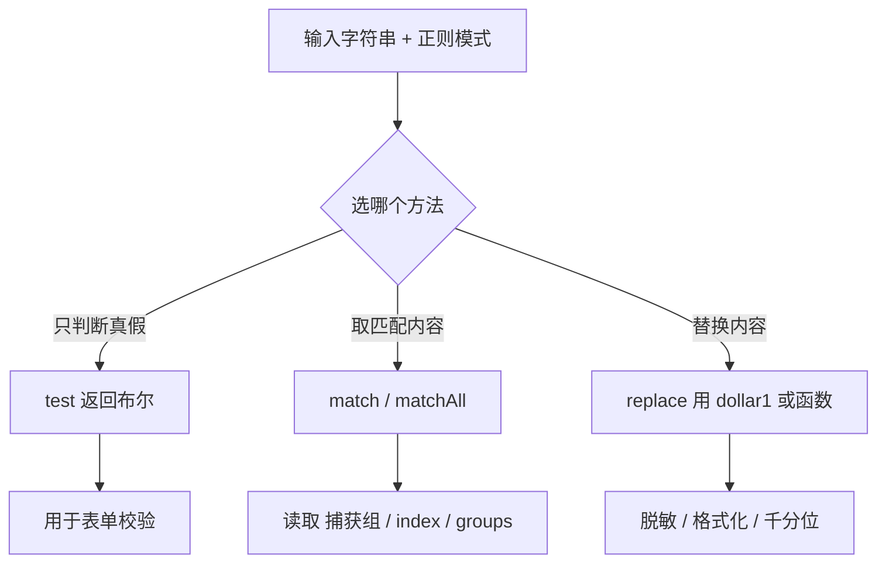

# 22 · 正则表达式（Regular Expression）

> 正则表达式是一种用「模式」描述字符串规则的微型语言，用来做匹配、查找、校验和替换。

## 📖 知识讲解

### 创建方式

```js
const re1 = /\d+/g;                 // 字面量：模式固定时首选，性能好
const re2 = new RegExp('\\d+', 'g'); // 构造函数：模式来自变量时使用（反斜杠要写两个）
```

常用标志（flags）：`g` 全局、`i` 忽略大小写、`m` 多行、`s` 让 `.` 匹配换行、`u` Unicode、`y` 粘连。

### 核心方法

| 方法 | 归属 | 返回 | 说明 |
| --- | --- | --- | --- |
| `re.test(str)` | 正则 | 布尔 | 判断是否匹配，最常用于校验 |
| `str.match(re)` | 字符串 | 数组 / null | 不带 `g` 含捕获组；带 `g` 返回全部匹配文本 |
| `str.matchAll(re)` | 字符串 | 迭代器 | 必须带 `g`，能拿下标与捕获组 |
| `str.replace(re, x)` | 字符串 | 新字符串 | `x` 可用 `$1` 引用组，也可传函数 |

### 元字符 / 字符类 / 量词

| 类别 | 写法 | 含义 |
| --- | --- | --- |
| 字符类 | `[abc]` `[a-z]` `[^abc]` | 任一 / 范围 / 取反 |
| 预定义 | `\d` `\w` `\s` | 数字 / 单词字符 / 空白（大写取反） |
| 通配 | `.` | 任意字符（默认不含换行） |
| 量词 | `*` `+` `?` | 0+ / 1+ / 0或1 |
| 量词 | `{n}` `{n,}` `{n,m}` | 恰好n / 至少n / n到m |
| 懒惰 | 量词后加 `?` | 尽量少匹配（默认贪婪） |
| 分组 | `()` `(?:)` `(?<name>)` | 捕获 / 非捕获 / 命名捕获 |
| 断言 | `^` `$` `\b` | 开头 / 结尾 / 单词边界 |
| 断言 | `(?=)` `(?!)` `(?<=)` `(?<!)` | 先行肯定/否定、后行肯定/否定 |

## 🔄 流程图 / 原理图



## 💻 代码说明

- **创建**：对比字面量与 `new RegExp` 动态拼接（变量 `word` 拼进 `\b...\b`）。
- **核心方法**：用「价格文本」演示 `test/match/matchAll`，用手机号脱敏演示 `replace` 的 `$1****$2`，再用函数版 `replace` 把数字翻倍。
- **语法要点**：字符类、量词、贪婪 vs 懒惰（`<.+>` 对比 `<.+?>`）、命名捕获组解析日期、先行断言实现千分位。
- **校验示例**：手机号、邮箱、身份证、强密码（多个先行断言）、URL，全部给出真假两组测试。

## ▶️ 运行方式

- 浏览器：直接双击打开 `index.html`，按 F12 看控制台。
- Node：在本目录执行 `node demo.js`。

## ⚠️ 常见坑 / 最佳实践

- **带 `g` 的正则有状态**：`re.test()` / `re.exec()` 会记住 `lastIndex`，循环复用同一个带 `g` 的正则可能跳着匹配。校验时别加 `g`，或每次新建。
- 构造函数里反斜杠要**写两次**：`new RegExp('\\d')` 才等于 `/\d/`。
- `match` 带不带 `g` 返回结构完全不同：带 `g` 拿不到捕获组，要捕获组用 `matchAll`。
- 量词默认**贪婪**，匹配过多时记得加 `?` 变懒惰。
- 别迷信「完美邮箱正则」，日常用简化版即可，真正校验靠发送验证码。
- 复杂正则务必写注释，或用具名捕获组提升可读性。

## 🔗 官方文档

- [正则表达式 - MDN](https://developer.mozilla.org/zh-CN/docs/Web/JavaScript/Guide/Regular_expressions)
- [RegExp - MDN](https://developer.mozilla.org/zh-CN/docs/Web/JavaScript/Reference/Global_Objects/RegExp)
- [String.prototype.matchAll - MDN](https://developer.mozilla.org/zh-CN/docs/Web/JavaScript/Reference/Global_Objects/String/matchAll)
