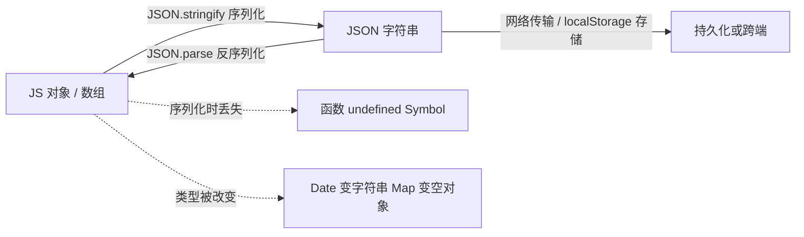

# 23 · JSON（JavaScript Object Notation）

> JSON 是一种轻量的「文本数据格式」，用来在网络传输和本地存储中表示对象；`JSON.stringify` 序列化、`JSON.parse` 反序列化是它的两把钥匙。

## 📖 知识讲解

### JSON 语法

JSON 只支持 6 种值：**对象、数组、字符串、数字、布尔、null**。硬性规则：

- 键必须用**双引号**包裹；字符串也必须用双引号（不能用单引号）。
- **末尾不能有多余逗号**；不能写注释；不能有函数、`undefined`、`Symbol`、`NaN`、`Infinity`。

### JSON.stringify(value, replacer?, space?)

- `replacer` 为**数组**：白名单，只保留列出的键。
- `replacer` 为**函数**：`(key, value) => 新值`，返回 `undefined` 表示删除该键（可用于过滤敏感字段）。
- `space`：缩进，传数字（空格数）或字符串，便于阅读。
- 若对象有 `toJSON()` 方法，会优先调用它（`Date` 自带，故序列化成 ISO 字符串）。

### JSON.parse(text, reviver?)

- `reviver` 为函数：`(key, value) => 新值`，解析时逐个还原值，常用来把日期字符串转回 `Date`。

### 深拷贝技巧及局限

- `JSON.parse(JSON.stringify(obj))`：最简单的深拷贝，但会**丢失**函数、`undefined`、`Symbol`，把 `Date` 变字符串、`Map/Set` 变 `{}`、`NaN/Infinity` 变 `null`，且**不能处理循环引用**。
- `structuredClone(obj)`：现代浏览器 / Node 17+ 内置，支持 `Date/Map/Set/ArrayBuffer` 与循环引用，是更好的深拷贝方案（但仍不能拷贝函数）。

## 🔄 流程图 / 原理图

## 💻 代码说明

- **语法**：给出一段合法 JSON 字符串，强调键和字符串都用双引号。
- **stringify**：演示基本用法、`space` 缩进、数组白名单、函数过滤 `password`、`Date` 的 `toJSON` 行为。
- **parse**：基本解析取值，再用 `reviver` 把 `time` 字符串还原成 `Date`。
- **深拷贝**：先用 JSON 大法证明嵌套对象被深拷贝（改副本不影响源），再用 `tricky` 对象暴露 JSON 拷贝的各种丢失；最后用 `structuredClone` 做对比。
- **常见报错**：非法 JSON 抛 `SyntaxError`、循环引用抛 `TypeError`，都用 `try...catch` 兜住。

## ▶️ 运行方式

- 浏览器：直接双击打开 `index.html`，按 F12 看控制台。
- Node：在本目录执行 `node demo.js`（Node 17+ 才有 `structuredClone`）。

## ⚠️ 常见坑 / 最佳实践

- `JSON.parse` 遇到非法字符串会**抛异常**，处理用户输入或接口返回时务必 `try...catch`。
- JSON 大法深拷贝会**静默丢数据**（函数、`undefined`、`Date` 类型），对含特殊类型的对象别用。
- 循环引用直接让 `stringify` **报错**，需用 `replacer` 或专门的库处理。
- 数字精度：超过 `Number.MAX_SAFE_INTEGER` 的大整数（如雪花 ID）会丢精度，后端建议用字符串传。
- 存 `localStorage` 前先 `stringify`，读出来后再 `parse`，因为它只能存字符串。

## 🔗 官方文档

- [JSON - MDN](https://developer.mozilla.org/zh-CN/docs/Web/JavaScript/Reference/Global_Objects/JSON)
- [JSON.stringify - MDN](https://developer.mozilla.org/zh-CN/docs/Web/JavaScript/Reference/Global_Objects/JSON/stringify)
- [JSON.parse - MDN](https://developer.mozilla.org/zh-CN/docs/Web/JavaScript/Reference/Global_Objects/JSON/parse)
- [structuredClone - MDN](https://developer.mozilla.org/zh-CN/docs/Web/API/structuredClone)
