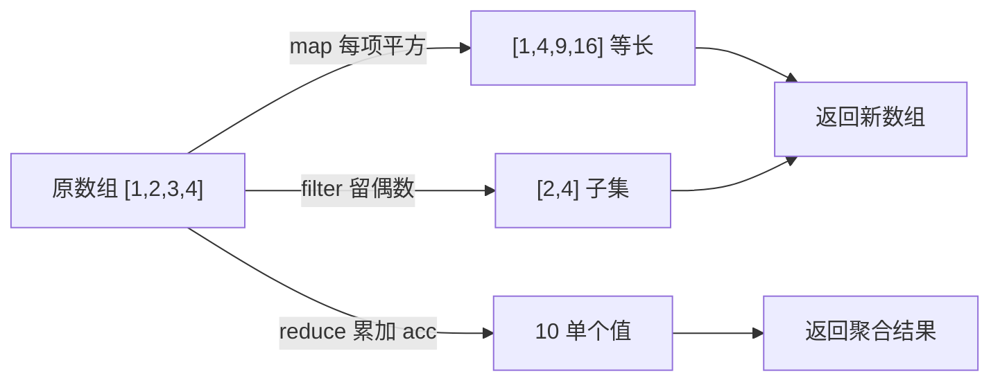

# 24 · 高阶函数（Higher-Order Functions）

> 高阶函数指「能接收函数作参数，或能返回函数」的函数；`map/filter/reduce` 等数组方法都是它，是函数式编程的基石。

## 📖 知识讲解

### 概念

一个函数只要满足以下任一条，就是高阶函数：

1. **接收函数作为参数**（如 `arr.map(fn)`）。
2. **返回一个函数**（如柯里化、工厂函数）。

它让我们把「要做什么」（逻辑）当数据传来传去，代码更声明式、更易复用。

### 数组常用高阶函数

| 方法 | 作用 | 返回值 | 是否改原数组 |
| --- | --- | --- | --- |
| `map` | 一对一变换 | 等长新数组 | 否 |
| `filter` | 按条件筛选 | 子集新数组 | 否 |
| `reduce` | 折叠成一个值 | 任意类型 | 否 |
| `forEach` | 仅遍历执行副作用 | `undefined` | 否 |
| `find` | 第一个满足条件的元素 | 元素 / `undefined` | 否 |
| `some` | 是否「存在」满足项 | 布尔 | 否 |
| `every` | 是否「全部」满足 | 布尔 | 否 |
| `sort` | 排序 | 原数组（已排序） | **是** |

### 函数作为参数与返回值

- 作参数：`repeat(n, action)` 把「每次做什么」交给调用方决定。
- 作返回值：`makeMultiplier(factor)` 返回一个记住了 `factor` 的新函数（闭包）。

### 链式调用与柯里化

- **链式调用**：`map/filter/sort` 都返回数组，可串成「数据管道」，逐级转换。
- **柯里化（Currying）**：把 `add(a, b, c)` 改写成 `add(a)(b)(c)`，便于「固定前面的参数」生成专用函数（如固定税率的 `withVat`）。

## 🔄 流程图 / 原理图

map / filter / reduce 的数据流（数组 → 变换 → 结果）：

## 💻 代码说明

- **概念段**：`repeat` 演示函数作参数；`makeMultiplier` 演示函数作返回值（`double/triple`）。
- **数组方法段**：对同一个 `nums` 数组逐一演示 8 个方法，注释标明各自的返回特点（尤其 `sort` 会改原数组，所以用 `[...nums]` 拷贝后再排）。
- **链式段**：对商品数组做「筛选有货 → 提取字段 → 按价排序」的管道；再用 `reduce` 实现按有货/缺货分组。
- **柯里化段**：`add(1)(2)(3)` 展示三层柯里化，`addTax(0.13)` 展示固定参数复用。

## ▶️ 运行方式

- 浏览器：直接双击打开 `index.html`，按 F12 看控制台。
- Node：在本目录执行 `node demo.js`。

## ⚠️ 常见坑 / 最佳实践

- `sort` **会修改原数组**，且默认按字符串比较（`[10, 2].sort()` 得 `[10, 2]`），数字排序必须传比较函数 `(a, b) => a - b`。
- `reduce` 建议**总是传初始值**（第二参），空数组不传初始值会抛错。
- `forEach` **无返回值、不能链式、不能 break**，只想取值或中断请改用 `map/find/some`。
- `map` 不要用来做纯副作用（那是 `forEach` 的活），否则会创建无用数组。
- 链式调用每步都生成新数组，超大数据量时注意性能，可考虑一次 `reduce` 搞定。

## 🔗 官方文档

- [Array.prototype.map - MDN](https://developer.mozilla.org/zh-CN/docs/Web/JavaScript/Reference/Global_Objects/Array/map)
- [Array.prototype.filter - MDN](https://developer.mozilla.org/zh-CN/docs/Web/JavaScript/Reference/Global_Objects/Array/filter)
- [Array.prototype.reduce - MDN](https://developer.mozilla.org/zh-CN/docs/Web/JavaScript/Reference/Global_Objects/Array/reduce)
- [Array.prototype.sort - MDN](https://developer.mozilla.org/zh-CN/docs/Web/JavaScript/Reference/Global_Objects/Array/sort)
