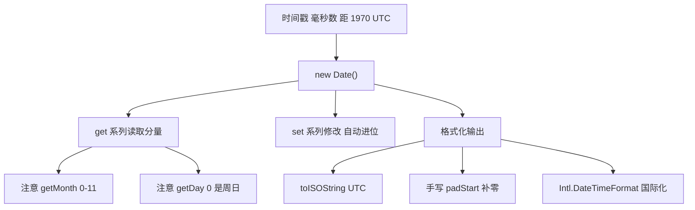

# 25 · 日期与时间（Date and Time）

> `Date` 是 JS 内置的日期时间对象，本质是一个「距 1970-01-01 UTC 的毫秒时间戳」；用它来创建、获取、设置、格式化时间，但有不少坑要避。

## 📖 知识讲解

### 创建 Date

```js
new Date();                          // 当前时间
new Date(2026, 5, 30, 10, 30);       // 年, 月(0-11!), 日, 时, 分
new Date(1782000000000);             // 用毫秒时间戳
new Date('2026-06-30T10:30:00');     // 用 ISO 8601 字符串（推荐）
```

### 获取 / 设置（get / set 系列）

| 分量 | 获取 | 说明 |
| --- | --- | --- |
| 年 | `getFullYear()` | 用它，别用废弃的 `getYear()` |
| 月 | `getMonth()` | **0-11**，显示要 `+1` |
| 日 | `getDate()` | 月里第几天（1-31） |
| 星期 | `getDay()` | **0=周日 … 6=周六** |
| 时/分/秒/毫秒 | `getHours()` / `getMinutes()` / `getSeconds()` / `getMilliseconds()` | — |

`set` 系列同名（`setDate` 等）。利用 `setDate(getDate() + 7)` 做日期加减时，会**自动跨月跨年进位**。

### 时间戳

- `Date.now()`：当前毫秒时间戳，最适合**计算耗时**。
- `date.getTime()`：某个 Date 的时间戳。两个时间戳相减即得毫秒差。

### 格式化

1. 内置：`toISOString()`（UTC）、`toLocaleString('zh-CN')`（本地化），格式固定。
2. 手写：用 `padStart(2, '0')` 补零拼出 `YYYY-MM-DD HH:mm:ss`。
3. **`Intl.DateTimeFormat`**：官方推荐的国际化方案，可定制年月日星期时分的样式与语言。

### 时区

- `Date` 内部存的是 UTC 绝对时刻，显示时按运行环境的本地时区转换。
- `getTimezoneOffset()` 返回本地与 UTC 的分钟差（中国 UTC+8 返回 `-480`）。
- 区分「绝对时刻」（`getUTCHours`）与「墙上时间」（`getHours`），字符串带 `Z` 表示 UTC。

## 🔄 流程图 / 原理图



## 💻 代码说明

- **创建**：演示 4 种创建方式，重点强调 `new Date(2026, 5, 30)` 的 `5` 才是六月。
- **获取**：对同一时刻读取全部分量，注释标注 `getMonth` 需 `+1`、`getDay` 的 0 是周日。
- **设置/运算**：`setDate(+7)` 跨月，「1 月 31 日 +1 天」自动进位到 2 月 1 日。
- **时间戳**：`Date.now()` 与 `getTime()` 相减算天数差，并演示计算循环耗时。
- **格式化**：内置方法、手写补零函数、`Intl.DateTimeFormat` 三种对照。
- **时区**：`getTimezoneOffset` 与 `getUTCHours` vs `getHours` 对比。

## ▶️ 运行方式

- 浏览器：直接双击打开 `index.html`，按 F12 看控制台。
- Node：在本目录执行 `node demo.js`（部分输出依赖运行环境的本地时区）。

## ⚠️ 常见坑 / 最佳实践

- **月份从 0 开始**：`new Date(2026, 0, 1)` 是一月一日；`getMonth()` 显示记得 `+1`。这是最高频的 bug。
- **`getDay` 是星期几（0=周日），`getDate` 才是几号**，别搞混。
- 解析字符串优先用 **ISO 8601**（`2026-06-30T10:30:00`）；`new Date('2026/6/30')` 等非标准格式在不同浏览器结果可能不一致。
- 不带时区的字符串按**本地时区**解析，带 `Z` 才是 UTC，跨时区业务务必明确。
- 原生 `Date` 做复杂日期运算很繁琐，生产项目建议用 `day.js` / `date-fns`，或新标准 `Temporal`。
- `Date` 对象**可变**（`setX` 会改自身），传参时小心被意外修改，必要时先拷贝。

## 🔗 官方文档

- [Date - MDN](https://developer.mozilla.org/zh-CN/docs/Web/JavaScript/Reference/Global_Objects/Date)
- [Date.now - MDN](https://developer.mozilla.org/zh-CN/docs/Web/JavaScript/Reference/Global_Objects/Date/now)
- [Intl.DateTimeFormat - MDN](https://developer.mozilla.org/zh-CN/docs/Web/JavaScript/Reference/Global_Objects/Intl/DateTimeFormat)
