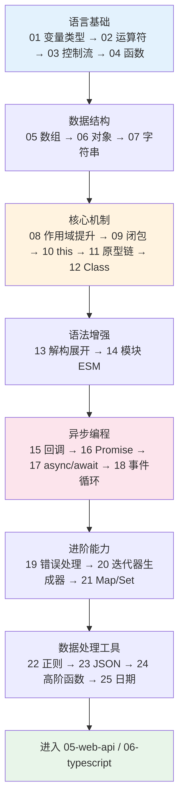

# 04 · JavaScript 核心语言（JavaScript Core）

> JavaScript 是浏览器和 Node.js 的核心编程语言，负责网页交互、逻辑运算与异步处理。本工程聚焦 **JS 语言本身**（变量、函数、对象、原型、异步、事件循环等），DOM 操作、Fetch、BOM 等浏览器 API 放在 `05-web-api`，不在此重复。

## 📖 JavaScript 简介

JavaScript（缩写 JS）是一门**动态、弱类型、基于原型、支持多范式（函数式 + 面向对象 + 命令式）**的脚本语言，遵循 ECMAScript 标准（当前主流为 ES2015+ / ES6+）。它最初为网页交互而生，如今借助 Node.js 已扩展到服务端、桌面、移动等全栈领域。

学习 JS 的三条主线：

1. **语言基础**：变量与类型、运算符、控制流、函数 —— 写出能跑的逻辑。
2. **数据与结构**：数组、对象、字符串、Map/Set、JSON、正则、日期 —— 处理真实数据。
3. **核心机制与异步**：作用域、闭包、this、原型链、Class、回调/Promise/async-await、事件循环 —— 理解 JS 的"为什么"。

## 🗂️ 模块索引

| 序号 | 模块 | 知识点 | 难度 |
| --- | --- | --- | --- |
| 01 | [variables-types](./01-variables-types/) | var/let/const、数据类型、typeof | ⭐ |
| 02 | [operators](./02-operators/) | 运算符、`==` vs `===`、类型转换、`?.` `??` | ⭐ |
| 03 | [control-flow](./03-control-flow/) | if/switch、for/while、for...of/in | ⭐ |
| 04 | [functions](./04-functions/) | 声明/表达式/箭头、默认/剩余参数 | ⭐ |
| 05 | [arrays](./05-arrays/) | 数组创建与常用方法 | ⭐ |
| 06 | [objects](./06-objects/) | 对象、引用类型、浅拷贝/深拷贝 | ⭐⭐ |
| 07 | [strings](./07-strings/) | 字符串方法、模板字符串 | ⭐ |
| 08 | [scope-hoisting](./08-scope-hoisting/) | 作用域、变量/函数提升、TDZ | ⭐⭐ |
| 09 | [closures](./09-closures/) | 闭包原理与应用 ★配图 | ⭐⭐⭐ |
| 10 | [this-binding](./10-this-binding/) | this 绑定、call/apply/bind | ⭐⭐⭐ |
| 11 | [prototype-inheritance](./11-prototype-inheritance/) | 原型链、继承 ★配图 | ⭐⭐⭐ |
| 12 | [class](./12-class/) | ES6 Class、extends/super | ⭐⭐ |
| 13 | [destructuring-spread](./13-destructuring-spread/) | 解构、展开、剩余 | ⭐⭐ |
| 14 | [modules-esm](./14-modules-esm/) | import/export、动态 import | ⭐⭐ |
| 15 | [callbacks](./15-callbacks/) | 回调、回调地狱 | ⭐⭐ |
| 16 | [promises](./16-promises/) | Promise、链式、all/race ★配图 | ⭐⭐⭐ |
| 17 | [async-await](./17-async-await/) | async/await 异步函数 | ⭐⭐⭐ |
| 18 | [event-loop](./18-event-loop/) | 事件循环、宏/微任务 ★重点配图 | ⭐⭐⭐⭐ |
| 19 | [error-handling](./19-error-handling/) | try/catch/throw、Error 类型 | ⭐⭐ |
| 20 | [iterators-generators](./20-iterators-generators/) | 迭代器、生成器 | ⭐⭐⭐ |
| 21 | [map-set](./21-map-set/) | Map/Set/WeakMap | ⭐⭐ |
| 22 | [regex](./22-regex/) | 正则表达式 | ⭐⭐⭐ |
| 23 | [json](./23-json/) | JSON 解析与序列化 | ⭐ |
| 24 | [higher-order-functions](./24-higher-order-functions/) | 高阶函数 map/filter/reduce | ⭐⭐ |
| 25 | [date-time](./25-date-time/) | 日期与时间处理 | ⭐⭐ |

> DOM、事件、Fetch/Ajax、BOM、Storage 等浏览器 API 请见 `05-web-api` 工程。

## 🔄 学习路线图



学习建议：

- **0 基础**：按 01 → 25 顺序学，遇到 ★ 模块（闭包、this、原型链、事件循环）多花时间、反复看流程图。
- **有基础查漏补缺**：直接挑核心机制（08-12）与异步（15-18）四件套。
- 每个模块都"先看 README 理解 → 打开 demo 运行 → 改代码做实验"。

## ▶️ 运行说明

每个模块都是**免构建**的，两种运行方式任选：

**方式一：浏览器看效果（推荐）**

直接用浏览器打开模块里的 `index.html`，页面会显示关键结果，按 `F12` 打开**控制台（Console）** 查看完整 `console.log` 输出。

```
# macOS 下可直接用命令打开，例如：
open 04-javascript/09-closures/index.html
```

> 注意：`14-modules-esm` 用到 ES Module，浏览器对 `file://` 协议的模块有 CORS 限制，需经本地服务器访问，例如：
> `npx serve 04-javascript/14-modules-esm`（或任意静态服务器），再用浏览器打开对应地址。

**方式二：用 Node.js 跑脚本**

每个模块的 `demo.js` 都兼容 Node 环境，可直接运行查看输出：

```
node 04-javascript/09-closures/demo.js
```

> 需要本机安装 Node.js（建议 18+）。模块 `14-modules-esm` 因使用 `import/export`，按其 README 中的说明运行。

## 🔗 官方文档

- [MDN · JavaScript 指南（中文）](https://developer.mozilla.org/zh-CN/docs/Web/JavaScript/Guide)
- [MDN · JavaScript 参考（中文）](https://developer.mozilla.org/zh-CN/docs/Web/JavaScript/Reference)
- [ECMAScript 语言规范](https://tc39.es/ecma262/)
