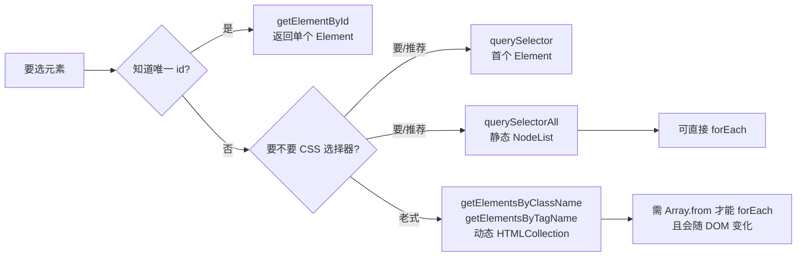

# 01 · DOM 元素选择（DOM Selection）

> 浏览器提供了一组 API，让 JavaScript 能从 HTML 文档中“找到”指定的元素节点，这是一切 DOM 操作的第一步。

## 📖 知识讲解

要操作页面，先得拿到元素。常用的选择 API 分两大家族：

### 1. 传统选择 API（老牌，返回动态集合）

| API | 作用 | 返回类型 |
| --- | --- | --- |
| `document.getElementById('id')` | 按 id 选，全文档唯一 | 单个 `Element` 或 `null` |
| `document.getElementsByClassName('cls')` | 按 class 选 | **动态** `HTMLCollection` |
| `document.getElementsByTagName('div')` | 按标签名选 | **动态** `HTMLCollection` |

- `getElementById` 最快，因为浏览器对 id 有索引。
- 后两者返回 **HTMLCollection**，它是「活的」(live)——DOM 变化时集合内容**自动同步**。

### 2. 现代选择 API（推荐，CSS 选择器 + 静态集合）

| API | 作用 | 返回类型 |
| --- | --- | --- |
| `el.querySelector(css)` | 返回**第一个**匹配的元素 | 单个 `Element` 或 `null` |
| `el.querySelectorAll(css)` | 返回**所有**匹配的元素 | **静态** `NodeList` |

- 接受任意 **CSS 选择器**：`#id`、`.class`、`tag`、`ul li:first-child`、`p.note`、`[data-fruit="apple"]`、`a, b`（并集）等。
- `querySelectorAll` 返回的 **NodeList 是静态的**（拍快照），之后 DOM 怎么变它都不变。
- 非法选择器会抛 `SyntaxError`。

### 3. 元素自身的判断/向上查找

- `el.closest(css)`：从**自身开始向上**找最近的匹配祖先（包含自己），找不到返回 `null`。事件委托里非常常用。
- `el.matches(css)`：判断元素**自己**是否匹配某个选择器，返回布尔值。

### 核心易错点

- **HTMLCollection（动态）vs NodeList（静态）**：这是高频考点，见下方流程图与“常见坑”。
- `querySelectorAll` 的 NodeList **可以直接 `forEach`**；但 `HTMLCollection` **没有** `forEach`，要先 `Array.from()` 或 `Array.prototype.forEach.call()`。
- `querySelector` 只返回第一个，别指望它返回数组。
- 选择器里 class 要带 `.`、id 要带 `#`，别和 `getElementsByClassName('cls')`（不带点）搞混。

## 🔄 流程图 / 原理图

各选择方法的区别与返回类型：



## 💻 代码说明

- **统一高亮**：选中元素后给它加 `.hl` class（红框 + 黄底），用 `classList.add` / `classList.remove` 控制。

```js
// NodeList 可直接 forEach；HTMLCollection 不行，所以用 call 统一处理
Array.prototype.forEach.call(elements, function (el) {
  el.classList.add('hl');
});
```

- **querySelectorAll vs querySelector**：前者拿全部并显示数量，后者只拿首个。
- **closest 演示**：从第一个 `.tag` 往上找到包裹它的 `.card`。
- **动态 vs 静态对比**（核心）：先各取一次集合，再 `appendChild` 一个新 `<li>`，然后重新读 `length`——动态 `HTMLCollection` 的长度变了，静态 `NodeList` 不变：

```js
var liveColl = list.getElementsByTagName('li');   // 动态
var staticNodes = list.querySelectorAll('li');     // 静态快照
list.appendChild(document.createElement('li'));
// liveColl.length 变大了，staticNodes.length 不变
```

## ▶️ 运行方式

浏览器直接双击打开 `index.html` 即可。无需任何构建工具。
在输入框里试试 `.card`、`#title`、`ul li:last-child`、`[data-fruit="banana"]`，或点各个演示按钮看高亮和数量。

## ⚠️ 常见坑 / 最佳实践

1. **动态集合 + 边遍历边删除 = 翻车**。`getElementsByClassName` / `getElementsByTagName` 返回的是 live 集合，如果你 `for (i=0; i<coll.length; i++)` 同时 `coll[i].remove()`，集合会实时缩短，导致漏删或下标错乱。解决：先 `Array.from(coll)` 转成静态数组再操作，或改用 `querySelectorAll`。
2. **HTMLCollection 没有 forEach**。`document.getElementsByClassName('x').forEach(...)` 会报错。NodeList（querySelectorAll 的结果）才有。
3. `querySelector` 找不到时返回 `null`，直接 `.classList` 会报 `Cannot read properties of null`，使用前要判空。
4. **选择器性能**：能用 `getElementById` 就别用复杂 CSS 选择器；但现代浏览器差距很小，可读性优先。
5. `matches` / `closest` 是写**事件委托**的利器：在父元素上监听，用 `e.target.closest('.item')` 判断点中了哪一项。

## 🔗 官方文档

- [Document.getElementById()](https://developer.mozilla.org/zh-CN/docs/Web/API/Document/getElementById)
- [Document.querySelector()](https://developer.mozilla.org/zh-CN/docs/Web/API/Document/querySelector)
- [Document.querySelectorAll()](https://developer.mozilla.org/zh-CN/docs/Web/API/Document/querySelectorAll)
- [Element.closest()](https://developer.mozilla.org/zh-CN/docs/Web/API/Element/closest)
- [Element.matches()](https://developer.mozilla.org/zh-CN/docs/Web/API/Element/matches)
- [HTMLCollection（动态集合）](https://developer.mozilla.org/zh-CN/docs/Web/API/HTMLCollection)
- [NodeList（静态/动态说明）](https://developer.mozilla.org/zh-CN/docs/Web/API/NodeList)
