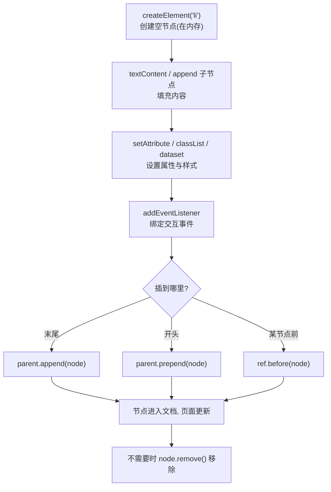

# 02 · DOM 节点操作（DOM Manipulation）

> 在拿到元素之后，如何用 JavaScript 创建、插入、删除、替换、修改 DOM 节点——这是动态更新页面的核心能力。

## 📖 知识讲解

### 1. 创建节点

- `document.createElement('div')`：创建一个元素节点（此刻还在内存里，没进文档）。
- `document.createTextNode('文本')`：创建纯文本节点（实际开发更常直接用 `textContent`）。

### 2. 插入节点

| API | 说明 |
| --- | --- |
| `parent.appendChild(node)` | 追加到末尾，只能传 1 个节点 |
| `parent.append(a, b, '文本')` | 追加到末尾，**可传多个节点和字符串**（推荐） |
| `parent.prepend(node)` | 插到最前面 |
| `parent.insertBefore(new, ref)` | 把 new 插到 ref 之前 |
| `ref.before(node)` / `ref.after(node)` | 在 ref 的前/后插入**兄弟**节点（现代写法） |

### 3. 删除 / 替换 / 克隆

- `node.remove()`：把自己从 DOM 移除（现代，简洁）。
- `parent.removeChild(child)`：老写法，需要拿到父节点。
- `parent.replaceChild(newNode, oldNode)`：用新节点替换旧节点。
- `node.cloneNode(true)`：深克隆（含所有子节点）；`cloneNode(false)` 只克隆自身。**注意：克隆不会复制通过 `addEventListener` 绑定的事件监听器。**

### 4. 修改内容（重点：安全）

- `el.textContent = str`：把内容当**纯文本**，标签不会被解析——**安全**。
- `el.innerHTML = str`：把内容当 **HTML** 解析——如果 str 含用户输入，可能被注入脚本（**XSS 风险**）。

### 5. 修改属性 / 样式 / 类名

- `el.setAttribute('title', 'x')` / `el.getAttribute('title')`：读写任意属性。
- `el.classList`：`add` / `remove` / `toggle`（有则删无则加）/ `contains`（判断是否含某 class）——操作 class 的标准方式，别再手拼 `className` 字符串。
- `el.style.color = 'red'`：改内联样式（驼峰命名，如 `backgroundColor`）。
- `el.dataset.foo = 'bar'`：对应 HTML 的 `data-foo="bar"`，读写自定义数据。

## 🔄 流程图 / 原理图

创建并插入一个节点的标准流程：



## 💻 代码说明

- **工厂函数 `createTodo(text)`**：演示「创建空节点 → 填内容 → 绑事件 → 返回」的完整套路。文字用 `textContent` 写入，从源头杜绝 XSS：

```js
var span = document.createElement('span');
span.textContent = text;            // 用户输入只当文本，安全
span.addEventListener('click', function () {
  li.classList.toggle('done');      // 点击切换完成态
});
li.append(span, del);               // append 可一次塞多个
```

- **删除**：删除按钮调用 `li.remove()`，比 `parent.removeChild` 简洁。
- **append vs prepend**：两个按钮分别把新待办插到末尾和开头。
- **textContent vs innerHTML**：把 `` 分别用两种方式渲染——`textContent` 原样显示文本，`innerHTML` 会真的解析并触发 `onerror`（XSS）。
- **cloneNode**：深克隆首项，并演示「克隆不带事件监听，需要 `rebind` 手动重绑」这个坑。
- **清空**：`while (list.firstChild) list.removeChild(list.firstChild)` 经典循环写法。

## ▶️ 运行方式

浏览器直接双击打开 `index.html`。输入待办、回车新增、点文字切换完成、点删除移除；再到第②区点两个按钮，对比 `textContent` 与 `innerHTML` 的安全差异。

## ⚠️ 常见坑 / 最佳实践

1. **innerHTML 的 XSS**：永远不要把用户输入直接赋给 `innerHTML`。要展示纯文本用 `textContent`；确实要插入 HTML，先做转义/消毒（如 DOMPurify）。
2. **cloneNode 不复制事件监听**。`cloneNode(true)` 只复制 DOM 结构和内联属性，`addEventListener` 绑的监听器丢失，需要手动重绑（或改用事件委托）。
3. **频繁插入用 DocumentFragment**。循环里反复 `appendChild` 到真实 DOM 会多次触发重排；先 append 到 `document.createDocumentFragment()`，最后一次性插入，性能更好。
4. `classList.toggle('x')` 比手动判断 `if (has) remove else add` 更简洁，还能传第二个参数 `toggle('x', force)` 强制开/关。
5. `style.xxx` 用驼峰：`el.style.backgroundColor`，不是 `background-color`。
6. `dataset` 自动做连字符↔驼峰转换：`data-created-at` ↔ `dataset.createdAt`。

## 🔗 官方文档

- [Document.createElement()](https://developer.mozilla.org/zh-CN/docs/Web/API/Document/createElement)
- [Element.append()](https://developer.mozilla.org/zh-CN/docs/Web/API/Element/append) / [prepend()](https://developer.mozilla.org/zh-CN/docs/Web/API/Element/prepend)
- [Element.remove()](https://developer.mozilla.org/zh-CN/docs/Web/API/Element/remove) / [Node.removeChild()](https://developer.mozilla.org/zh-CN/docs/Web/API/Node/removeChild)
- [Node.cloneNode()](https://developer.mozilla.org/zh-CN/docs/Web/API/Node/cloneNode)
- [Node.textContent](https://developer.mozilla.org/zh-CN/docs/Web/API/Node/textContent) / [Element.innerHTML](https://developer.mozilla.org/zh-CN/docs/Web/API/Element/innerHTML)
- [Element.classList](https://developer.mozilla.org/zh-CN/docs/Web/API/Element/classList)
- [HTMLElement.dataset](https://developer.mozilla.org/zh-CN/docs/Web/API/HTMLElement/dataset)
- [跨站脚本攻击 XSS](https://developer.mozilla.org/zh-CN/docs/Glossary/Cross-site_scripting)
