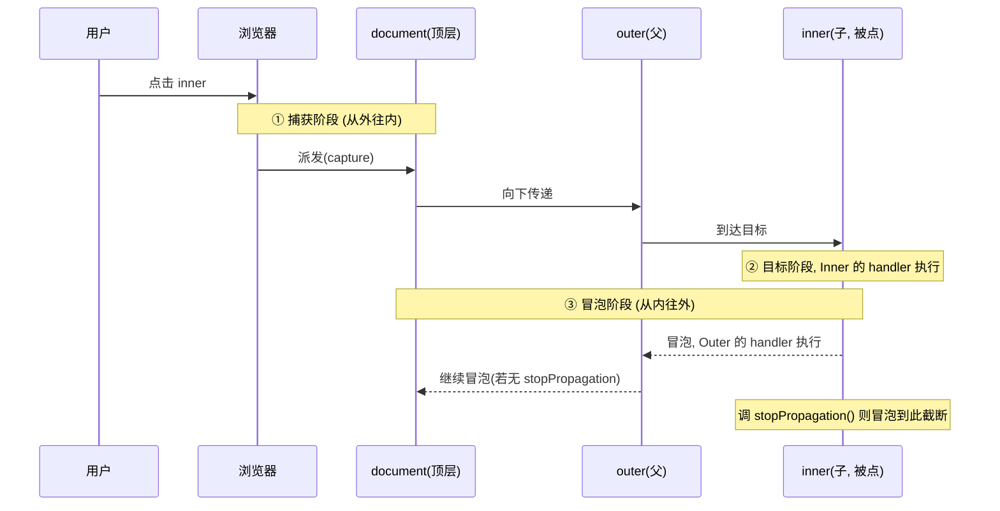

# 03 · DOM 事件基础（DOM Events）

> 事件是网页交互的核心：用户点击、输入、移动鼠标、敲键盘时，浏览器派发事件，JavaScript 用监听器响应它们。

## 📖 知识讲解

### 1. 绑定事件：addEventListener

```js
element.addEventListener(type, handler, options);
```

- `type`：事件名（不带 `on`），如 `'click'`、`'input'`、`'keydown'`。
- `handler`：回调函数，会收到一个 `event` 对象。
- `options`：可选，常用 `{ once, passive, capture }`。

相比内联 `onclick="..."` 或 `el.onclick = fn`，`addEventListener` 可以给同一元素同一事件绑**多个**监听器，互不覆盖，是推荐写法。

### 2. event 事件对象（重点）

| 属性/方法 | 含义 |
| --- | --- |
| `event.type` | 事件类型，如 `'click'` |
| `event.target` | **真正触发**事件的元素（冒泡时是最内层被点的那个） |
| `event.currentTarget` | **当前监听器绑定**的元素（= 处理函数里的 `this`） |
| `event.preventDefault()` | 阻止默认行为（如 `<a>` 跳转、表单提交、右键菜单） |
| `event.stopPropagation()` | 阻止事件继续冒泡 |
| `event.key` / `event.code` | 键盘事件：按键字符 / 物理键位 |

### 3. options 选项

- `{ once: true }`：触发一次后**自动移除**监听器。
- `{ passive: true }`：承诺不调用 `preventDefault`，浏览器可优化滚动性能（常用于 `touchstart`/`wheel`）。
- `{ capture: true }`：在**捕获阶段**触发（默认是冒泡阶段）。

### 4. 移除事件：removeEventListener

```js
element.removeEventListener(type, handler, options);
```

**必须传入和添加时「同一个函数引用」**才能移除——这是最经典的坑（见下）。

### 5. 常见事件类型

`click`（点击）、`input`（输入框内容变化，实时）、`change`（失焦且值变了）、`keydown`/`keyup`（键盘）、`mouseover`/`mousemove`（鼠标）、`submit`（表单提交）、`focus`/`blur`（聚焦/失焦）。

## 🔄 流程图 / 原理图

一次点击事件从触发到 handler 执行，会经历「捕获 → 目标 → 冒泡」三个阶段：



## 💻 代码说明

- **click 计数 + once**：普通按钮每点一次 `count++`；`once` 按钮用 `{ once: true }`，点一次后监听自动失效。处理函数里 `this === event.currentTarget` 指向按钮本身。
- **input 实时回显**：监听 `input` 事件，`event.target.value` 拿当前输入值，实时写到下方。
- **keydown**：`event.key` 是字符，`event.code` 是物理键位，还能读 `ctrlKey/shiftKey/altKey`。
- **mousemove**：`offsetX/offsetY` 是相对触发元素的坐标，`clientX/clientY` 是相对视口的坐标。
- **preventDefault**：拦住 `<a>` 的跳转：

```js
preventLink.addEventListener('click', function (event) {
  event.preventDefault();   // 链接不再跳转
});
```

- **冒泡 / stopPropagation / removeEventListener**：handler 抽成**具名函数** `outerHandler`，这样才能被 `removeEventListener` 正确移除；勾选框控制子元素是否 `stopPropagation` 来截断冒泡：

```js
function outerHandler(event) { /* ... */ }
outer.addEventListener('click', outerHandler);
// 因为是具名函数，能成功移除
outer.removeEventListener('click', outerHandler);
```

## ▶️ 运行方式

浏览器直接双击打开 `index.html`，逐个面板交互：点按钮看计数、打字看回显、按键看按键名、移动鼠标看坐标、点两个链接对比 `preventDefault`、点 outer/inner 观察冒泡并试试勾选「stopPropagation」和「移除监听器」。

## ⚠️ 常见坑 / 最佳实践

1. **removeEventListener 必须同一函数引用**。下面这样**无法**移除——因为两个匿名函数是不同的对象：

```js
el.addEventListener('click', function () { ... });
el.removeEventListener('click', function () { ... }); // 无效！
```
正确做法：把 handler 存成具名函数或变量再传给两边；或直接用 `{ once: true }` 让它自动移除。

2. **箭头函数 vs 普通函数的 this**。普通 `function` 里 `this` 指向 `currentTarget`；箭头函数没有自己的 `this`，会指向外层作用域。需要 `this` 指向元素时用普通函数，或统一用 `event.currentTarget`。

3. **`target` vs `currentTarget` 别混**。事件委托时 `currentTarget` 是绑监听的父元素，`target` 才是真正被点的子元素，用 `e.target.closest('.item')` 定位。

4. **内联 onclick 的缺点**：只能绑一个、和 HTML 耦合、作用域诡异，生产中用 `addEventListener`。

5. **passive 与滚动性能**：给 `wheel`/`touchstart` 加 `{ passive: true }`，告诉浏览器你不会 `preventDefault`，滚动更流畅。

6. **及时解绑防内存泄漏**：组件/元素销毁前移除不再需要的监听器（尤其是绑在 `window`/`document` 上的）。

## 🔗 官方文档

- [EventTarget.addEventListener()](https://developer.mozilla.org/zh-CN/docs/Web/API/EventTarget/addEventListener)
- [EventTarget.removeEventListener()](https://developer.mozilla.org/zh-CN/docs/Web/API/EventTarget/removeEventListener)
- [Event 对象](https://developer.mozilla.org/zh-CN/docs/Web/API/Event)
- [Event.preventDefault()](https://developer.mozilla.org/zh-CN/docs/Web/API/Event/preventDefault)
- [Event.stopPropagation()](https://developer.mozilla.org/zh-CN/docs/Web/API/Event/stopPropagation)
- [事件冒泡与捕获（事件介绍）](https://developer.mozilla.org/zh-CN/docs/Learn/JavaScript/Building_blocks/Events)
- [KeyboardEvent.key](https://developer.mozilla.org/zh-CN/docs/Web/API/KeyboardEvent/key)
