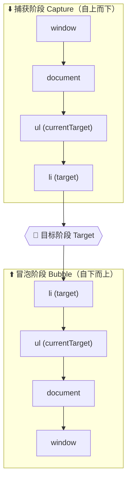

# 04 · 事件委托 + 冒泡/捕获（Event Delegation & Event Flow）

> 把监听器加在父元素上，利用事件冒泡统一处理所有子元素（含动态新增），并理解事件流的捕获/目标/冒泡三阶段。

## 📖 知识讲解（对照 MDN，列核心 API + 易错点）

### 事件流的三个阶段
一次点击在 DOM 中传播会经历三个阶段：

1. **捕获阶段（Capture）**：事件从 `window` 自上而下传到目标元素的父级链。
2. **目标阶段（Target）**：到达真正被点击的元素。
3. **冒泡阶段（Bubble）**：事件再从目标元素自下而上传回 `window`。

### 核心 API
| API | 说明 |
| --- | --- |
| `addEventListener(type, fn, capture)` | 第三个参数 `capture` 为 `true` 时在**捕获阶段**触发，默认 `false` 在**冒泡阶段**触发 |
| `event.target` | **实际被点击**的元素（可能是子元素或更深的内部元素） |
| `event.currentTarget` | **监听器所绑定**的元素（事件委托里永远是父元素） |
| `event.stopPropagation()` | 阻止事件继续向上冒泡（或在捕获阶段继续向下） |
| `event.stopImmediatePropagation()` | 阻止冒泡，且阻止同元素上其余同类监听器 |
| `element.closest(selector)` | 从目标向上找最近的匹配祖先，常用于委托中定位真正的目标行 |

### 事件委托原理
不给每个子元素单独绑定监听器，而是只在**父元素**上绑定一个。子元素被点击时事件冒泡到父元素，在回调里用 `event.target` / `closest()` 判断点的是哪一个。

**优势**：① 监听器数量少，省内存、性能好；② 动态新增的子元素**无需重新绑定**即可生效。

### 易错点
- **`target` 与 `currentTarget` 混淆**：委托里要操作「被点的那一项」必须用 `event.target`（配合 `closest`），用 `currentTarget` 永远拿到父元素。
- 点到子元素内部（如 li 里的 span）时，`target` 是 span 而非 li，需用 `closest('li')` 回溯。
- 不是所有事件都冒泡（如 `focus`、`blur` 不冒泡，对应可冒泡的是 `focusin`、`focusout`）。

## 🔄 流程图 / 原理图

> 事件委托把监听器放在 `ul` 上：点击任意 `li` → 事件冒泡到 `ul` → 回调里 `event.target` 是被点的 `li`，`event.currentTarget` 是 `ul`。

## 💻 代码说明

- `demo.js` 第一部分：在 `ul#todo-list` 上绑定唯一一个 `click` 监听器；用 `event.target.closest('li')` 定位被点项并高亮；并把 `target` / `currentTarget` 的区别实时显示在页面，直观体会坑点。
- 「动态新增 li」按钮创建的新 `li` **没有任何单独绑定**，照样可被点击高亮，证明委托对动态元素有效。
- 第二部分：三层嵌套盒子在捕获和冒泡阶段各绑一个监听器，点击最内层会按 `捕获 outer→middle→inner → 冒泡 inner→middle→outer` 的顺序输出日志。
- 第三部分：开关控制内层是否调用 `stopPropagation()`，观察外层能否收到冒泡。

## ▶️ 运行方式

双击 `index.html` 在浏览器打开即可（无需任何构建或联网）。

## ⚠️ 常见坑 / 最佳实践

- 委托里务必区分 `event.target`（被点的具体元素）和 `event.currentTarget`（绑定监听的父元素）。
- 用 `closest()` 而不是直接判断 `target.tagName`，以兼容点到子元素内部的情况。
- 需要委托不冒泡的事件（focus/blur）时改用 `focusin`/`focusout`。
- 不要滥用 `stopPropagation()`，它会破坏其他依赖冒泡的逻辑（如全局关闭弹层）。

## 🔗 官方文档

- [事件介绍（MDN）](https://developer.mozilla.org/zh-CN/docs/Learn/JavaScript/Building_blocks/Events)
- [EventTarget.addEventListener()](https://developer.mozilla.org/zh-CN/docs/Web/API/EventTarget/addEventListener)
- [Event.target](https://developer.mozilla.org/zh-CN/docs/Web/API/Event/target)
- [Event.currentTarget](https://developer.mozilla.org/zh-CN/docs/Web/API/Event/currentTarget)
- [Event.stopPropagation()](https://developer.mozilla.org/zh-CN/docs/Web/API/Event/stopPropagation)
- [Element.closest()](https://developer.mozilla.org/zh-CN/docs/Web/API/Element/closest)
