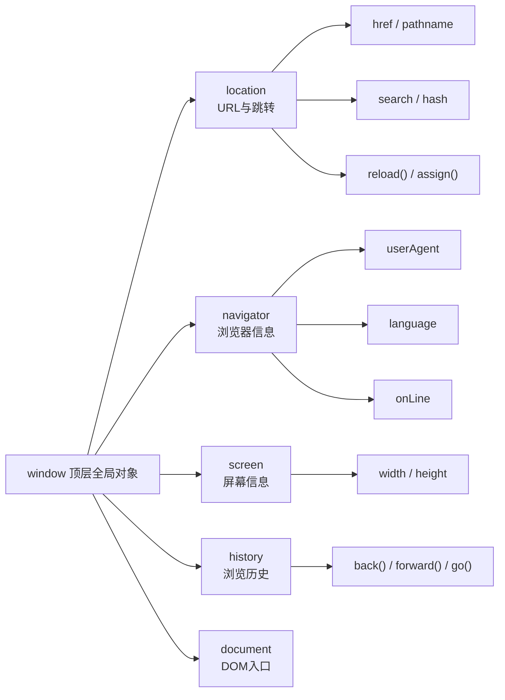

# 05 · BOM 浏览器对象模型（Browser Object Model）

> 以 `window` 为顶层全局对象，提供操作浏览器窗口、URL、导航信息、屏幕等与「页面内容无关」的能力。

## 📖 知识讲解（对照 MDN，列核心 API + 易错点）

BOM 没有官方统一标准，但各浏览器实现已高度趋同。顶层对象是 `window`，全局变量/函数其实都是它的属性（`window.alert` 等同 `alert`）。

### window.location（当前页面 URL）
| 属性/方法 | 说明 |
| --- | --- |
| `location.href` | 完整 URL；**赋值会立即跳转**到新地址 |
| `location.protocol` / `host` / `hostname` / `port` | 协议 / 主机+端口 / 主机名 / 端口 |
| `location.pathname` | 路径部分 `/a/b` |
| `location.search` | 查询字符串 `?id=1`（配合 `URLSearchParams` 解析） |
| `location.hash` | 锚点 `#section`，改它不刷新页面，触发 `hashchange`（前端路由基础） |
| `location.reload()` | 重新加载当前页 |
| `location.assign(url)` | 跳转到新页（保留历史，可后退） |
| `location.replace(url)` | 跳转但**替换**当前历史记录（不能后退回来） |

### window.navigator（浏览器/设备信息）
- `navigator.userAgent`：UA 字符串（可被伪造，不可靠）。
- `navigator.language` / `languages`：首选语言。
- `navigator.onLine`：是否联网；配合 `online` / `offline` 事件监听变化。

### 其他
- `window.screen`：`width`/`height`（物理屏幕）、`availWidth`/`availHeight`（去掉任务栏的可用区）。
- `window.innerWidth` / `innerHeight`：视口尺寸，随 `resize` 变化。
- `window.open(url, name, features)` / `window.close()`：开关窗口（脚本只能 close 自己 open 的窗口）。
- `alert()` / `confirm()`（返回布尔）/ `prompt()`（返回字符串或 null）：模态对话框，会**阻塞**主线程。
- `window.scrollTo({ top, behavior: 'smooth' })`：滚动到指定位置。

### 易错点
- `location.href = '...'`、`location.assign()`、`location.replace()` 都会**触发页面跳转**，不要误以为只是改字符串。
- `file://` 协议下 `host` / `hostname` / `port` 为空。
- `alert/confirm/prompt` 会阻塞，体验差，生产中多用自定义弹层。

## 🔄 原理图：window 下挂的 BOM 对象树

## 💻 代码说明

- `renderLocation()` 把 `window.location` 各部分拆解成表格显示；「随机修改 hash」按钮改 `location.hash` 并触发 `hashchange`。
- `renderNavigator()` 读取语言、`onLine`、UA；并监听 `online`/`offline` 事件实时更新网络状态。
- `renderSize()` 显示 `screen` 与 `innerWidth/Height`，监听 `resize` 实时刷新。
- 按钮分别演示 `alert` / `confirm` / `prompt` 的返回值、`window.open`/`close`、`scrollTo` 平滑滚动到顶部、`location.reload()`。

## ▶️ 运行方式

双击 `index.html` 在浏览器打开即可（无需构建、无需联网）。可缩放窗口、断网测试 `onLine`、点击各按钮观察效果。

## ⚠️ 常见坑 / 最佳实践

- BOM 非 W3C 标准，但主流浏览器趋同；涉及具体 UA 解析仍需谨慎（UA 可伪造，能力检测优于 UA 嗅探）。
- 给 `location.href` 赋值会真的跳转页面；只想改锚点用 `location.hash`。
- 解析查询参数优先用 `new URLSearchParams(location.search)` 而非手写正则。
- `window.open` 常被浏览器弹窗拦截，需在用户点击事件中调用。

## 🔗 官方文档

- [Window（MDN）](https://developer.mozilla.org/zh-CN/docs/Web/API/Window)
- [Location](https://developer.mozilla.org/zh-CN/docs/Web/API/Location)
- [Navigator](https://developer.mozilla.org/zh-CN/docs/Web/API/Navigator)
- [Screen](https://developer.mozilla.org/zh-CN/docs/Web/API/Screen)
- [Window.open()](https://developer.mozilla.org/zh-CN/docs/Web/API/Window/open)
- [Window.scrollTo()](https://developer.mozilla.org/zh-CN/docs/Web/API/Window/scrollTo)
