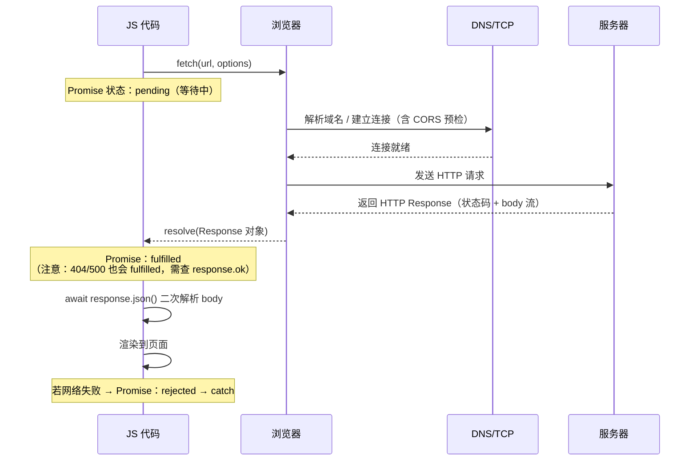

# 06 · Fetch 网络请求（Fetch API）

> `fetch(url, options)` 返回 Promise，提供现代化、基于 Promise 的网络请求能力，替代老旧的 XMLHttpRequest。

## 📖 知识讲解（对照 MDN，列核心 API + 易错点）

### 基本用法
```js
const response = await fetch(url, options); // 返回 Promise<Response>
const data = await response.json();         // body 需二次解析
```

### Response 对象
| 属性/方法 | 说明 |
| --- | --- |
| `response.ok` | 状态码在 200–299 之间为 `true`，否则 `false`（判断成功的关键） |
| `response.status` | HTTP 状态码（200 / 404 / 500 ...） |
| `response.statusText` | 状态文本（OK / Not Found ...） |
| `response.headers` | 响应头（`Headers` 对象） |
| `response.json()` | 把 body 解析为 JS 对象（返回 Promise） |
| `response.text()` | 把 body 解析为字符串（返回 Promise） |
| `response.blob()` | 解析为二进制（图片/文件） |

### options 常用字段（POST 等）
```js
fetch(url, {
  method: 'POST',                                  // 请求方法
  headers: { 'Content-Type': 'application/json' }, // 请求头
  body: JSON.stringify({ a: 1 }),                  // 对象必须序列化为字符串
  signal: controller.signal,                       // 配合 AbortController 取消
});
```

### 两种写法
- `.then()` 链式：`fetch().then(r => r.json()).then(data => ...).catch(...)`。
- `async/await`：用 `try/catch` 捕获错误，代码更直观（推荐）。

### ⚠️ 核心易错点
1. **fetch 对 4xx/5xx 不会 reject**：只有网络层失败（断网、DNS、CORS）才 reject。404/500 会正常 resolve，必须手动 `if (!response.ok) throw ...`。
2. **body 需要二次解析**：`response` 拿到时 body 还是流，要 `await response.json()` / `text()` 才能得到数据；且 body 只能被读取一次。
3. **CORS**：跨域请求受同源策略限制，服务器需返回正确的 `Access-Control-Allow-Origin` 头，否则浏览器拦截并 reject。
4. **取消请求**：用 `AbortController`，`controller.abort()` 会让 fetch 抛出 `name === 'AbortError'` 的错误。

## 🔄 流程图：fetch 请求时序（必看）



## 💻 代码说明

- **① GET 单篇**（`.then` 链式）：检查 `response.ok`，不 OK 就 `throw` 进 `.catch`；演示 Promise pending→fulfilled。
- **② GET 列表**（`async/await`）：`try/catch` 包裹，渲染 5 条文章。
- **③ POST 新建**：设置 `method`、`headers`、`JSON.stringify(body)`，显示服务器返回的新对象（id 通常为 101）。
- **④ AbortController**：发起请求后可点「取消」，触发 `AbortError`，演示请求中断。
- 所有交互都带 loading / success / error 三种视觉状态，并对接口返回内容做 HTML 转义。

## ▶️ 运行方式

双击 `index.html` 在浏览器打开。**本模块需要联网**（请求公共接口 `https://jsonplaceholder.typicode.com`）。逐个点击按钮观察 loading、成功结果与错误处理；可在 AbortController 区域测试取消。

## ⚠️ 常见坑 / 最佳实践

- **务必判断 `response.ok`**：fetch 不会因 404/500 进入 `catch`，漏判会把错误页当成数据。
- **body 只能读一次**：不要对同一个 response 既 `json()` 又 `text()`。
- **跨域 CORS**：本地用 `file://` 打开请求第三方接口可能因 CORS 失败，jsonplaceholder 已开放 CORS 故可用；自建后端需配置允许跨域。
- **超时**：fetch 无内置超时，可用 `AbortController` + `setTimeout` 实现。
- POST 发送 JSON 时别忘了 `Content-Type: application/json` 和 `JSON.stringify`。

## 🔗 官方文档

- [使用 Fetch（MDN）](https://developer.mozilla.org/zh-CN/docs/Web/API/Fetch_API/Using_Fetch)
- [fetch() 全局函数](https://developer.mozilla.org/zh-CN/docs/Web/API/fetch)
- [Response](https://developer.mozilla.org/zh-CN/docs/Web/API/Response)
- [Response.ok](https://developer.mozilla.org/zh-CN/docs/Web/API/Response/ok)
- [AbortController](https://developer.mozilla.org/zh-CN/docs/Web/API/AbortController)
- [跨源资源共享 CORS](https://developer.mozilla.org/zh-CN/docs/Web/HTTP/CORS)
