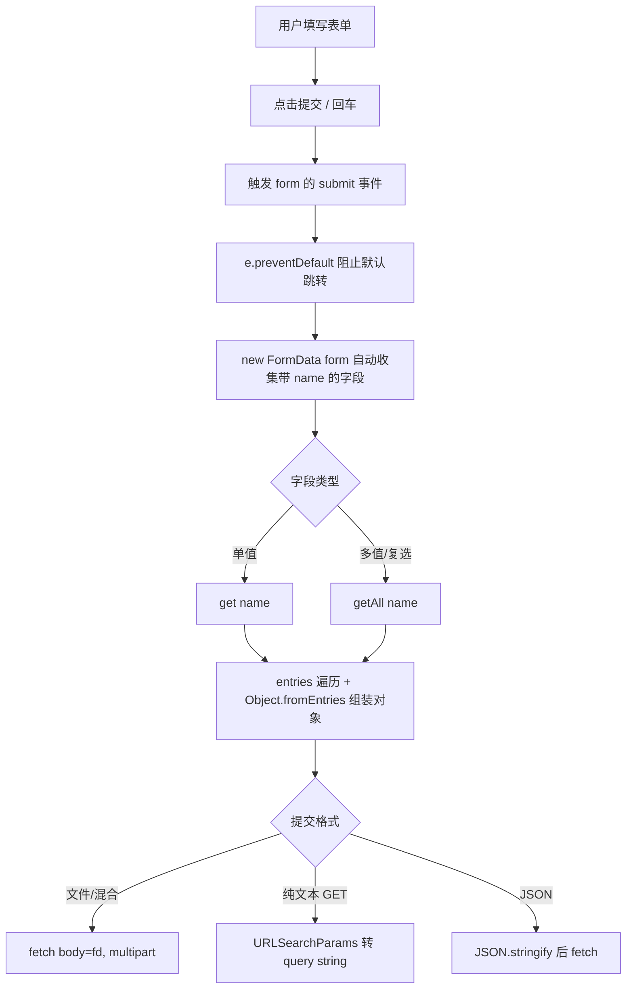

# 07 · 表单数据与 FormData（FormData）

> 用 `FormData` 一行代码收集表单所有字段，配合 `submit` 事件 + `preventDefault()` 接管提交，再决定是发 JSON、发 multipart 还是拼成 query string。

## 📖 知识讲解（对照 MDN）

### 1. HTMLFormElement 与表单元素取值
- `<form>` 对应 `HTMLFormElement`。常用：
  - `form.elements`：表单内所有控件的集合，可用 `form.elements['username']` 或下标访问。
  - `form.submit()` / `form.reset()`：以代码方式提交 / 重置。
- 单个控件取值：文本框 `input.value`；下拉 `select.value`；单选取被选中那个 `value`；复选要遍历看 `checkbox.checked`。
- **手动逐个取值很繁琐**，所以有了 `FormData`。

### 2. FormData 对象（核心）
| API | 作用 |
| --- | --- |
| `new FormData(form)` | 自动读取表单里**所有带 name 且未禁用**的控件 |
| `fd.get(name)` | 取第一个值 |
| `fd.getAll(name)` | 取同名的**所有**值（复选框、多选必用） |
| `fd.has(name)` | 是否存在该字段 |
| `fd.append(name, value)` | 追加一个值（同名不覆盖，会多一条） |
| `fd.set(name, value)` | 设置/覆盖（同名只留一个） |
| `fd.delete(name)` | 删除字段 |
| `fd.entries()` | 返回 `[name, value]` 迭代器，可 `for...of` 遍历 |

### 3. 提交方式
- **配合 fetch**：`fetch(url, { method:'POST', body: fd })`。传 `FormData` 时浏览器**自动设置** `Content-Type: multipart/form-data`（含 boundary），**千万别自己手动再设** Content-Type，否则 boundary 丢失、后端解析失败。
- **转对象**：`Object.fromEntries(fd)` 一行转普通对象，方便 `JSON.stringify` 发 JSON。
- **转 query string**：`new URLSearchParams(fd).toString()` → `a=1&b=2`，自动 URL 编码，适合 GET。

### 4. submit 事件 + preventDefault
- `submit` 事件由 **表单** 触发（不是按钮）；`type=submit` 的按钮或输入框回车都会触发。
- 默认行为是**刷新/跳转页面**，会导致 JS 来不及收集数据。用 `e.preventDefault()` 接管。

### 易错点速记
- **没有 `name` 属性的控件不会被 FormData 收集**（本 demo 的手机号就是反例）。
- 多选字段用 `getAll`，别用 `get`（只拿到第一个）。
- `Object.fromEntries(fd)` 对同名字段只保留**最后一个**值——多选会丢数据。

## 🔄 流程图 / 原理图

## 💻 代码说明

- `form.addEventListener('submit', e => { e.preventDefault(); ... })`：接管提交，阻止页面跳转。
- `const fd = new FormData(form)`：一行收集所有字段；手机号因无 `name` 不被收集。
- `fd.getAll('hobby')`：正确拿到复选框的多个值。
- `Object.fromEntries(fd)`：转对象，再用 `obj.hobby = hobbies` 修正多选。
- 「转 query string」按钮：用 `URLSearchParams` + `append` 保留多值，`toString()` 自动 URL 编码。
- `form.elements['username']`：演示按 name 访问单个控件。

## ▶️ 运行方式

免构建，直接双击 `index.html` 用浏览器打开即可。填好表单点「提交」看页面输出；点「转成 URLSearchParams」看 query string。

## ⚠️ 常见坑 / 最佳实践

- ❌ **控件忘了写 `name`** → FormData 静默忽略，后端收不到该字段。给每个要提交的控件都加 `name`。
- ❌ **传 FormData 给 fetch 时手动设 `Content-Type`** → boundary 丢失、后端解析失败。让浏览器自动设。
- ❌ **多选只用 `get`** → 只拿到第一个值。用 `getAll`。
- ✅ 纯文本表单 + GET 用 `URLSearchParams`；含文件用 `FormData`(multipart)；前后端约定 JSON 就 `Object.fromEntries` + `JSON.stringify`。
- ✅ `submit` 事件里务必 `preventDefault()`，否则页面刷新数据丢失。

## 🔗 官方文档

- [FormData - MDN](https://developer.mozilla.org/zh-CN/docs/Web/API/FormData)
- [HTMLFormElement - MDN](https://developer.mozilla.org/zh-CN/docs/Web/API/HTMLFormElement)
- [URLSearchParams - MDN](https://developer.mozilla.org/zh-CN/docs/Web/API/URLSearchParams)
- [HTMLFormElement: submit 事件 - MDN](https://developer.mozilla.org/zh-CN/docs/Web/API/HTMLFormElement/submit_event)
- [Object.fromEntries() - MDN](https://developer.mozilla.org/zh-CN/docs/Web/JavaScript/Reference/Global_Objects/Object/fromEntries)
