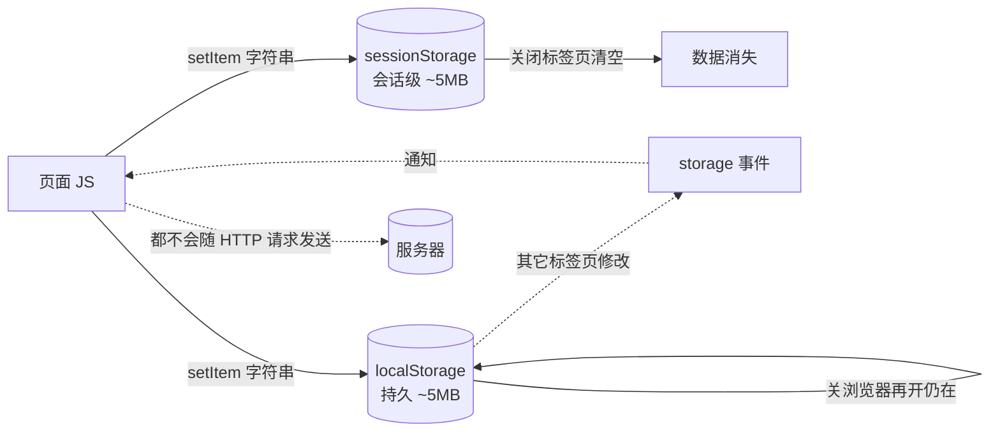

# 08 · Web Storage（localStorage / sessionStorage）

> 浏览器自带的键值对存储，比 cookie 容量大、用法简单，用来在本地持久化主题、笔记、登录状态等非敏感数据。

## 📖 知识讲解（对照 MDN）

### 1. 两个存储对象，API 完全一样，区别只在生命周期
- `localStorage`：**持久化**。关闭浏览器再打开仍在，除非手动清除。
- `sessionStorage`：**会话级**。仅当前标签页本次会话有效，**关闭标签页就清空**（同一标签页刷新仍在）。

两者共同点：**同源隔离**（协议+域名+端口都相同才共享）、容量约 **5MB**、**只能存字符串**、**同步 API**。

### 2. 核心方法（Storage 接口）
| API | 作用 |
| --- | --- |
| `setItem(key, value)` | 写入（value 必须是字符串） |
| `getItem(key)` | 读取，不存在返回 `null` |
| `removeItem(key)` | 删除单个键 |
| `clear()` | 清空当前源下全部键 |
| `key(index)` | 取第 index 个键名 |
| `length` | 键的数量 |

### 3. 只能存字符串 → 对象要序列化
```js
localStorage.setItem('user', JSON.stringify({ name: '小明' })); // 存
const user = JSON.parse(localStorage.getItem('user'));          // 取
```
直接存对象会被转成字符串 `"[object Object]"`，数据丢失。

### 4. storage 事件（跨标签页同步）
```js
window.addEventListener('storage', e => { /* e.key, e.oldValue, e.newValue */ });
```
**只在「其它」同源标签页修改时触发**，当前标签页自己改不会触发自己。常用于多标签页登录态同步。

### 5. 三者对比

| 特性 | localStorage | sessionStorage | cookie |
| --- | --- | --- | --- |
| 生命周期 | 永久（手动清） | 关标签页即失效 | 可设过期时间 |
| 容量 | ~5MB | ~5MB | ~4KB |
| 随 HTTP 请求自动发送 | ❌ 否 | ❌ 否 | ✅ 是（同域请求自动带上） |
| 服务器可读写 | ❌ 仅前端 JS | ❌ 仅前端 JS | ✅ 可（Set-Cookie） |
| API | 简单同步 | 简单同步 | `document.cookie` 字符串，繁琐 |

## 🔄 流程图 / 原理图



## 💻 代码说明

- **主题切换**：`applyTheme()` 里 `localStorage.setItem('demo.theme', theme)`，`init()` 时读回 → 刷新后主题保留。
- **笔记**：`note` 输入框 `input` 事件实时 `setItem`；`init()` 用 `getItem` 恢复 → 刷新/重开都在。
- **草稿**：用 `sessionStorage`，刷新还在但关标签页即失效，对比 localStorage。
- **存对象**：`JSON.stringify` 存、`JSON.parse` 取，演示「只能存字符串」。
- **遍历**：`for (i<localStorage.length) localStorage.key(i)` 列出全部键值。
- **storage 事件**：打开两个相同页面，一边改、另一边收到通知并同步。

## ▶️ 运行方式

免构建，双击 `index.html` 用浏览器打开。写笔记后刷新看是否保留；切主题刷新看是否记住；想看 `storage` 事件就在浏览器开两个相同标签页，一边操作、另一边看控制台。

## ⚠️ 常见坑 / 最佳实践

- ❌ **直接存对象/数组** → 变成 `"[object Object]"`。务必 `JSON.stringify` / `JSON.parse`。
- ❌ **存大量数据超过 ~5MB** → 抛 `QuotaExceededError`。写入大数据要 `try/catch`。
- ❌ **同步 API 阻塞主线程** → 别在循环里频繁读写大字符串，会卡 UI。
- ❌ **存敏感信息**（token、密码）→ 任何 JS（含 XSS）都能读，不安全；敏感凭证用 `HttpOnly` cookie。
- ✅ 隐私/无痕模式下写入可能受限或抛错，做好降级。
- ✅ key 加业务前缀（如 `demo.note`）避免和第三方脚本冲突。

## 🔗 官方文档

- [Web Storage API - MDN](https://developer.mozilla.org/zh-CN/docs/Web/API/Web_Storage_API)
- [Window.localStorage - MDN](https://developer.mozilla.org/zh-CN/docs/Web/API/Window/localStorage)
- [Window.sessionStorage - MDN](https://developer.mozilla.org/zh-CN/docs/Web/API/Window/sessionStorage)
- [Storage 接口 - MDN](https://developer.mozilla.org/zh-CN/docs/Web/API/Storage)
- [storage 事件 - MDN](https://developer.mozilla.org/zh-CN/docs/Web/API/Window/storage_event)
