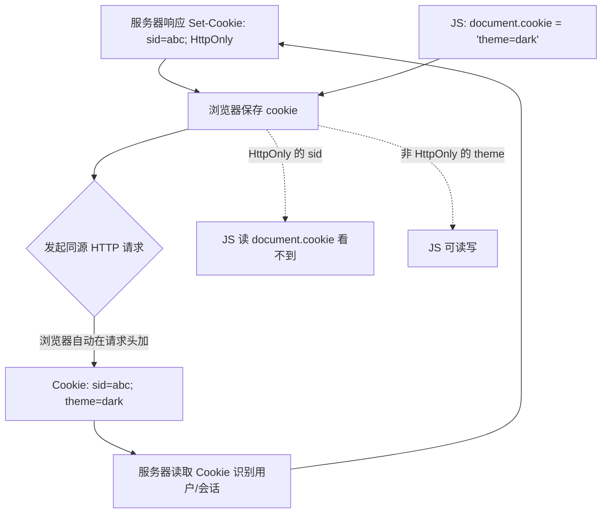

# 09 · Cookie 操作（Cookies）

> 存在浏览器、并会**随同源 HTTP 请求自动发给服务器**的一小段数据（约 4KB），最经典用途是维持登录状态（session id）。

## 📖 知识讲解（对照 MDN）

### 1. document.cookie 读写（最反直觉的地方）
- **读取**：`document.cookie` 返回**整串**，形如 `"a=1; b=2; c=3"`，没有按名取值的内置 API，要自己 `split('; ')` 解析。
- **写入**：给 `document.cookie` 赋值一次**只设/改一个** cookie，**不会覆盖整串**其它 cookie。
  ```js
  document.cookie = 'username=xiaoming; max-age=3600; path=/';
  document.cookie = 'theme=dark';   // username 仍在，这是新增/修改 theme
  ```
  这和普通变量赋值完全不同——它是一个「写访问器」，每次只处理一条。

### 2. 常用属性
| 属性 | 作用 |
| --- | --- |
| `expires=<日期>` / `max-age=<秒>` | 过期时间。都不设=**会话 cookie**，关浏览器即失效。`max-age` 更直观 |
| `path=/` | 生效路径，通常设 `/` 让整站可用 |
| `domain=` | 生效域名（含子域） |
| `Secure` | 仅 HTTPS 才发送 |
| `SameSite=Lax/Strict/None` | 控制跨站请求是否携带，**默认 Lax** |
| `HttpOnly` | **只能服务器设置**，JS 读不到（防 XSS 窃取） |

### 3. SameSite 取值
- `Strict`：完全禁止跨站携带，最严。
- `Lax`（**现代浏览器默认**）：跨站的安全导航（如点链接 GET）可带，POST/iframe/图片等不带。
- `None`：允许跨站携带，但**必须同时加 `Secure`**（HTTPS），否则浏览器拒绝。

### 4. 与 Web Storage 的区别
- cookie **会随每个同源 HTTP 请求自动发送**（localStorage/sessionStorage 不会）→ 适合服务器需要的凭证，但也会增加请求体积。
- cookie 容量小（~4KB），API 是「整串字符串」很繁琐；纯前端存储优先用 localStorage。

### 5. 封装三件套（见 demo.js）
`setCookie(name, value, options)` / `getCookie(name)` / `deleteCookie(name)`。删除靠**设置一个已过期的时间**（`max-age=0`）。

## 🔄 流程图 / 原理图



## 💻 代码说明

- `setCookie(name, value, {maxAge, path, sameSite, secure})`：拼接成 `name=value; max-age=...; path=/; samesite=...` 赋值给 `document.cookie`；名值做 `encodeURIComponent` 编码。
- `getCookie(name)`：`document.cookie.split('; ')` 后逐条匹配，`decodeURIComponent` 还原值，找不到返回 `null`。
- `deleteCookie(name)`：`setCookie(name, '', {maxAge:0})`——把过期时间设为现在，浏览器立即删除。
- 「10 秒过期」按钮：写 `max-age=10` 的 cookie，11 秒后自动刷新展示，直观看到它消失。
- 全部 cookie 面板演示 `document.cookie` 返回的整串。

## ▶️ 运行方式

免构建，双击 `index.html` 用浏览器打开。设置/读取/删除 cookie，点「刷新查看」看整串；点「写一个 10 秒后过期的 cookie」等几秒看它自动消失。

> 注意：`file://` 协议下 cookie 行为受限，且 `SameSite=None` 需要 HTTPS。建议用本地静态服务器（如 `npx serve`）打开以获得完整效果。

## ⚠️ 常见坑 / 最佳实践

- ❌ **以为给 `document.cookie` 赋值会覆盖所有 cookie** → 实际只增改一项，其它仍在。
- ❌ **删 cookie 删不掉** → `path`/`domain` 必须和设置时**完全一致**才能删除。
- ❌ **想用 JS 读 HttpOnly cookie**（如 session id）→ 读不到，这是防 XSS 的安全设计，别绕。
- ❌ **跨站场景没设 `SameSite=None; Secure`** → cookie 不被携带，第三方登录/iframe 失效。
- ❌ 名/值含分号、空格、中文不编码 → cookie 解析错乱。用 `encodeURIComponent`。
- ✅ 敏感凭证用服务器下发的 `HttpOnly; Secure; SameSite` cookie；纯前端数据用 localStorage。
- ✅ cookie 越少越好，因为每个请求都会带上，影响性能。

## 🔗 官方文档

- [Document.cookie - MDN](https://developer.mozilla.org/zh-CN/docs/Web/API/Document/cookie)
- [使用 HTTP Cookie - MDN](https://developer.mozilla.org/zh-CN/docs/Web/HTTP/Cookies)
- [Set-Cookie 响应头 - MDN](https://developer.mozilla.org/zh-CN/docs/Web/HTTP/Headers/Set-Cookie)
- [SameSite cookies - MDN](https://developer.mozilla.org/zh-CN/docs/Web/HTTP/Headers/Set-Cookie/SameSite)
