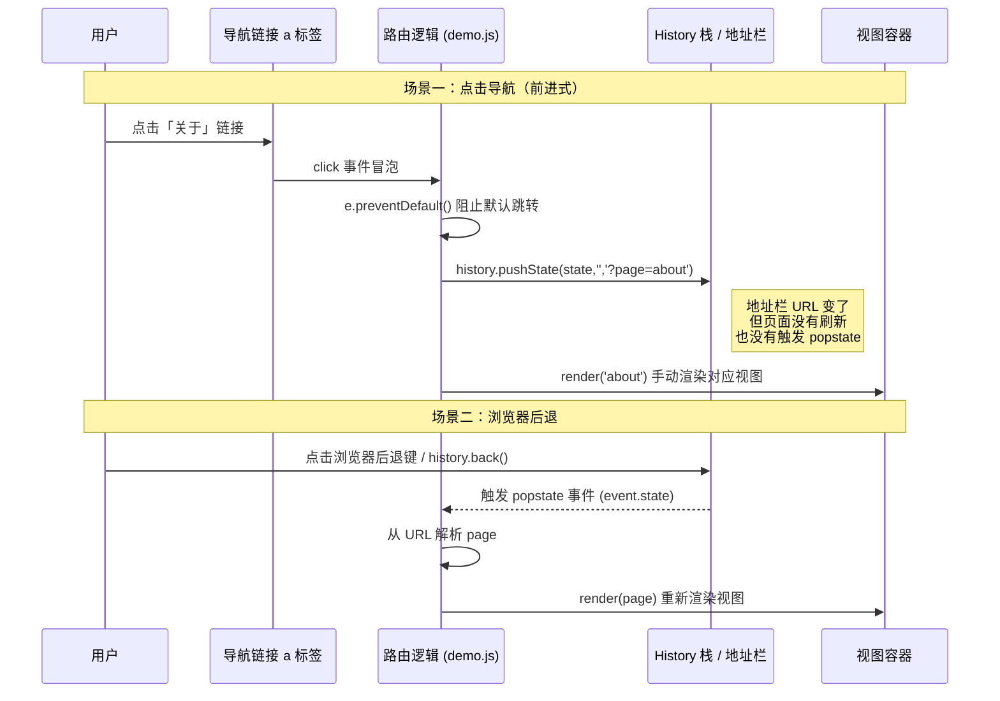
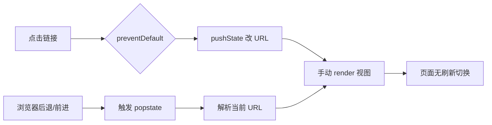

# 10 · History API 与 SPA 路由（History API & SPA Routing）

> 用 History API 在不刷新页面的前提下改变地址栏 URL 并切换视图，这是所有前端框架路由（React Router / Vue Router）的底层原理。

## 📖 知识讲解（对照 MDN，列核心 API + 易错点）

History API 让 JavaScript 能够操作浏览器的会话历史栈（session history），从而实现「单页应用」（SPA）。

### 核心 API

| API | 说明 |
| --- | --- |
| `history.pushState(state, title, url)` | 向历史栈**新增**一条记录并改变地址栏 URL。**不触发页面加载，也不触发 popstate**。 |
| `history.replaceState(state, title, url)` | **替换**当前历史记录（不新增条目），其余同 pushState。 |
| `history.back()` | 后退一步，等价于浏览器后退键。 |
| `history.forward()` | 前进一步。 |
| `history.go(n)` | 跳转 n 步，`go(-2)` 后退两步，`go(0)` 刷新当前页。 |
| `history.state` | 当前历史记录关联的 state 数据。 |
| `history.length` | 历史栈长度。 |
| `popstate` 事件 | 当**用户**点击前进/后退，或调用 `back/forward/go` 时触发；回调可从 `event.state` 取回 state。 |

### pushState 三个参数

1. **state**：与该条历史记录绑定的、可被结构化克隆的任意数据。后退回来时通过 `event.state` / `history.state` 取回。注意有大小限制（约 640KB）。
2. **title**：绝大多数浏览器忽略此参数，传空字符串 `''` 即可。
3. **url**：新的地址栏 URL，受**同源策略**限制（不能跨域）。

### 与 location.hash 路由的对比

| 维度 | hash 路由（`#/home`） | History 路由（`/home`） |
| --- | --- | --- |
| URL 美观度 | 带 `#`，较丑 | 干净 |
| 触发事件 | `hashchange` | `popstate` |
| 刷新是否 404 | 不会（hash 不发给服务器） | **会**，需服务器配合回退 index.html |
| 兼容性 | 极好 | 现代浏览器都支持 |
| 改 URL 不刷新 | 改 hash | pushState |

### 易错点速记

- `pushState` / `replaceState` **本身不会触发 popstate**——这是最常见误解，改完 URL 必须手动调用渲染函数。
- 点击 `<a>` 必须 `preventDefault()`，否则浏览器走默认跳转、整页刷新。
- History 路由刷新页面时，浏览器会把完整路径（如 `/list`）发给服务器，服务器若没有该路由就返回 404，**必须配置回退到 index.html**。

## 🔄 流程图 / 原理图





## 💻 代码说明

- `index.html`：一个 SPA 骨架——顶部导航 `<nav>`、视图容器 `#view`、history 控制按钮、实时显示 `location.href` 与 `history.state` 的监视器。
- `demo.js`：
  - `VIEWS`：每个「页面」对应一段 HTML 字符串。
  - `navigateTo(page, true)`：点击导航时调用，`pushState` 改 URL + 手动 `render`。
  - `popstate` 监听器：浏览器前进/后退时，从 URL 解析出 page 并重新渲染。
  - 列表页演示 `state` 的用途：进入时把随机编号存进 `history.state`，后退回来时能从 `event.state` 还原。
  - 初始化时用 `replaceState` 写入初始 state（避免首条记录 state 为 null）。

> 为保证 `file://` 双击直接打开也能运行，demo 的 URL 用**查询串形式** `?page=home`，而非改变路径 `/home`（后者在 file:// 下会因同源/路径限制报错）。

## ▶️ 运行方式

1. 直接双击 `index.html` 在浏览器打开即可（已规避 file:// 限制）。
2. 推荐用本地静态服务器获得更真实的体验：
   ```bash
   npx serve .      # 或 python3 -m http.server
   ```
3. 操作：点击导航切换视图（观察地址栏变化但页面不刷新）→ 用浏览器后退/前进键，或页面上的 back/forward 按钮，观察 popstate 重新渲染。

## ⚠️ 常见坑 / 最佳实践

- **pushState 不触发 popstate**：改完 URL 后必须主动渲染，不要指望 popstate 帮你。
- **刷新 404**：History 路由部署到生产时，Nginx / Node 需把未匹配的路径统统回退到 `index.html`（`try_files $uri /index.html;`），否则刷新或直接访问深层 URL 会 404。
- **file:// 限制**：本地直接打开 HTML 时，改变 URL 路径会受限，应使用查询串/锚点，或起一个本地静态服务器。
- **必须 preventDefault**：拦截 `<a>` 点击时若忘记阻止默认行为，会触发整页跳转，SPA 体验全失。
- **state 大小限制**：不要往 state 塞大对象，约 640KB 上限，超出会抛错。
- **同源限制**：`pushState` 的 url 不能跨域，否则抛 `SecurityError`。

## 🔗 官方文档

- [History API（MDN）](https://developer.mozilla.org/zh-CN/docs/Web/API/History_API)
- [History.pushState()](https://developer.mozilla.org/zh-CN/docs/Web/API/History/pushState)
- [History.replaceState()](https://developer.mozilla.org/zh-CN/docs/Web/API/History/replaceState)
- [Window: popstate 事件](https://developer.mozilla.org/zh-CN/docs/Web/API/Window/popstate_event)
- [使用 History API 实现单页应用](https://developer.mozilla.org/zh-CN/docs/Web/API/History_API/Working_with_the_History_API)
