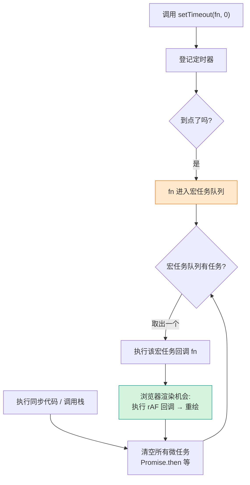
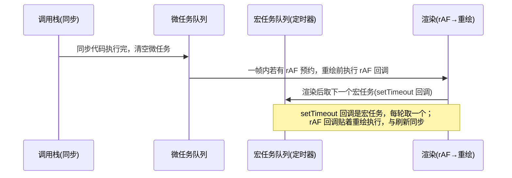

# 11 · 定时器与动画帧（Timers & requestAnimationFrame）

> setTimeout / setInterval 是基于事件循环的宏任务定时器；做动画首选 requestAnimationFrame，它与屏幕刷新率同步、在重绘前执行，更流畅更省电。

## 📖 知识讲解（对照 MDN，列核心 API + 易错点）

### 核心 API

| API | 说明 |
| --- | --- |
| `setTimeout(fn, delay, ...args)` | `delay` 毫秒后执行一次 `fn`，返回数字句柄。 |
| `clearTimeout(id)` | 取消尚未执行的 `setTimeout`。 |
| `setInterval(fn, delay)` | 每隔 `delay` 毫秒重复执行 `fn`，返回句柄。 |
| `clearInterval(id)` | 停止 `setInterval`。 |
| `requestAnimationFrame(cb)` | 在浏览器**下一次重绘前**执行 `cb`，`cb` 收到一个高精度时间戳；返回句柄。 |
| `cancelAnimationFrame(id)` | 取消已预约的帧回调。 |

### 它们是宏任务（事件循环）

`setTimeout` / `setInterval` 的回调是**宏任务（macrotask）**。调用时只是把回调登记到定时器，到点后回调进入**宏任务队列**；事件循环在当前同步代码与所有微任务（Promise.then 等）执行完后，才从宏任务队列取出执行。因此：

- `setTimeout(fn, 0)` 并不是「立即执行」，而是「把 fn 排到当前任务之后、尽快执行」，常用于把任务推迟到下一轮事件循环（让出主线程、等 DOM 更新等）。
- `delay` 是**最小延迟**而非精确延迟，主线程忙时会被推后。

### 最小延迟 4ms 嵌套限制

HTML 规范规定：当 `setTimeout` / `setInterval` **嵌套层级超过 5 层**时，浏览器会强制把最小延迟钳制为 **4ms**。所以 `setTimeout(fn, 0)` 在深层嵌套时实际至少 4ms。这正是不该用定时器精确控制动画时序的原因之一。

### requestAnimationFrame 为什么更适合动画

- **与屏幕刷新率同步**：通常 60Hz 屏幕约每 16.7ms 一帧，rAF 恰好在每次重绘前调用，动画不掉帧、不撕裂。
- **重绘前执行**：所有样式修改在同一帧内统一渲染，避免 setInterval 那种与刷新不同步导致的抖动。
- **后台自动暂停**：标签页不可见时 rAF 停止回调，省 CPU/电量（setInterval 仍会跑，浪费资源）。
- **帧间隔自适应**：回调拿到时间戳，可用 `dt` 让动画速度与帧率无关。

### 防抖与节流（简介）

二者都用定时器思想控制高频事件（scroll/resize/input）的触发频率：

- **防抖（debounce）**：事件停止触发 N 毫秒后才执行一次，期间不断 `clearTimeout` 重置。适合搜索框输入联想。
- **节流（throttle）**：固定每 N 毫秒最多执行一次。适合 scroll、拖拽。

## 🔄 流程图 / 原理图

## 💻 代码说明

`demo.js` 三个独立 IIFE：

1. **秒表**：`setInterval(tick, 30)` 刷新显示，`clearInterval` 暂停/复位。关键——用 `Date.now() - startTime` 计算真实经过时间，避免「每次 +30ms」的累积漂移。
2. **rAF 动画**：递归 `requestAnimationFrame(frame)` 推进进度条与小球，用帧间隔 `dt` 让速度与帧率无关，并实时统计 FPS；暂停用 `cancelAnimationFrame`。
3. **setInterval 动画对比**：`setInterval(..., 8)` 用固定步长移动橙色小球，与 rAF 绿球同时跑，肉眼可见橙球更抖、易掉帧。

## ▶️ 运行方式

直接双击 `index.html` 打开即可。依次试：开始/暂停/复位秒表 → 开始 rAF 动画看 FPS → 同时启动 setInterval 小球，对比两个小球的流畅度。

## ⚠️ 常见坑 / 最佳实践

- **setInterval 累积漂移**：回调耗时或主线程繁忙会让间隔变长，时间逐渐偏差。计时类需求应基于 `Date.now()` / `performance.now()` 计算真实差值。
- **忘记 clear 导致内存泄漏 / 重复定时器**：组件销毁、暂停时务必 `clearInterval` / `clearTimeout` / `cancelAnimationFrame`；重复调用 start 前先判空，避免叠加多个定时器。
- **rAF 后台暂停**：标签页隐藏时 rAF 停止，回到前台 `dt` 可能很大，需重置 `lastTs` 避免动画「瞬移」。
- **this 指向**：把方法直接传给 setTimeout（如 `setTimeout(obj.fn, 0)`）会丢失 `this`，应用箭头函数包裹 `setTimeout(() => obj.fn(), 0)` 或 `bind`。
- **delay 不精确**：定时器是最小延迟，受事件循环与 4ms 嵌套钳制影响，别用它做精确节拍。
- **动画用 rAF 而非 setInterval**：流畅、省电、与刷新同步。

## 🔗 官方文档

- [setTimeout()（MDN）](https://developer.mozilla.org/zh-CN/docs/Web/API/Window/setTimeout)
- [setInterval()（MDN）](https://developer.mozilla.org/zh-CN/docs/Web/API/Window/setInterval)
- [clearTimeout()（MDN）](https://developer.mozilla.org/zh-CN/docs/Web/API/Window/clearTimeout)
- [requestAnimationFrame()（MDN）](https://developer.mozilla.org/zh-CN/docs/Web/API/Window/requestAnimationFrame)
- [cancelAnimationFrame()（MDN）](https://developer.mozilla.org/zh-CN/docs/Web/API/Window/cancelAnimationFrame)
- [事件循环（MDN）](https://developer.mozilla.org/zh-CN/docs/Web/JavaScript/Event_loop)
