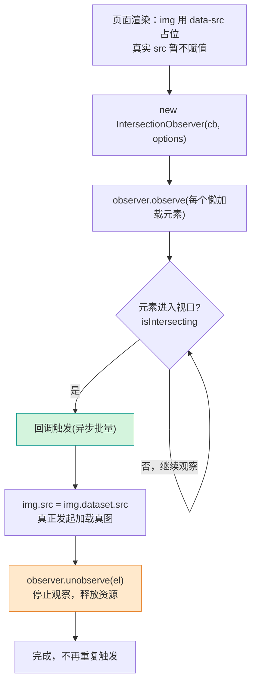
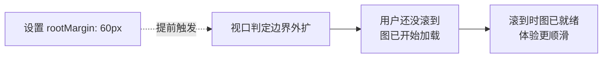

# 12 · IntersectionObserver 交叉观察器（IntersectionObserver）

> 浏览器原生提供的「元素是否进入视口」异步观测 API，用于图片懒加载、无限滚动、曝光埋点，性能远优于监听 scroll + getBoundingClientRect。

## 📖 知识讲解（对照 MDN，列核心 API + 易错点）

### 核心 API

| API | 说明 |
| --- | --- |
| `new IntersectionObserver(callback, options)` | 创建观察器。`callback(entries, observer)` 在交叉状态变化时异步触发。 |
| `observer.observe(target)` | 开始观察某个元素。 |
| `observer.unobserve(target)` | 停止观察某个元素（已处理的元素应及时取消）。 |
| `observer.disconnect()` | 停止观察所有元素，一次性清理。 |
| `entry.isIntersecting` | 该元素当前是否与 root 达到阈值（是否「进入视口」）。 |
| `entry.intersectionRatio` | 交叉比例 0~1。 |
| `entry.target` | 被观察的元素。 |
| `entry.boundingClientRect` / `intersectionRect` / `rootBounds` | 各种几何信息。 |

### options 三件套

- **root**：作为「视口」的容器元素，默认 `null` 表示浏览器视口；指定某个可滚动元素时，以它为参照。
- **rootMargin**：把 root 的判定边界外扩/内缩，写法同 CSS margin，如 `"100px 0px"`。**正值提前触发**（预加载），负值延后触发。
- **threshold**：阈值，可为单个数或数组。`0` = 露出 1px 就触发；`0.5` = 露出一半触发；`[0, 0.25, 0.5, 1]` = 在每个比例处都回调。

### 相比 scroll + getBoundingClientRect 的性能优势

| 维度 | scroll 监听方案 | IntersectionObserver |
| --- | --- | --- |
| 触发时机 | scroll 事件**同步**高频触发，主线程计算 | 浏览器**异步批量**回调，不阻塞滚动 |
| 是否引发重排 | 频繁 `getBoundingClientRect()` 触发重排 | 浏览器内部优化，无强制重排 |
| 代码复杂度 | 需手写节流/防抖 | 内建优化，声明式 |
| 性能 | 列表多时易卡顿 | 流畅 |

## 🔄 流程图 / 原理图

## 💻 代码说明

`demo.js` 两个独立 IIFE：

1. **图片懒加载**：动态生成占位灰块，真图（渐变色）放在 `data-src`。观察器在元素进入视口（`isIntersecting`）时把 `data-src` 应用为背景、加 `loaded` 类，并 `unobserve` 该元素。设置 `rootMargin: '60px'` 实现提前预加载。为免网络依赖，这里用渐变色块模拟真图，但「进入视口才显示」的效果与真实图片懒加载完全一致。
2. **曝光统计**：`threshold: 0.5`，元素露出一半时计一次曝光、高亮并 `unobserve`（曝光只统计一次）。`intersectionRatio` 显示实际交叉比例。

两个 demo 都把 `root` 指定为各自的滚动容器，而非浏览器视口。

## ▶️ 运行方式

直接双击 `index.html` 打开。在两个虚线滚动容器内向下滚动：观察灰块进入视口时「加载」成彩色（懒加载），以及卡片露出一半时变绿并计数（曝光）。无需联网。

## ⚠️ 常见坑 / 最佳实践

- **回调是异步、批量触发的**：不是滚动同步执行，不要假设滚动事件那种实时性；一次回调的 `entries` 可能包含多个元素。
- **threshold 含义**：`0` 是「碰到边缘就触发」，`1` 是「完全进入才触发」。需要在多个比例点回调时传数组。
- **记得 unobserve / disconnect**：懒加载、单次曝光这类「处理一次就够」的场景，处理后立刻 `unobserve(el)`，否则反复进出视口会重复触发，也浪费资源；组件销毁时 `disconnect()`。
- **rootMargin 用于预加载**：给正值（如 `"200px"`）让元素还没真正进视口就提前加载，体验更顺滑。
- **root 必须是被观察元素的祖先**：若 `root` 不是 target 的滚动祖先，观察不会生效。
- **初始即在视口内的元素**：observe 后会立即触发一次回调（哪怕没滚动），需要处理这种首屏情况。

## 🔗 官方文档

- [IntersectionObserver（MDN）](https://developer.mozilla.org/zh-CN/docs/Web/API/IntersectionObserver)
- [IntersectionObserver() 构造函数](https://developer.mozilla.org/zh-CN/docs/Web/API/IntersectionObserver/IntersectionObserver)
- [IntersectionObserverEntry](https://developer.mozilla.org/zh-CN/docs/Web/API/IntersectionObserverEntry)
- [Intersection Observer API 概览](https://developer.mozilla.org/zh-CN/docs/Web/API/Intersection_Observer_API)
- [懒加载（MDN 词汇表）](https://developer.mozilla.org/zh-CN/docs/Glossary/Lazy_load)
