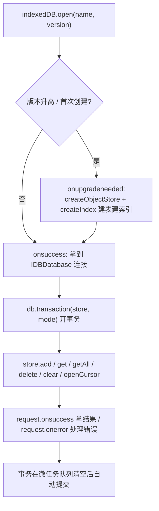
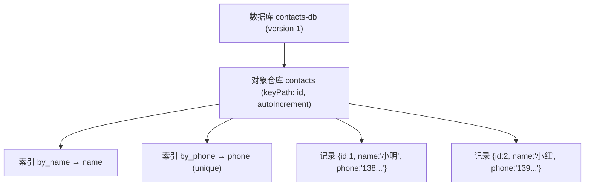

# 13 · IndexedDB 浏览器数据库（IndexedDB）

> 浏览器内置的「异步事件驱动」NoSQL 数据库，能在客户端持久化存储大量结构化数据，刷新 / 关页面后数据仍在。

## 📖 知识讲解（对照 MDN，列核心 API + 易错点）

IndexedDB 不是 `localStorage` 那种简单的 key-value，而是一个真正的「对象数据库」：有数据库、对象仓库（表）、索引、事务、游标。它的最大特征是 **全异步 + 事件回调**，原生 API 非常啰嗦。

层级关系：**数据库（Database） > 对象仓库（Object Store，≈表） > 记录（Record，一个 JS 对象）**。

| API | 作用 | 易错点 |
| --- | --- | --- |
| `indexedDB.open(name, version)` | 打开/创建数据库，**返回 `IDBOpenDBRequest`**（不是数据库本身！） | 结果要在 `onsuccess` 里拿 `event.target.result` |
| `onupgradeneeded` | **唯一**能改结构（建表/建索引）的时机 | 只有首次创建或 `version` 升高时触发 |
| `createObjectStore(name, {keyPath, autoIncrement})` | 建对象仓库（表） | 只能在 `onupgradeneeded` 里调用 |
| `createIndex(name, keyPath, {unique})` | 建索引，便于按字段查询 | 唯一索引插入重复值会抛 `ConstraintError` |
| `db.transaction(stores, mode)` | 开事务，`mode` 为 `'readonly'`/`'readwrite'` | **事务会自动提交**，不能跨微任务保持 |
| `store.add / put / get / getAll / delete / clear` | 增（不覆盖）/ 增改（覆盖）/ 查 / 查全部 / 删 / 清空 | 每个调用返回 `IDBRequest`，结果在 `onsuccess` |
| `store.openCursor()` | 打开游标逐条遍历 | 必须 `cursor.continue()` 才前进，`null` 表示结束 |

核心心智模型：**「发请求 → 等事件回调」**。所以实战里通常先把它 Promise 化（见 `demo.js` 的 `openDB`/`withStore`）。

## 🔄 流程图 / 原理图

层级结构图：

## 💻 代码说明

- `demo.js`
  - `openDB()`：封装 `indexedDB.open`，在 `onupgradeneeded` 里 `createObjectStore` + `createIndex`，把结果包成 Promise 并缓存连接。
  - `withStore(mode, fn)`：通用事务封装，开事务 → 拿 store → 执行操作 → 监听 `onsuccess/onerror` 转 Promise。
  - `addContact / getAllContacts / deleteContact / clearContacts`：对应 `add / getAll / delete / clear`。
  - `listByCursor()`：用 `openCursor()` 逐条遍历，演示游标。
  - 页面层：添加 / 删除 / 清空 / 游标遍历四个交互，结果直接渲染到列表与顶部提示条。
- `index.html`：内联样式美化，表单 + 列表 + 工具栏，效果显示在页面上。

## ▶️ 运行方式

直接**双击 `index.html`** 用浏览器打开即可（IndexedDB 在 `file://` 下也能用）。

操作：填姓名 + 电话 → 「添加」→ 列表出现记录 → **刷新页面**，数据仍在。可打开 DevTools → Application → IndexedDB → `contacts-db` 查看真实存储。

## ⚠️ 常见坑 / 最佳实践

- **异步事件驱动、API 啰嗦**：所有操作都返回 `IDBRequest`，结果只能在 `onsuccess` 里取。实战务必先 Promise 化。
- **改结构只能在 `onupgradeneeded`**：要加表 / 加索引，必须把 `version` 号 +1 触发升级，不能在普通事务里改结构。
- **事务自动提交，不能跨微任务保持**：在同一个事务里 `await` 一个无关的异步操作（如 `fetch`）后，事务可能已经提交失效。要让事务里的所有操作连续发出。
- **`add` vs `put`**：`add` 主键已存在会报错；`put` 是「有则覆盖、无则新增」。
- **唯一索引冲突**：向 `unique:true` 的索引写重复值会抛 `ConstraintError`，记得 catch。
- **同源限制**：数据库按「协议 + 域名 + 端口」隔离，换源访问不到。
- 隐私 / 无痕模式下存储可能被限制或关页即清。

## 🔗 官方文档

- [IndexedDB API 总览](https://developer.mozilla.org/zh-CN/docs/Web/API/IndexedDB_API)
- [使用 IndexedDB](https://developer.mozilla.org/zh-CN/docs/Web/API/IndexedDB_API/Using_IndexedDB)
- [IDBFactory.open()](https://developer.mozilla.org/zh-CN/docs/Web/API/IDBFactory/open)
- [IDBObjectStore](https://developer.mozilla.org/zh-CN/docs/Web/API/IDBObjectStore)
- [IDBCursor](https://developer.mozilla.org/zh-CN/docs/Web/API/IDBCursor)
- [IDBTransaction](https://developer.mozilla.org/zh-CN/docs/Web/API/IDBTransaction)
