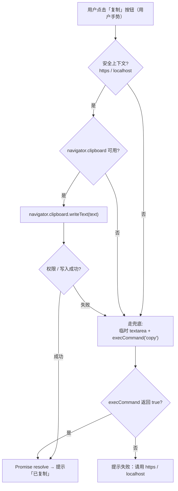

# 14 · 剪贴板与其他常用 API（Clipboard & Others）

> 一组日常开发高频用到的浏览器 API：复制粘贴、系统通知、媒体查询监听、分享与定位，大多需要「安全上下文 + 用户手势」。

## 📖 知识讲解（对照 MDN，列核心 API + 易错点）

| API | 作用 | 关键限制 / 易错点 |
| --- | --- | --- |
| `navigator.clipboard.writeText(text)` | 写入剪贴板，**返回 Promise**（异步） | 需**安全上下文**（https/localhost）+ **用户手势**触发 |
| `navigator.clipboard.readText()` | 读取剪贴板 | 同上，且常会弹**读取授权**框 |
| `document.execCommand('copy')` | 旧版复制，**已废弃**但兼容性好 | 作为非安全上下文 / 老浏览器的**兜底** |
| `Notification.requestPermission()` | 申请通知权限 | 返回 `'granted'/'denied'/'default'`；被 `denied` 后无法再弹 |
| `new Notification(title, options)` | 弹系统通知 | 必须先获得 `granted` 权限 |
| `navigator.share(data)` | 调起系统分享面板（Web Share） | 需安全上下文 + 用户手势，**多见于移动端** |
| `navigator.geolocation.getCurrentPosition(ok, err, opts)` | 获取地理位置 | 弹权限框；回调式 API |
| `window.matchMedia(query)` | 用 JS 监听媒体查询 | 返回 `MediaQueryList`，用 `.matches` 取值、监听 `'change'` |

「安全上下文（Secure Context）」= `https://` 或 `http://localhost`。`file://` 双击打开的页面**不算**安全上下文，所以 Clipboard / Notification 等可能不可用，这正是本模块要演示兜底与 localhost 建议的原因。

## 🔄 流程图 / 原理图

`clipboard.writeText` 的执行流程：



## 💻 代码说明

- `demo.js`
  - **复制**：先判断 `navigator.clipboard && window.isSecureContext`，用 `writeText`；失败或非安全上下文时调用 `fallbackCopy()`（临时 `textarea` + `execCommand('copy')`）兜底。`readText()` 演示读取剪贴板。
  - **通知**：检查 `'Notification' in window` → `Notification.requestPermission()` → `new Notification(...)`，并处理 `denied` 状态。
  - **matchMedia**：`window.matchMedia('(prefers-color-scheme: dark)')` 初始渲染 + 监听 `'change'`，系统切主题实时更新；另演示 `(min-width: 600px)` 视口监听。
  - **其他**：`navigator.share` 与 `navigator.geolocation.getCurrentPosition` 的特性检测与调用。
- `index.html`：四个卡片区块，每个交互结果显示在页面状态条 / 盒子里。

## ▶️ 运行方式

**强烈建议用 localhost 打开**，以获得完整的剪贴板 / 通知能力。在本目录执行任意静态服务器，例如：

```bash
# 任选其一
python3 -m http.server 8080
# 或
npx serve .
```

然后浏览器访问 `http://localhost:8080`。

直接双击 `index.html`（`file://`）也能打开，复制会自动降级到 `execCommand` 兜底，但通知 / 分享可能不可用。

## ⚠️ 常见坑 / 最佳实践

- **Clipboard API 需安全上下文**：`https` 或 `localhost` 才有 `navigator.clipboard`；`file://` 下可能为 `undefined`，必须用 `execCommand` 兜底。
- **必须由用户手势触发**：`writeText` / `share` 要在 `click` 等事件回调里调用，定时器或页面加载时直接调用会被拒绝。
- **Notification 需用户授权**：第一次要 `requestPermission()`；被 `denied` 后代码无法再弹，只能引导用户去浏览器站点设置开启。
- **execCommand 已废弃**：仅作兼容兜底，新代码优先 Clipboard API。
- **matchMedia 别忘监听 change**：只读 `.matches` 是一次性的；要随系统主题 / 视口变化更新需 `addEventListener('change', ...)`。
- **geolocation / share 多在移动端 https 才完整可用**，桌面或 file:// 下常被限制。

## 🔗 官方文档

- [Clipboard API](https://developer.mozilla.org/zh-CN/docs/Web/API/Clipboard_API)
- [Clipboard.writeText()](https://developer.mozilla.org/zh-CN/docs/Web/API/Clipboard/writeText)
- [Notification API](https://developer.mozilla.org/zh-CN/docs/Web/API/Notifications_API)
- [Window.matchMedia()](https://developer.mozilla.org/zh-CN/docs/Web/API/Window/matchMedia)
- [Navigator.share()（Web Share API）](https://developer.mozilla.org/zh-CN/docs/Web/API/Navigator/share)
- [Geolocation API](https://developer.mozilla.org/zh-CN/docs/Web/API/Geolocation_API)
- [安全上下文 Secure Contexts](https://developer.mozilla.org/zh-CN/docs/Web/Security/Secure_Contexts)
