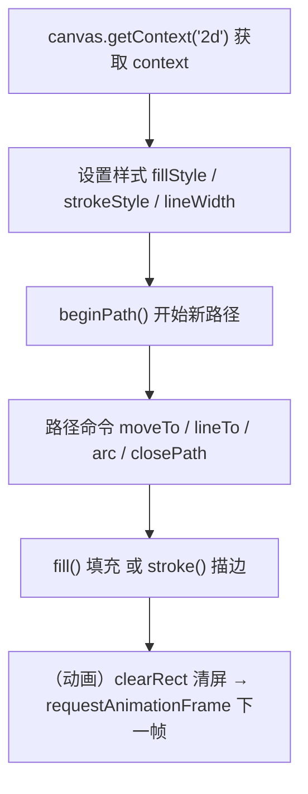
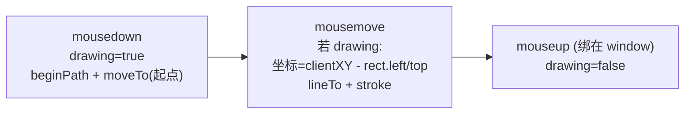

# 15 · Canvas 2D 绘图（Canvas API）

> `<canvas>` + `getContext('2d')` 提供一块「位图画布」，用 JS 即时绘制图形、文字与动画，适合可视化、图表、游戏、画板。

## 📖 知识讲解（对照 MDN，列核心 API + 易错点）

Canvas 是**位图（像素）**绘制：一旦 `fill()` / `stroke()` 画下去，就只剩像素，没有「矩形对象」可以再选中修改（这点和 SVG 完全不同）。要改只能清掉重画。

**坐标系**：左上角为原点 `(0,0)`，x 轴向右、y 轴向下。

| API | 作用 |
| --- | --- |
| `canvas.getContext('2d')` | 拿到 2D 绘图上下文 `CanvasRenderingContext2D` |
| `fillRect(x,y,w,h)` / `strokeRect` / `clearRect` | 填充矩形 / 描边矩形 / 清空区域 |
| `beginPath()` | 开始一条新路径（不调用会和上次路径连起来） |
| `moveTo(x,y)` / `lineTo(x,y)` | 抬笔移动 / 画直线到某点 |
| `arc(cx,cy,r,start,end)` | 画圆弧 / 圆（弧度制，整圆用 `0` 到 `Math.PI*2`） |
| `closePath()` | 闭合路径（连回起点） |
| `fill()` / `stroke()` | 填充 / 描边当前路径 |
| `fillStyle` / `strokeStyle` / `lineWidth` | 填充色 / 描边色 / 线宽 |
| `font` + `fillText(text,x,y)` | 设置字体并绘制文字 |
| `drawImage(img,x,y[,w,h])` | 绘制图片 / 视频帧到画布 |
| `requestAnimationFrame(cb)` | 在下次重绘前调用回调，做平滑动画（约 60fps） |

**易错点速记**：

- **尺寸要用属性**：`<canvas width="400" height="220">`，不要只用 CSS 设宽高，否则会把默认 300×150 的位图拉伸 → 模糊变形。
- **画路径前先 `beginPath()`**，否则会和上一段路径粘连。
- **鼠标坐标要换算**：`e.clientX/Y` 是视口坐标，要减去 `canvas.getBoundingClientRect()` 的 `left/top`（CSS 尺寸与属性不一致时还要按比例缩放）。

## 🔄 流程图 / 原理图

Canvas 绘制一个图形的流程：

画板的鼠标事件流：

## 💻 代码说明

- `demo.js`
  - **Part 1 `drawShapes()`**：演示 `fillRect`/`strokeRect`、`arc` 画圆、`moveTo/lineTo` 折线、`closePath` 三角形、`fillText` 文字。
  - **Part 2 画板**：`getPos(evt)` 用 `getBoundingClientRect()` + 缩放比把鼠标 / 触摸坐标换算到画布内部坐标；`mousedown/move/up`（+ 触摸）实现按住拖动绘制，支持选色、调线宽、清空。
  - **Part 3 动画**：`requestAnimationFrame` 驱动小球绕圈，每帧 `clearRect` 清屏再重画。
- `index.html`：三块画布，`width/height` 用属性设置避免模糊；控件结果实时反映在画面上。

## ▶️ 运行方式

直接**双击 `index.html`** 用浏览器打开即可（Canvas 无需服务器、无需安全上下文）。

- 第 1 块：自动绘制基本图形示例。
- 第 2 块：在画布上按住鼠标拖动作画，可换颜色 / 线宽 / 清空。
- 第 3 块：小球自动绕圈动画。

## ⚠️ 常见坑 / 最佳实践

- **宽高用 `width`/`height` 属性，不要只用 CSS**：CSS 只是把固定分辨率的位图缩放，会导致拉伸模糊。需要高分屏清晰可把属性设为 `CSS 尺寸 × devicePixelRatio` 并 `scale`。
- **位图无对象概念**：画下去就是像素，改动只能清除区域后重绘；需要可交互的矢量图形可考虑 SVG。
- **坐标必须减偏移**：用 `getBoundingClientRect()` 把视口坐标转成画布坐标，否则画的位置会错位。
- **路径记得 `beginPath()`**：否则新路径会和旧路径合并，描边 / 填充全乱。
- **动画用 `requestAnimationFrame`** 而非 `setInterval`：跟随刷新率、后台标签自动暂停、更省电更平滑。
- `clearRect` 清的是矩形区域；想全清就清整块 `(0,0,width,height)`。

## 🔗 官方文档

- [Canvas API](https://developer.mozilla.org/zh-CN/docs/Web/API/Canvas_API)
- [Canvas 教程](https://developer.mozilla.org/zh-CN/docs/Web/API/Canvas_API/Tutorial)
- [CanvasRenderingContext2D](https://developer.mozilla.org/zh-CN/docs/Web/API/CanvasRenderingContext2D)
- [绘制形状（路径）](https://developer.mozilla.org/zh-CN/docs/Web/API/Canvas_API/Tutorial/Drawing_shapes)
- [Window.requestAnimationFrame()](https://developer.mozilla.org/zh-CN/docs/Web/API/Window/requestAnimationFrame)
- [Element.getBoundingClientRect()](https://developer.mozilla.org/zh-CN/docs/Web/API/Element/getBoundingClientRect)
