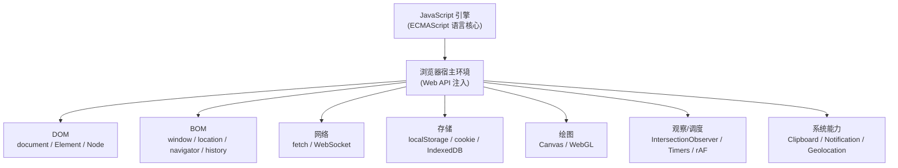
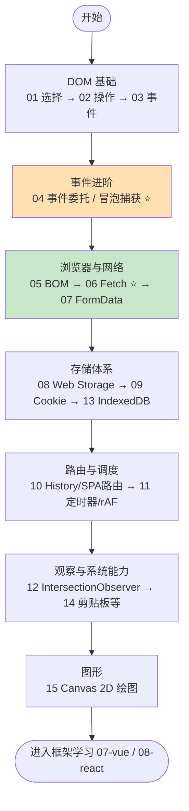

# 05 · 浏览器 Web API（Web API / DOM / BOM）

> 本工程讲解**浏览器运行环境提供的 API**：如何用 JavaScript 操作网页结构（DOM）、控制浏览器窗口（BOM）、收发网络请求（Fetch）、读写本地存储、绘图、监听元素可见性等。
>
> 注意区分：`04-javascript` 讲的是 **JavaScript 语言本身**（变量、函数、闭包、原型、异步语法）；本工程讲的是**浏览器宿主环境额外提供的对象与接口**——这些 API 在 Node.js 里大多不存在，是「浏览器」赋予 JS 的超能力。

## 🌐 什么是 Web API

JavaScript 语言标准（ECMAScript）只定义了 `Array`、`Object`、`Promise` 等语言核心。而当 JS 运行在**浏览器**里时，浏览器会额外注入一大批对象和方法，让脚本能够：

- **操作页面**：`document`、`Element`、`Node` —— DOM（文档对象模型）
- **控制浏览器**：`window`、`location`、`navigator`、`history` —— BOM（浏览器对象模型）
- **联网**：`fetch`、`XMLHttpRequest`、`WebSocket`
- **存储**：`localStorage`、`sessionStorage`、`document.cookie`、`indexedDB`
- **绘图与媒体**：`canvas`、`Web Audio`、`WebGL`
- **观察与调度**：`IntersectionObserver`、`setTimeout`、`requestAnimationFrame`
- **系统能力**：`clipboard`、`Notification`、`geolocation`

这些统称 **Web API**，由 W3C / WHATWG 规范定义，MDN 是最权威的中文参考：
<https://developer.mozilla.org/zh-CN/docs/Web/API>

## 📚 模块索引

| 序号 | 模块 | 知识点 | 核心 API |
|------|------|--------|----------|
| 01 | [dom-selection](./01-dom-selection/) | DOM 元素选择 | `getElementById` / `querySelector` / `querySelectorAll` / `closest` |
| 02 | [dom-manipulation](./02-dom-manipulation/) | 创建/插入/删除/修改节点 | `createElement` / `append` / `remove` / `classList` / `textContent` |
| 03 | [dom-events](./03-dom-events/) | 事件基础与事件对象 | `addEventListener` / `event` / `preventDefault` |
| 04 | [event-delegation](./04-event-delegation/) | 事件委托 / 冒泡捕获 | 事件流三阶段 / `target` vs `currentTarget` / `stopPropagation` |
| 05 | [bom-window](./05-bom-window/) | BOM 浏览器对象模型 | `window` / `location` / `navigator` / `screen` |
| 06 | [fetch-api](./06-fetch-api/) | Fetch 网络请求 | `fetch` / `Response` / `async/await` / `AbortController` |
| 07 | [form-data-submit](./07-form-data-submit/) | 表单数据与 FormData | `FormData` / `URLSearchParams` / `submit` 事件 |
| 08 | [web-storage](./08-web-storage/) | 本地存储 | `localStorage` / `sessionStorage` / `storage` 事件 |
| 09 | [cookies](./09-cookies/) | Cookie 操作 | `document.cookie` / `max-age` / `SameSite` |
| 10 | [history-api](./10-history-api/) | History API 与 SPA 路由 | `pushState` / `replaceState` / `popstate` |
| 11 | [timers](./11-timers/) | 定时器与动画帧 | `setTimeout` / `setInterval` / `requestAnimationFrame` |
| 12 | [intersection-observer](./12-intersection-observer/) | 交叉观察器（懒加载/曝光） | `IntersectionObserver` / `isIntersecting` |
| 13 | [indexeddb](./13-indexeddb/) | 浏览器数据库入门 | `indexedDB.open` / `objectStore` / 事务 / 游标 |
| 14 | [clipboard-and-others](./14-clipboard-and-others/) | 剪贴板与常用系统 API | `navigator.clipboard` / `Notification` / `matchMedia` |
| 15 | [canvas-api](./15-canvas-api/) | Canvas 2D 绘图 | `getContext('2d')` / 路径 / `drawImage` |

## 🗺️ 学习路线

建议按编号顺序学习：先掌握 **DOM 三件套**（选择→操作→事件），再理解**事件流与委托**这一进阶重点，然后是 **BOM 与网络请求**，接着**存储体系**（Storage / Cookie / IndexedDB），最后是**调度、观察与绘图**等专项能力。

> ⭐ 标记为重点/高频面试点：**事件委托与事件流**、**Fetch 请求流程**。

## ▶️ 运行方式

本工程所有模块**免构建**，无需 npm、无需打包工具：

1. 进入任意模块目录，**直接用浏览器打开 `index.html`** 即可看到可交互的 demo。
2. 推荐用 Chrome / Edge / Firefox 最新版，并打开开发者工具（F12）观察 Console。

少数模块对运行环境有额外要求，已在各自 README 注明：

| 模块 | 额外要求 |
|------|----------|
| 06 fetch-api | 需**联网**（调用公共测试接口 `jsonplaceholder.typicode.com`） |
| 12 intersection-observer | 懒加载真图需联网；纯效果演示离线即可 |
| 14 clipboard-and-others | 剪贴板/通知 API 需**安全上下文**，建议用 `http://localhost` 打开（`file://` 下部分功能受限，demo 已做兜底） |

> 如需用本地服务器打开（推荐给 06/14 模块），可在根目录执行：
> `npx serve` 或 `python3 -m http.server`，再访问对应路径。

## 🔗 权威文档

- MDN Web API 总览：<https://developer.mozilla.org/zh-CN/docs/Web/API>
- MDN DOM 文档：<https://developer.mozilla.org/zh-CN/docs/Web/API/Document_Object_Model>
- MDN Fetch：<https://developer.mozilla.org/zh-CN/docs/Web/API/Fetch_API>
- MDN Web Storage：<https://developer.mozilla.org/zh-CN/docs/Web/API/Web_Storage_API>
