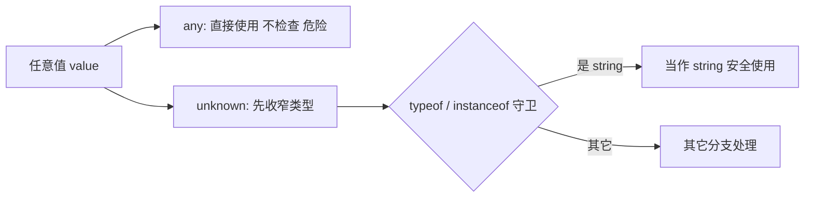

# 01 · 基础类型（Basic / Everyday Types）
> TypeScript 在 JavaScript 的值之上，用「类型」标注每个变量能装什么，编译期就拦住类型错误。本模块覆盖日常最常用的一组基础类型。

## 📖 知识讲解

对照官方 Handbook 的 **Everyday Types** 一页，核心类型如下：

| 类型 | 含义 | 备注 |
| --- | --- | --- |
| `string` / `number` / `boolean` | 三大原始类型 | `number` 不区分整数和浮点 |
| `T[]` / `Array<T>` | 数组 | 两种写法完全等价 |
| `[T1, T2]` | 元组 tuple | 长度固定、每位类型固定 |
| `any` | 关闭类型检查 | 危险，等于放弃 TS 保护 |
| `unknown` | 类型安全的 any | 使用前必须收窄，**优先用它** |
| `void` | 函数无返回值 | 表示不该使用返回值 |
| `null` / `undefined` | 空值 | strict 模式下是独立类型 |
| `never` | 永不出现的值 | 抛异常 / 死循环 / 穷尽检查 |

核心要点与易错点：
- **类型推断**：大多数变量不必显式注解，TS 会自动推断，写多了反而啰嗦。
- **`unknown` vs `any`（本模块重点）**：两者都能接收任意值；区别在使用时——`any` 不做检查，`unknown` 必须先用类型守卫（`typeof`、`instanceof` 等）收窄才能访问成员。
- **`strictNullChecks`**：开启后 `null`/`undefined` 不能随意赋给别的类型，需要用联合类型 `string | null` 显式声明。
- 元组的长度与每位类型都受检查，赋值越界或类型错位都会报错。

## 🔄 流程图 / 原理图



## 💻 代码说明

- `username/age/isAdmin`：三大原始类型的注解写法，以及把 `number` 赋给 `string` 的反例。
- `nums1` / `nums2`：演示 `number[]` 与 `Array<number>` 等价。
- `point` / `entry`：元组的定义与「位置类型错位 / 长度不符」反例。
- `loose: any`：展示 `any` 可随意取任意属性而不报错的危险。
- `input: unknown`：展示 unknown 直接取属性会报错，必须 `typeof` 收窄后才能用——本模块核心对比。
- `logMessage`：`void` 返回类型。
- `fail`：`never` 返回类型（抛异常）。

## ▶️ 运行方式

在工程根 `06-typescript` 下：

```bash
npm i -D typescript ts-node
npx ts-node 01-basic-types/demo.ts
# 或编译检查：npx tsc 01-basic-types/demo.ts --noEmit
```

## ⚠️ 常见坑 / 最佳实践

- 能不写注解就不写，交给类型推断；只在函数参数、公共 API、推断不出来时显式标注。
- **杜绝 `any`**，需要「任意值」时用 `unknown` 并配合类型守卫。
- 开启 `strict`（含 `strictNullChecks`），尽早暴露空值问题。
- 元组适合结构固定的少量值；元素较多或语义复杂时改用 `interface` / 对象。
- `void` 不等于 `undefined`：`void` 表达「忽略返回值」，别用它当普通空值类型。

## 🔗 官方文档

- Everyday Types: https://www.typescriptlang.org/docs/handbook/2/everyday-types.html
