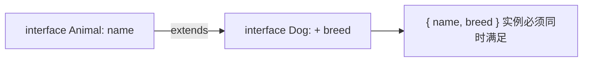
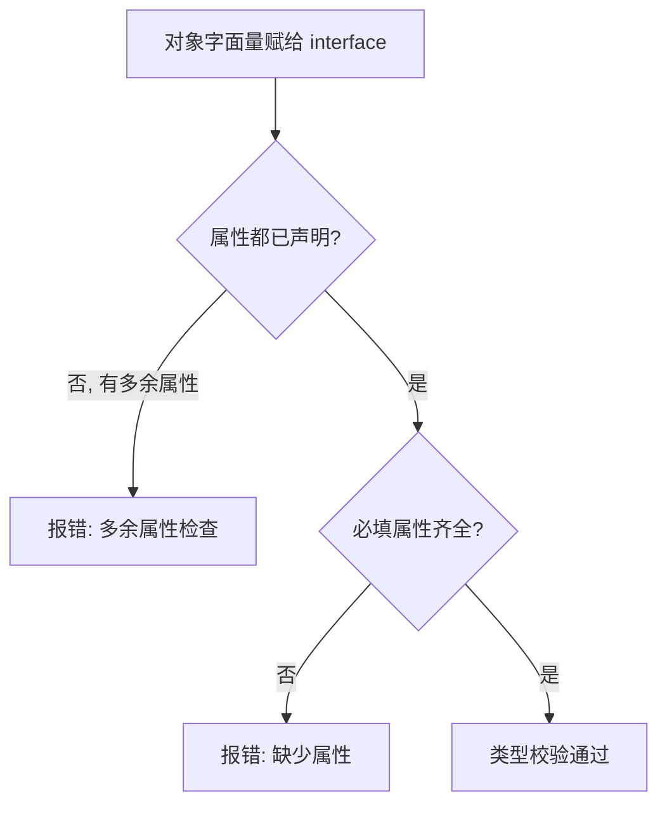

# 02 · 接口（Interfaces / Object Types）
> `interface` 用来描述「对象应该长什么样」——有哪些属性、什么类型、是否可选只读，从而在编译期约束对象结构。

## 📖 知识讲解

对照官方 Handbook 的 **Object Types** 一页，本模块覆盖：

- **对象结构**：在 `interface` 里逐条声明属性名与类型。
- **可选属性 `?`**：`email?: string` 表示该属性可有可无。
- **只读 `readonly`**：`readonly id: number` 初始化后不可再赋值。
- **函数类型接口**：用「调用签名」`(a, b): number` 描述一个函数的形状。
- **可索引签名 index signature**：`[key: string]: string`，键不固定但值类型统一。
- **接口继承 `extends`**：`interface Dog extends Animal`，可多继承。
- **`interface` vs `type`**：描述对象时几乎等价；`interface` 支持声明合并，`type` 能表达联合/交叉等更复杂类型。

易错点：
- **多余属性检查**：用「对象字面量」直接赋给接口类型时，出现接口未声明的属性会报错（赋一个已有变量则不触发）。
- `readonly` 只在编译期检查，不是运行时冻结（那是 `Object.freeze`）。
- 索引签名会约束所有同类键的值类型，混入异类值会报错。

## 🔄 流程图 / 原理图





## 💻 代码说明

- `interface User`：演示必填 / `?` 可选 / `readonly` 只读，并给出修改只读、缺必填、多余属性三类反例。
- `interface Comparator`：函数类型接口，赋值时参数类型被自动推断。
- `interface StringDict`：可索引签名，键任意但值必须 `string`。
- `Dog extends Animal`：接口继承，实例需同时满足父子两边属性。
- `type UserType` 与同名 `interface Box`：对比 `type` 写法，并演示 `interface` 的声明合并。

## ▶️ 运行方式

在工程根 `06-typescript` 下：

```bash
npm i -D typescript ts-node
npx ts-node 02-interfaces/demo.ts
# 或编译检查：npx tsc 02-interfaces/demo.ts --noEmit
```

## ⚠️ 常见坑 / 最佳实践

- 想绕过多余属性检查，可先赋给中间变量，或在接口加索引签名——但通常说明你的类型该补声明了。
- 公共数据结构 / 对外 API 优先用 `interface`，可读性好、能被合并扩展。
- 需要联合、交叉、映射、条件类型时用 `type`。
- `readonly` 防的是「重新赋值」，深层对象内部仍可变，别误以为是深度冻结。

## 🔗 官方文档

- Object Types: https://www.typescriptlang.org/docs/handbook/2/objects.html
- Everyday Types（interface 基础）: https://www.typescriptlang.org/docs/handbook/2/everyday-types.html#interfaces
