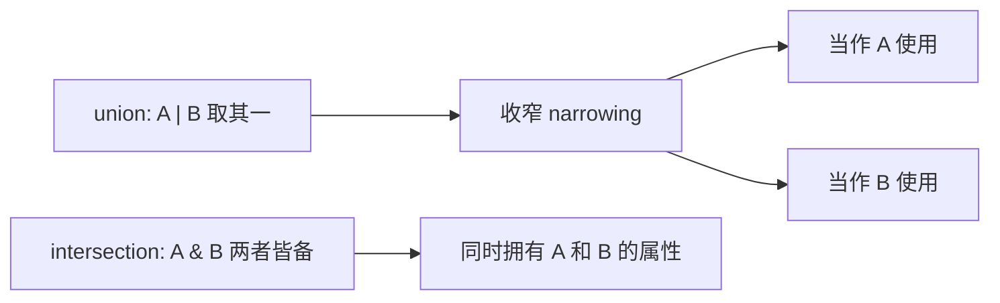

# 03 · 类型别名 / 联合 / 交叉 / 字面量（Type Alias · Union · Intersection · Literal）
> `type` 给类型起别名，并用 `|` `&`、字面量等把简单类型组合成更贴合业务的复杂类型。

## 📖 知识讲解

对照官方 Handbook 的 **Everyday Types** 与 **Object Types**：

- **类型别名 `type`**：给任意类型起名，便于复用，例如 `type ID = number | string`。
- **联合类型 `|`**：值可以是「其中任意一种」。使用前常需通过 `typeof`/标签判断「收窄（narrowing）」。
- **交叉类型 `&`**：合并多个类型，结果「同时拥有各方所有属性」。
- **字面量类型 literal**：把具体值（`"up"`、`6`）当类型用，常以联合形式构成枚举式取值集合。
- **可辨识联合 discriminated union**：每个成员带一个共同的字面量标签字段（如 `kind`），用 `switch` 判断标签即可精确收窄，并能借 `never` 做穷尽性检查。

易错点：
- 联合类型在收窄前，只能访问「各成员共有的成员」。
- 交叉类型缺任意一方属性都会报错；两个有冲突原始类型相交会得到 `never`。
- 字面量类型对拼写敏感，值不在集合内即报错（这正是它的价值）。

## 🔄 流程图 / 原理图



```mermaid
flowchart TD
  S[Shape = Circle | Rectangle] --> K{switch shape.kind}
  K -->|circle| C[收窄为 Circle 用 radius]
  K -->|rectangle| R[收窄为 Rectangle 用 width/height]
  K -->|default| N[never 穷尽性检查]
```

## 💻 代码说明

- `type ID`：类型别名，等于「数字或字符串」的联合。
- `type Status` / `printId`：字面量联合 + `typeof` 收窄，分支内访问各自特有方法。
- `type Person = HasName & HasAge`：交叉类型，缺属性即报错。
- `Direction` / `Dice`：字符串与数字字面量类型。
- `Shape` + `area`：可辨识联合的完整范式，`default` 分支用 `never` 做穷尽性检查，将来漏处理新成员会编译报错。

## ▶️ 运行方式

在工程根 `06-typescript` 下：

```bash
npm i -D typescript ts-node
npx ts-node 03-type-alias-union/demo.ts
# 或编译检查：npx tsc 03-type-alias-union/demo.ts --noEmit
```

## ⚠️ 常见坑 / 最佳实践

- 处理「多种形态的数据」优先用可辨识联合 + `switch`，配合 `never` 兜底，扩展时编译器帮你查漏。
- 联合类型报「属性不存在」时，先做类型守卫收窄，别用 `as` 强转绕过。
- 字面量集合较大或会变化时，考虑用常量对象 + `as const` 推导，减少手写维护。
- `type` 与 `interface` 不是对立面：对象形状偏好 `interface`，联合/交叉/工具类型用 `type`。

## 🔗 官方文档

- Everyday Types（Union / Literal）: https://www.typescriptlang.org/docs/handbook/2/everyday-types.html#union-types
- Object Types（Intersection）: https://www.typescriptlang.org/docs/handbook/2/objects.html#intersection-types
- Narrowing（Discriminated Unions）: https://www.typescriptlang.org/docs/handbook/2/narrowing.html#discriminated-unions
