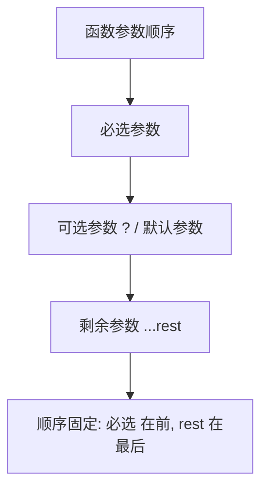

# 04 · 函数类型（More on Functions）
> 给函数的参数和返回值加类型，并掌握可选/默认/剩余参数、函数类型表达式、调用签名、重载与 `this` 参数。

## 📖 知识讲解

对照官方 Handbook 的 **More on Functions** 一页：

- **参数与返回值类型**：`function add(x: number, y: number): number`，返回值常可省略交给推断。
- **可选参数 `?`**：未传时值为 `undefined`，必须排在必选参数之后。
- **默认参数**：`exp: number = 2`，未传用默认值，天然可选。
- **剩余参数 `...rest`**：把不定数量实参收集成数组，类型写成 `number[]`。
- **函数类型表达式**：`(a: number, b: number) => number` 描述函数变量的类型。
- **调用签名 call signature**：函数既能被调用又带属性时，用 `{ (): number; count: number }` 这种对象形式描述。
- **函数重载 overload**：多条「重载签名」+ 一条「实现签名」，对不同入参给不同返回类型；实现签名对调用方不可见。
- **`this` 参数**：把 `this` 写成第一个形参来约束其类型，仅参与类型检查、不占真实参数位。

易错点：
- 可选参数不能在必选参数前面。
- 重载的实现签名必须兼容所有重载签名，且实现签名本身不能被外部直接调用。
- 默认参数与可选 `?` 不要同时写在一个参数上。

## 🔄 流程图 / 原理图

```mermaid
graph LR
  Call[调用 len 的实参] --> O1[重载签名1: string => number]
  Call --> O2[重载签名2: any[] => number]
  O1 --> Impl[实现签名 string｜any[] => number]
  O2 --> Impl
  Impl --> R[返回 length]
```



## 💻 代码说明

- `add`：基础参数/返回值类型 + 实参类型不符反例。
- `greet`：可选参数 `?` 配合 `??` 给默认值；`power`：默认参数。
- `sum`：剩余参数 `...nums: number[]`。
- `type BinaryOp` / `multiply`：函数类型表达式。
- `type Counter` / `makeCounter`：调用签名——可调用且带 `count` 属性。
- `len`：函数重载，两条重载签名 + 一条实现签名，并给出不匹配重载的反例。
- `Card.describe`：`this` 参数，约束方法内 `this` 类型。

## ▶️ 运行方式

在工程根 `06-typescript` 下：

```bash
npm i -D typescript ts-node
npx ts-node 04-functions-types/demo.ts
# 或编译检查：npx tsc 04-functions-types/demo.ts --noEmit
```

## ⚠️ 常见坑 / 最佳实践

- 多数重载能用「联合类型参数 + 类型守卫」替代，更简单；仅当入参与返回值存在强对应关系时才用 overload。
- 公共函数显式写返回类型，避免推断出意料之外的宽泛类型。
- 剩余参数永远在参数列表最后，且只能有一个。
- 用箭头函数可避免 `this` 指向问题；确需动态 `this` 时再用 `this` 参数约束类型。

## 🔗 官方文档

- More on Functions: https://www.typescriptlang.org/docs/handbook/2/functions.html
