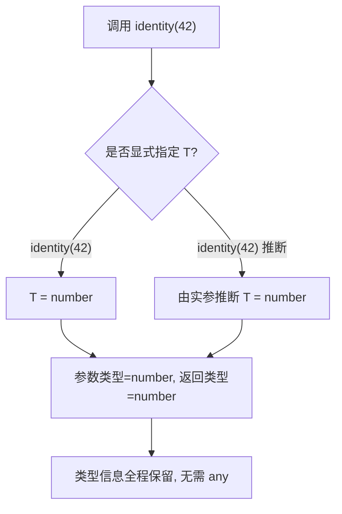
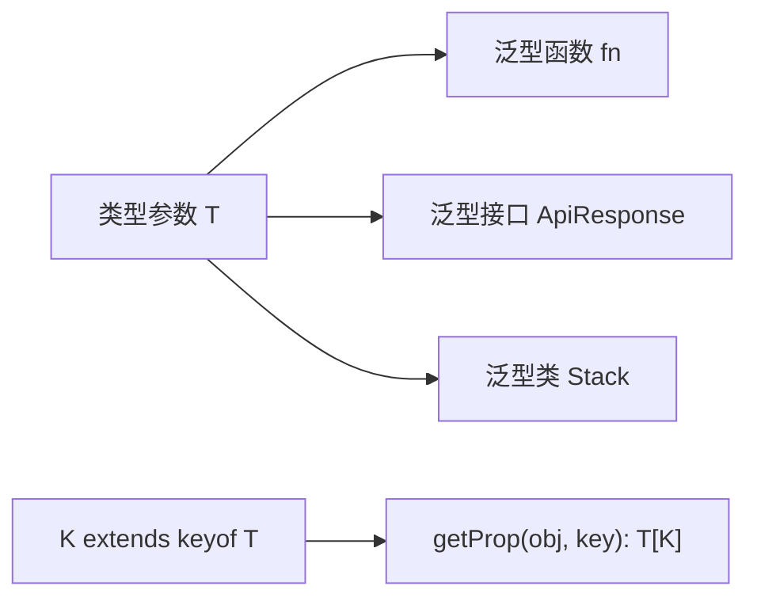

# 05 · 泛型（Generics）
> 泛型让你把「类型」作为参数传入函数、接口、类，从而写出既复用又类型安全的代码——不必为每种类型重复写一遍，也不必退化成 `any`。

## 📖 知识讲解

泛型的本质：**先用一个类型变量占位，调用时再确定真实类型**。习惯用大写单字母命名：`T`（Type）、`K`（Key）、`U`/`V`（额外类型）、`E`（Element）。

核心语法与 API：

- **泛型函数**：`function fn<T>(arg: T): T {}`，调用时可显式 `fn<number>(1)` 或交给编译器推断 `fn(1)`。
- **多个类型参数**：`<T, U>`，彼此独立，如 `swap<T, U>`。
- **泛型约束 `extends`**：`<T extends HasLength>` 限定 T 必须满足某结构，约束后才能安全访问该结构的成员。
- **`keyof` + 泛型**：`<T, K extends keyof T>(obj: T, key: K): T[K]`，实现「类型安全地取属性」，返回值精确到 `T[K]`。
- **泛型接口**：`interface ApiResponse<T> { data: T }`，常用于统一封装返回结构。
- **默认泛型参数**：`<T = string>`，不传时使用默认类型。
- **泛型类**：`class Stack<T>`，类型在 `new Stack<number>()` 时确定。

易错点：

1. **泛型 ≠ any**：泛型保留类型信息并在前后传递；any 直接关闭检查。
2. **约束前不能访问成员**：未 `extends` 时，编译器不知道 T 有没有 `.length`。
3. **能推断就别显式写**：多数情况下让 TS 自动推断更简洁。

## 🔄 流程图 / 原理图





## 💻 代码说明

- `identity<T>`：最小泛型函数，演示「显式指定」与「自动推断」两种用法。
- `swap<T, U>`：两个类型参数，返回 `[U, T]` 体现类型随之翻转。
- `logLength<T extends HasLength>`：约束保证 `arg.length` 合法；传 `number` 会编译报错。
- `getProp<T, K extends keyof T>`：`keyof` 把对象键变成联合类型，返回值精确到 `T[K]`。
- `ApiResponse<T>` / `Box<T = string>`：泛型接口与默认参数。
- `Stack<T>`：泛型类，`new Stack<number>()` 后只接受 number。

## ▶️ 运行方式

在工程根 `06-typescript` 下：

```bash
npm i -D typescript ts-node
npx ts-node 05-generics/demo.ts
# 或编译检查：npx tsc
```

## ⚠️ 常见坑 / 最佳实践

- 不要用 `any` 假装通用，优先泛型，保留类型推断能力。
- 约束尽量「最小够用」：只 `extends` 你真正要用到的结构。
- 默认泛型参数能减少调用噪音，但别滥用导致语义模糊。
- 命名：单字母适合简单场景，复杂业务可用 `TItem`、`TKey` 等更具语义的名字。

## 🔗 官方文档

- Generics: https://www.typescriptlang.org/docs/handbook/2/generics.html
- keyof Type Operator: https://www.typescriptlang.org/docs/handbook/2/keyof-types.html
