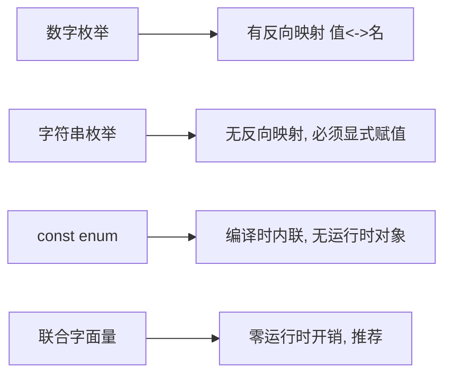

# 06 · 枚举（Enums）
> 枚举用于给一组相关常量起「有意义的名字」。但它是 TS 少数会生成运行时代码的特性，实际项目里常被联合字面量替代——本模块讲清两者取舍。

## 📖 知识讲解

核心语法：

- **数字枚举**：`enum Direction { Up, Down }`，默认从 `0` 自增；可手动指定起始值，后续自动 +1。
- **反向映射**：仅数字枚举生成「值 → 名」映射，如 `Direction[0] === "Up"`。
- **字符串枚举**：`enum Color { Red = "RED" }`，可读性强，但**每个成员都必须显式赋值**，且**没有反向映射**。
- **异构枚举**：数字+字符串混用，语法合法但语义混乱，**不推荐**。
- **常量枚举 `const enum`**：编译时直接内联成字面量，不生成运行时对象，体积更小、更快；代价是不能反向映射，且在 `isolatedModules` 等配置下有限制。

为什么很多项目改用**联合字面量**（`type Fruit = "apple" | "banana"`）：

1. **零运行时开销**：枚举会生成 JS 对象，联合字面量纯类型层面，编译后消失。
2. **更易与 JSON / 字符串互操作**：值本身就是字符串。
3. **数字枚举类型偏松**：任意 `number` 都能赋给数字枚举类型（如 `let sc: StatusCode = 999` 不报错），是著名的坑。

易错点：字符串枚举成员必须初始化；`const enum` 跨模块需注意编译配置；数字枚举的「任意 number 可赋值」。

## 🔄 流程图 / 原理图

```mermaid
flowchart TD
    A[需要一组命名常量] --> B{值需要在运行时遍历/反查吗?}
    B -- 需要反向映射 --> C[数字枚举 enum]
    B -- 只是类型约束, 想零开销 --> D[联合字面量 type X = 'a' | 'b']
    B -- 需要常量内联省体积 --> E[const enum]
    C --> F[注意: 任意 number 可赋值的坑]
    D --> G[推荐: 现代项目首选]
```



## 💻 代码说明

- `Direction`：数字枚举自增，`Direction[0]` 演示反向映射。
- `StatusCode`：手动起始值；末尾 `let sc: StatusCode = 999` 暴露「任意 number 可赋值」的坑。
- `Color`：字符串枚举，注释展示「成员缺初始值会报错」。
- `Mixed`：异构枚举，仅作了解。
- `const enum Size`：编译后 `Size.Medium` 被替换为字面量 `1`，无运行时对象。
- `type Fruit` + `eat`：联合字面量替代方案，传错值即编译报错。

## ▶️ 运行方式

在工程根 `06-typescript` 下：

```bash
npm i -D typescript ts-node
npx ts-node 06-enums/demo.ts
# 或编译检查：npx tsc
```

## ⚠️ 常见坑 / 最佳实践

- **优先联合字面量**：除非确实需要反向映射或运行时遍历枚举值。
- 数字枚举别依赖其「类型严格性」——它能接收任意 number。
- 字符串枚举每个成员都要赋值，别漏。
- `const enum` 能省体积，但在使用 Babel / `isolatedModules` 的工程里可能不被支持，需确认。
- 需要遍历所有取值时，可用 `Object.values(Color)`（普通枚举）或自己维护一个数组配合联合类型。

## 🔗 官方文档

- Enums: https://www.typescriptlang.org/docs/handbook/enums.html
- Literal Types（联合字面量）: https://www.typescriptlang.org/docs/handbook/2/everyday-types.html#literal-types
