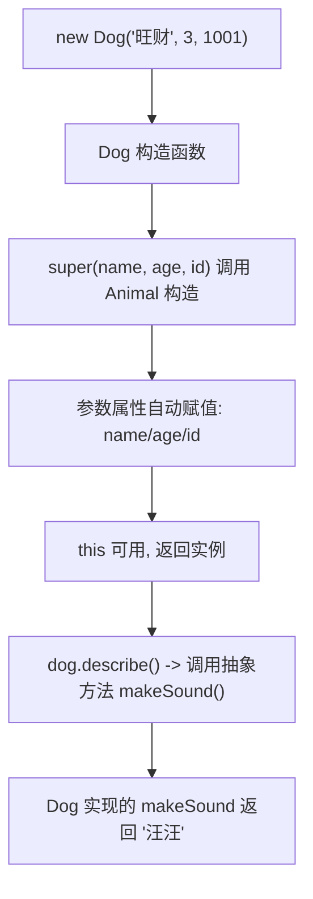
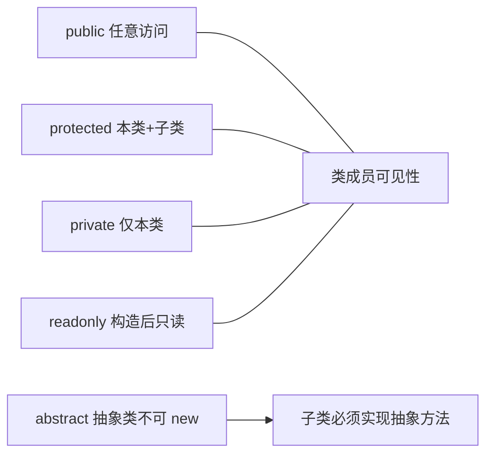

# 07 · 类（Classes）
> TS 的类在 ES 类基础上加了访问修饰符、`readonly`、参数属性简写、抽象类、接口实现等，让面向对象代码既有封装又有静态类型保障。

## 📖 知识讲解

核心语法与 API：

- **构造函数 / 属性 / 方法**：`constructor(...) {}`，实例属性配合类型注解。
- **访问修饰符**：
  - `public`（默认）：任意位置可访问。
  - `protected`：本类**及子类**可访问，外部不可。
  - `private`：**仅本类**内部可访问（编译期约束）。
- **`readonly`**：构造完成后不可再赋值，常用于不变量。
- **参数属性简写**：在构造函数参数前加修饰符（如 `constructor(public readonly name: string)`），等于「声明属性 + 赋值」一步完成。
- **getter / setter**：`get x()` / `set x(v)`，调用方像普通属性一样读写。
- **`static`**：属于类本身而非实例，用 `ClassName.member` 访问。
- **继承 `extends` 与 `super`**：子类构造函数必须先 `super(...)` 才能用 `this`。
- **抽象类 `abstract`**：不能被 `new`，可包含抽象方法（只有签名），强制子类实现。
- **`implements` 接口**：让类承诺实现接口定义的成员，便于多态。

易错点：private/protected 越权访问、修改 readonly、忘记调用 super、误以为能 new 抽象类。

## 🔄 流程图 / 原理图





## 💻 代码说明

- `Describable` 接口 + `Animal implements Describable`：约定 `describe()` 必须存在。
- `Animal` 抽象类的构造函数用**参数属性简写**同时声明 `public readonly name`、`protected age`、`private id`，并定义抽象方法 `makeSound()`。
- `Dog extends Animal`：`super(...)` 初始化父类，实现 `makeSound()`；`growUp()` 演示子类能访问 `protected age` 但访问 `private id` 会报错。
- 注释中的 `dog.name = ...`、`dog.age` 展示 readonly 与 protected 的越权报错。
- `Temperature`：getter/setter 在摄氏/华氏之间换算，调用方像读写普通属性。
- `Dog.species`：静态成员。

## ▶️ 运行方式

在工程根 `06-typescript` 下：

```bash
npm i -D typescript ts-node
npx ts-node 07-classes/demo.ts
# 或编译检查：npx tsc
```

## ⚠️ 常见坑 / 最佳实践

- `private`/`protected` 是**编译期**约束；如需运行时真正私有可用 ES 的 `#field`。
- 用参数属性简写减少样板代码，但别和普通声明混用导致可读性下降。
- 子类构造函数中，`super()` 之前不能访问 `this`。
- 抽象类用于「定义模板 + 强制实现」，纯能力约定优先用 `interface`。
- `readonly` 只防重新赋值，不会冻结对象内部（对象属性仍可改）。

## 🔗 官方文档

- Classes: https://www.typescriptlang.org/docs/handbook/2/classes.html
