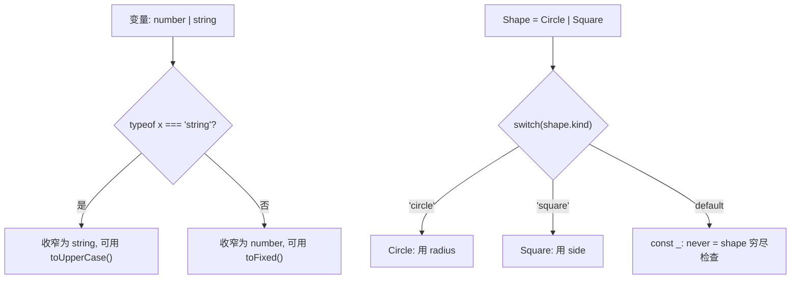
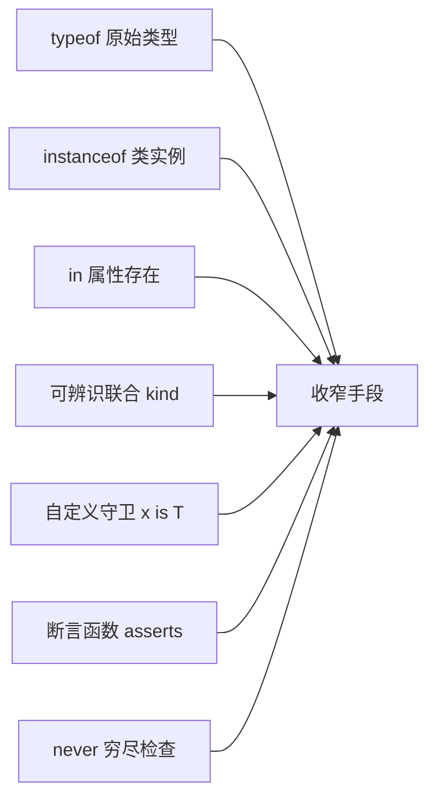

# 08 · 类型收窄（Narrowing）
> 联合类型变量在不同代码分支里会被 TS 自动「收窄」到更具体的子类型，从而安全访问其独有成员。本模块覆盖全部主流收窄手段。

## 📖 知识讲解

TS 通过**控制流分析**在条件分支里缩小变量类型。主要手段：

- **`typeof` 守卫**：区分原始类型 `"string" | "number" | "boolean" | "object" | "function" | "undefined" | "symbol" | "bigint"`。
- **真值收窄（truthiness）**：`if (x)` 排除 `null/undefined/0/""/NaN/false`。
- **字面量相等收窄**：`if (dir === "up")` 把联合字面量收窄到具体值。
- **`instanceof` 守卫**：区分**类实例**（如 `Date`）。
- **`in` 操作符守卫**：按属性是否存在区分对象类型（`"swim" in animal`）。
- **可辨识联合（discriminated union）**：每个成员有公共「标签」字段（如 `kind`），用 `switch` 区分，最清晰可扩展。
- **自定义类型守卫**：返回类型写成 `形参 is 类型`（type predicate），把布尔函数变成收窄依据。
- **断言函数 `asserts`**：`function f(x): asserts x is T`，不满足就抛错，通过后类型即被收窄。
- **`never` 穷尽检查**：在 `default` 分支把变量赋给 `never`，新增联合成员却漏处理时会编译报错。

易错点：未收窄就访问子类型成员；`typeof null === "object"` 的历史坑；自定义守卫逻辑写错会「骗过」编译器。

## 🔄 流程图 / 原理图





## 💻 代码说明

- `printId`：`typeof` 区分 string / number。
- `greet`：真值收窄排除 `undefined` 与空串。
- `move`：字面量相等收窄。
- `logDate`：`instanceof Date` 区分实例。
- `moveAnimal`：`"swim" in animal` 区分 Fish / Bird。
- `area(Shape)`：可辨识联合 + `switch`，`default` 里 `const _exhaustive: never = shape` 做穷尽检查——给 `Shape` 加新成员而忘记 case 时此处报错。
- `isFish`：返回 `animal is Fish` 的自定义守卫。
- `assertIsString`：`asserts val is string` 断言函数，通过后 `input` 收窄为 string。

## ▶️ 运行方式

在工程根 `06-typescript` 下：

```bash
npm i -D typescript ts-node
npx ts-node 08-type-narrowing/demo.ts
# 或编译检查：npx tsc
```

## ⚠️ 常见坑 / 最佳实践

- `typeof null === "object"`：判空要单独 `=== null`，别只靠 typeof。
- 自定义守卫的判断逻辑必须真实可靠，写错会让编译器「误信」从而埋下运行时 bug。
- 优先用**可辨识联合**建模多态数据，配合 `never` 穷尽检查，新增分支不会被遗漏。
- 断言函数会改变控制流语义（可能抛错），命名要清晰（`assertXxx`）。
- 收窄只在当前作用域有效；把变量传进回调/异步后可能「丢失」收窄结果。

## 🔗 官方文档

- Narrowing: https://www.typescriptlang.org/docs/handbook/2/narrowing.html
